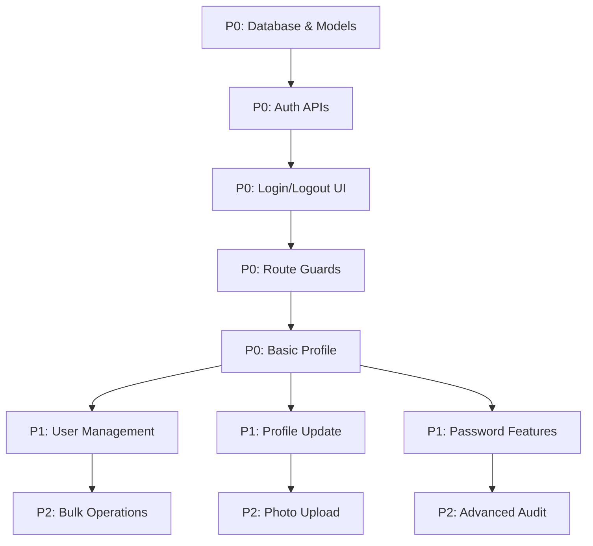

# Authentication System - Cross-Frontend Implementation Strategy

## PHASE 1: FEATURE UNDERSTANDING

### What Data is Being Created/Managed?

Based on the `users` table in Database Architecture:

- **User accounts** with NIP-based authentication (5-character username)
- **User profiles** (full_name, email, phone, role, department, shift)
- **Authentication sessions** (login/logout, remember me tokens)
- **Activity logs** (audit trail for all user actions)
- **Gamification data** (points, achievements)
- **Notifications** (in-app alerts for users)
- **Password reset tokens** (for password recovery)

### Who Creates This Data? (Owner)

- **Admin/Manager**: Creates and manages user accounts
- **System**: Auto-generates sessions, activity logs, notifications
- **Users (Self)**: Update their own profiles, change passwords

### Who Needs to See/Use This Data? (Consumer)

- **All Users**: Authenticate to access their role-specific features
- **Admin/Manager**: View user list, manage permissions, view activity logs
- **Individual Users**: View their own profile, notifications, achievements

### Primary User Goal

Enable secure, role-based access to the production management system where each user role (STAFF_KHAZWAL, OPERATOR_CETAK, QC_INSPECTOR, etc.) can only access features relevant to their department and responsibilities.

---

## PHASE 2: CROSS-FRONTEND IMPACT MAPPING

| Feature Name | Owner (Who Creates) | Consumer (Who Views) | Data Flow |

|--------------|---------------------|----------------------|-----------|

| **User Registration** | Admin via Admin Panel | N/A (internal only) | Admin creates → Backend stores → User receives credentials |

| **Login** | User via Login Page | All Users | User submits NIP+password → Backend validates → Returns JWT → Frontend stores token → Redirects to role dashboard |

| **Session Management** | System (auto) | All authenticated users | Every API call includes JWT → Backend validates → Returns data or 401 |

| **User Profile View** | User (self-service) | Individual user via Profile page | User navigates → Frontend fetches from `/api/auth/me` → Displays profile |

| **Profile Update** | User (self-service) | Individual user | User edits → Frontend PUTs to `/api/users/:id` → Backend updates → Frontend refreshes |

| **Password Change** | User (self-service) | Individual user | User submits old+new password → Backend validates → Updates → Logs out all sessions |

| **Password Reset** | User via Forgot Password | User via email link | User requests → Backend sends email → User clicks link → Resets password |

| **Role-Based Dashboard** | System (auto-routing) | All users after login | Login success → Frontend checks role → Routes to specific dashboard (Khazwal/Cetak/Verifikasi/Khazkhir/Admin) |

| **User Management** | Admin via User Management | Admin only | Admin CRUD users → Backend stores → Activity log created |

| **Activity Logs** | System (auto) | Admin via Audit page | Every action → Observer pattern → `activity_logs` table → Admin can search/filter |

| **Notifications** | System (auto) | All users via Notification bell | Event triggers → Backend creates notification → Real-time push (WebSocket) → User sees in-app |

| **Achievements** | System (auto) | User via Profile/Gamification | Criteria met → Backend awards achievement → Notification sent → User sees badge |

| **Logout** | User via Logout button | User (confirmation) | User clicks → Frontend calls `/api/auth/logout` → Backend invalidates token → Redirects to login |

---

## PHASE 3: MISSING IMPLEMENTATION DETECTION

### ✅ Owner Side (Data Creation) - COMPLETE IN SPEC

- [x] UI form/interface for creating user accounts (Admin panel)
- [x] Validation rules (NIP max 5 char, unique, role required)
- [x] Edit/Update capability (Admin can edit users)
- [x] Delete/Archive capability (Soft delete with `deleted_at`)
- [x] Preview before publishing (N/A for users)
- [x] Bulk operations (Not specified - **GAP IDENTIFIED**)

### ⚠️ Consumer Side (Data Display) - GAPS IDENTIFIED

- [x] Where users will SEE this data (Login page, Profile page, Dashboard)
- [x] How users will FIND this data (Direct navigation after login)
- [ ] **GAP**: What users can DO with their profile data (edit email/phone? upload photo?)
- [x] Mobile/responsive version (Tailwind CSS mobile-first design)
- [ ] **GAP**: Empty states (new user with no notifications/achievements?)
- [ ] **GAP**: Loading states for authentication API calls

### ⚠️ Integration Points - GAPS IDENTIFIED

- [x] API endpoints needed (listed below)
- [x] Database schema (from Database Architecture)
- [ ] **GAP**: State management updates (Pinia store for auth state?)
- [ ] **GAP**: Navigation menu updates (role-based menu items?)
- [ ] **GAP**: Search/filter in User Management (Admin needs to search by NIP/name/role)
- [ ] **GAP**: Notification/real-time updates (WebSocket integration?)

---

## PHASE 4: GAP ANALYSIS

### 🚨 CRITICAL GAPS

#### 1. **Bulk User Import/Export**

- ⚠️ Admin can create users one-by-one BUT cannot import 50+ users from CSV/Excel
- **Impact**: Manual data entry for initial setup (time-consuming)
- **Recommendation**: Add bulk import feature (CSV upload with validation)

#### 2. **User Profile Photo**

- ⚠️ Database has user fields BUT no `profile_photo_url` column
- **Impact**: No visual identification in UI
- **Recommendation**: Add `profile_photo_url VARCHAR(255)` to users table

#### 3. **Password Policy Enforcement**

- ⚠️ Database has `password` field BUT no policy enforcement documented
- **Impact**: Weak passwords possible
- **Recommendation**: Enforce min 8 characters, 1 uppercase, 1 number

#### 4. **Session/Token Storage**

- ⚠️ No `user_sessions` or `refresh_tokens` table in database
- **Impact**: Cannot track active sessions or implement "logout all devices"
- **Recommendation**: Add `user_sessions` table with device info

#### 5. **Role Permissions Granularity**

- ⚠️ Database has `role` field BUT no `permissions` table
- **Impact**: Cannot fine-tune permissions (e.g., QC_INSPECTOR can view but not edit reports)
- **Recommendation**: Add `roles` and `permissions` tables (RBAC pattern)

#### 6. **First-Time Login Flow**

- ⚠️ Admin creates user with default password BUT no "force password change on first login" mechanism
- **Impact**: Security risk if user keeps default password
- **Recommendation**: Add `must_change_password BOOLEAN` field

#### 7. **Real-Time Notifications**

- ⚠️ `notifications` table exists BUT no WebSocket/SSE implementation specified
- **Impact**: Users must refresh to see new notifications
- **Recommendation**: Implement WebSocket or polling mechanism

---

## PHASE 5: IMPLEMENTATION SEQUENCING

### PRIORITY MATRIX

#### **P0 (Critical - Must Have for MVP)**

1. User model & database migration
2. Login/Logout functionality
3. JWT-based session management
4. Password hashing (bcrypt)
5. Role-based route guards (Vue Router)
6. Basic profile view
7. Activity logging (critical actions only)

#### **P1 (Important - Needed for Full Feature)**

8. User Management CRUD (Admin)
9. Profile update (self-service)
10. Password change (self-service)
11. Password reset flow (email)
12. Notifications (in-app display)
13. Search/filter in User Management
14. Role-based dashboard routing
15. "Remember Me" functionality

#### **P2 (Enhancement - Can Ship Later)**

16. Achievements & gamification display
17. Bulk user import/export
18. User profile photo upload
19. "Logout all devices" feature
20. Real-time notification push (WebSocket)
21. Advanced audit log viewer with filters
22. Password policy customization UI

### BUILD SEQUENCE



#### PARALLEL WORK STREAMS

**Stream 1 (Backend)**: Models → Handlers → Services → Middleware

**Stream 2 (Frontend)**: Login UI → Dashboard → Profile → User Management

**Stream 3 (Integration)**: API integration → State management → Real-time features

---

## PHASE 6: DETAILED RECOMMENDATIONS

### 🗄️ DATABASE UPDATES NEEDED

Add to existing `users` table:

```sql
ALTER TABLE users ADD COLUMN profile_photo_url VARCHAR(255);
ALTER TABLE users ADD COLUMN must_change_password BOOLEAN DEFAULT TRUE;
ALTER TABLE users ADD COLUMN last_login_at TIMESTAMP WITH TIME ZONE;
ALTER TABLE users ADD COLUMN failed_login_attempts INTEGER DEFAULT 0;
ALTER TABLE users ADD COLUMN locked_until TIMESTAMP WITH TIME ZONE;
```

Create new tables:

```sql
CREATE TABLE user_sessions (
    id BIGSERIAL PRIMARY KEY,
    user_id BIGINT NOT NULL,
    token_hash VARCHAR(255) NOT NULL UNIQUE,
    device_info JSONB,
    ip_address VARCHAR(45),
    expires_at TIMESTAMP WITH TIME ZONE NOT NULL,
    created_at TIMESTAMP WITH TIME ZONE DEFAULT CURRENT_TIMESTAMP,
    CONSTRAINT fk_user_session FOREIGN KEY (user_id) REFERENCES users(id) ON DELETE CASCADE
);

CREATE TABLE password_reset_tokens (
    id BIGSERIAL PRIMARY KEY,
    user_id BIGINT NOT NULL,
    token_hash VARCHAR(255) NOT NULL UNIQUE,
    expires_at TIMESTAMP WITH TIME ZONE NOT NULL,
    used_at TIMESTAMP WITH TIME ZONE,
    created_at TIMESTAMP WITH TIME ZONE DEFAULT CURRENT_TIMESTAMP,
    CONSTRAINT fk_user_password_reset FOREIGN KEY (user_id) REFERENCES users(id) ON DELETE CASCADE
);
```

---

### 🔧 BACKEND (Go + Gin)

#### New Files to Create

**Models** (`backend/models/`)

- [ ] `user.go` - User model with GORM tags - **P0**
- [ ] `user_session.go` - Session tracking - **P1**
- [ ] `password_reset_token.go` - Password reset - **P1**

**Services** (`backend/services/`)

- [ ] `auth_service.go` - Login, logout, token validation - **P0**
- [ ] `user_service.go` - User CRUD operations - **P1**
- [ ] `password_service.go` - Password hashing, reset - **P0**

**Handlers** (`backend/handlers/`)

- [ ] `auth_handler.go` - Login, logout, me, refresh - **P0**
- [ ] `user_handler.go` - User management CRUD - **P1**
- [ ] `profile_handler.go` - Self-service profile update - **P1**

**Middleware** (`backend/middleware/`)

- [ ] `auth_middleware.go` - JWT validation - **P0**
- [ ] `role_middleware.go` - Role-based access control - **P0**
- [ ] `activity_logger.go` - Auto-log user actions - **P1**

**Routes** (`backend/routes/`)

- Update `routes.go` to include:
  - `POST /api/auth/login` - **P0**
  - `POST /api/auth/logout` - **P0**
  - `GET /api/auth/me` - **P0**
  - `POST /api/auth/refresh` - **P1**
  - `POST /api/auth/forgot-password` - **P1**
  - `POST /api/auth/reset-password` - **P1**
  - `GET /api/users` (Admin only) - **P1**
  - `POST /api/users` (Admin only) - **P1**
  - `PUT /api/users/:id` (Admin or self) - **P1**
  - `DELETE /api/users/:id` (Admin only) - **P1**
  - `PUT /api/profile` (Self) - **P1**
  - `PUT /api/profile/password` (Self) - **P1**

---

### 🎨 FRONTEND (Vue 3 + Vite)

#### New Pages/Routes Needed

**Public Routes** (No auth required)

- [ ] `views/auth/Login.vue` - Login form (NIP + Password) - **P0**
- [ ] `views/auth/ForgotPassword.vue` - Request password reset - **P1**
- [ ] `views/auth/ResetPassword.vue` - Reset password via token - **P1**

**Protected Routes** (Auth required)

- [ ] `views/profile/Profile.vue` - View own profile - **P0**
- [ ] `views/profile/EditProfile.vue` - Edit own profile - **P1**
- [ ] `views/profile/ChangePassword.vue` - Change own password - **P1**

**Admin Only Routes**

- [ ] `views/admin/users/UserList.vue` - User management list - **P1**
- [ ] `views/admin/users/UserCreate.vue` - Create new user - **P1**
- [ ] `views/admin/users/UserEdit.vue` - Edit user - **P1**
- [ ] `views/admin/audit/ActivityLogs.vue` - Audit trail viewer - **P2**

**Role-Specific Dashboards**

- [ ] `views/dashboards/KhazwalDashboard.vue` - For STAFF_KHAZWAL - **P1**
- [ ] `views/dashboards/CetakDashboard.vue` - For OPERATOR_CETAK - **P1**
- [ ] `views/dashboards/VerifikasiDashboard.vue` - For QC_INSPECTOR - **P1**
- [ ] `views/dashboards/KhazkhirDashboard.vue` - For STAFF_KHAZKHIR - **P1**
- [ ] `views/dashboards/AdminDashboard.vue` - For ADMIN/MANAGER - **P1**

#### Updates to Existing Files

**Router** (`frontend/src/router/index.js` - create if not exists)

- [ ] Add route guards for authentication - **P0**
- [ ] Add role-based route guards - **P0**
- [ ] Implement auto-redirect after login based on role - **P0**
- [ ] Handle 401 redirects to login - **P0**

**State Management** (`frontend/src/stores/` - create Pinia stores)

- [ ] `useAuthStore.js` - Auth state (user, token, isAuthenticated) - **P0**
- [ ] `useUserStore.js` - User management state (for admin) - **P1**
- [ ] `useNotificationStore.js` - Notifications state - **P1**

**Composables** (`frontend/src/composables/`)

- [ ] `useAuth.js` - Auth logic (login, logout, checkAuth) - **P0**
- [ ] `usePermissions.js` - Check user permissions/roles - **P0**
- [ ] `useApi.js` - Axios wrapper with auto token injection - **P0**

**Components** (`frontend/src/components/`)

**Auth Components:**

- [ ] `auth/LoginForm.vue` - Login form with validation - **P0**
- [ ] `auth/PasswordStrength.vue` - Visual password strength indicator - **P1**
- [ ] `auth/SessionExpired.vue` - Modal when session expires - **P1**

**Layout Components:**

- [ ] `layout/Navbar.vue` - Add user menu dropdown (Profile, Logout) - **P0**
- [ ] `layout/NotificationBell.vue` - Notification icon with count - **P1**
- [ ] `layout/Sidebar.vue` - Role-based navigation menu - **P0**

**Profile Components:**

- [ ] `profile/ProfileCard.vue` - Display user info with photo - **P1**
- [ ] `profile/AchievementsList.vue` - Display user achievements - **P2**
- [ ] `profile/PointsHistory.vue` - Display gamification points - **P2**

**Admin Components:**

- [ ] `admin/UserTable.vue` - User list with search/filter - **P1**
- [ ] `admin/UserForm.vue` - Create/Edit user form - **P1**
- [ ] `admin/RoleBadge.vue` - Visual role indicator - **P1**
- [ ] `admin/ActivityLogTable.vue` - Audit logs table - **P2**

#### Navigation/Menu Changes

**Main Navigation** (After login - Role-based visibility)

```javascript
{
  name: 'Profile',
  icon: 'UserIcon',
  route: '/profile',
  roles: ['*'], // All roles
  priority: 'P0'
},
{
  name: 'User Management',
  icon: 'UsersIcon',
  route: '/admin/users',
  roles: ['ADMIN', 'MANAGER'], // Admin only
  priority: 'P1'
},
{
  name: 'Audit Logs',
  icon: 'ClipboardListIcon',
  route: '/admin/audit',
  roles: ['ADMIN'], // Admin only
  priority: 'P2'
}
```

**User Dropdown Menu** (Top-right navbar)

- Profile → `/profile` - **P0**
- Change Password → `/profile/password` - **P1**
- Settings → `/settings` (Future) - **P2**
- Logout → Trigger logout action - **P0**

---

### 🔌 API ENDPOINTS SPECIFICATION

#### Authentication Endpoints

| Method | Endpoint | Access | Request Body | Response | Priority |

|--------|----------|--------|--------------|----------|----------|

| POST | `/api/auth/login` | Public | `{nip, password, remember_me}` | `{token, refresh_token, user}` | P0 |

| POST | `/api/auth/logout` | Protected | - | `{message}` | P0 |

| GET | `/api/auth/me` | Protected | - | `{user}` | P0 |

| POST | `/api/auth/refresh` | Protected | `{refresh_token}` | `{token}` | P1 |

| POST | `/api/auth/forgot-password` | Public | `{nip, email}` | `{message}` | P1 |

| POST | `/api/auth/reset-password` | Public | `{token, password}` | `{message}` | P1 |

#### User Management Endpoints (Admin Only)

| Method | Endpoint | Access | Request Body | Response | Priority |

|--------|----------|--------|--------------|----------|----------|

| GET | `/api/users` | Admin | Query: `?role=&department=&search=` | `{users[], total, page}` | P1 |

| GET | `/api/users/:id` | Admin | - | `{user}` | P1 |

| POST | `/api/users` | Admin | `{nip, full_name, role, department, ...}` | `{user}` | P1 |

| PUT | `/api/users/:id` | Admin | `{full_name, role, department, ...}` | `{user}` | P1 |

| DELETE | `/api/users/:id` | Admin | - | `{message}` | P1 |

| POST | `/api/users/bulk-import` | Admin | `{csv_file}` | `{imported, failed[]}` | P2 |

#### Profile Endpoints (Self-Service)

| Method | Endpoint | Access | Request Body | Response | Priority |

|--------|----------|--------|--------------|----------|----------|

| GET | `/api/profile` | Protected | - | `{user}` | P0 |

| PUT | `/api/profile` | Protected | `{full_name, email, phone}` | `{user}` | P1 |

| PUT | `/api/profile/password` | Protected | `{current_password, new_password}` | `{message}` | P1 |

| POST | `/api/profile/photo` | Protected | `{photo: File}` | `{photo_url}` | P2 |

---

## PHASE 7: EXAMPLE USER JOURNEYS

### USER JOURNEY 1: First-Time Login (Most Critical)

**Owner Journey: Admin Creates User**

1. Admin navigates to: `/admin/users`
2. Admin clicks: "Tambah User Baru" button
3. Admin fills form:

   - NIP: 12345 (validation: max 5 digits, unique)
   - Full Name: Ahmad Fauzi
   - Role: OPERATOR_CETAK
   - Department: CETAK
   - Shift: PAGI
   - Initial Password: Auto-generated (shown once)

4. System does:

   - Backend validates NIP is unique
   - Hashes password with bcrypt
   - Sets `must_change_password = TRUE`
   - Creates user in database
   - Logs action to `activity_logs`

5. Admin sees:

   - Success notification
   - Credentials displayed (copy button)
   - Option to email credentials

**Consumer Journey: User First Login**

1. User navigates to: `/login`
2. User sees:

   - NIP input field
   - Password input field
   - "Ingat Saya" checkbox
   - "Lupa Password?" link

3. User enters:

   - NIP: 12345
   - Password: (from admin)
   - Clicks "Masuk"

4. System does:

   - POST to `/api/auth/login`
   - Backend validates credentials
   - Checks `must_change_password = TRUE`
   - Returns token + redirect to `/profile/password/change-required`

5. User sees:

   - Forced password change screen
   - "Anda harus mengubah password sebelum melanjutkan"
   - Form: Current Password, New Password, Confirm

6. User changes password:

   - Enters new password (validated: min 8 char, 1 uppercase, 1 number)
   - Submits
   - Backend updates password, sets `must_change_password = FALSE`

7. User is redirected to:

   - Role-based dashboard (OPERATOR_CETAK → `/dashboards/cetak`)
   - Sees welcome notification

---

### USER JOURNEY 2: Daily Login & Profile Check

**Consumer Journey: Returning User**

1. User navigates to: `/login`
2. User enters:

   - NIP: 12345
   - Password: (their password)
   - Checks "Ingat Saya"

3. System does:

   - POST to `/api/auth/login` with `remember_me: true`
   - Backend creates session in `user_sessions` table
   - Returns JWT (15min expiry) + Refresh Token (30 days expiry)
   - Frontend stores in localStorage (or httpOnly cookie)

4. User sees:

   - Loading spinner (< 1 second)
   - Redirect to `/dashboards/cetak`
   - Navbar with: Logo, Navigation, Notification Bell (3 unread), User Avatar

5. User clicks: Notification Bell

   - Dropdown shows 3 notifications:
     - "PO 123456 siap untuk dicetak"
     - "Maintenance scheduled for MC-01"
     - "New achievement unlocked: 100 Jobs Completed"

6. User clicks: User Avatar dropdown

   - Profile
   - Ganti Password
   - Keluar

7. User clicks: "Profile"

   - Navigates to `/profile`

8. User sees:

   - Profile card with photo
   - NIP: 12345
   - Nama: Ahmad Fauzi
   - Role: Operator Cetak
   - Department: Cetak
   - Total Points: 1,250
   - Achievements: 8 badges
   - "Edit Profile" button

9. User clicks: "Edit Profile"

   - Navigates to `/profile/edit`
   - Can update: Full Name, Email, Phone, Photo
   - Cannot update: NIP, Role, Department (read-only)

10. User updates phone number:

    - Changes phone: 08123456789 → 08129999999
    - Clicks "Simpan"
    - PUT to `/api/profile`
    - Success notification
    - Redirects back to `/profile`

---

### USER JOURNEY 3: Admin User Management

**Owner Journey: Admin Manages Users**

1. Admin navigates to: `/admin/users`
2. Admin sees:

   - Table with columns: NIP, Nama, Role, Department, Status, Actions
   - Search bar: "Cari berdasarkan NIP atau Nama"
   - Filters: Role dropdown, Department dropdown, Status toggle
   - "Tambah User" button (top-right)
   - "Import CSV" button
   - Pagination: Showing 1-20 of 85 users

3. Admin uses search:

   - Types "Ahmad" in search bar
   - Table updates real-time (debounced 300ms)
   - Shows 3 results matching "Ahmad"

4. Admin clicks: "Edit" button on one user (Ahmad Fauzi)

   - Modal opens (or navigates to `/admin/users/12/edit`)
   - Form pre-filled with user data
   - Admin changes: Role from OPERATOR_CETAK → SUPERVISOR_CETAK

5. System does:

   - PUT to `/api/users/12`
   - Backend validates role exists
   - Updates user
   - Logs action to `activity_logs`:
     ```json
     {
       "user_id": 1,
       "action": "UPDATE",
       "entity_type": "users",
       "entity_id": 12,
       "changes": {
         "before": {"role": "OPERATOR_CETAK"},
         "after": {"role": "SUPERVISOR_CETAK"}
       }
     }
     ```


6. Admin sees:

   - Success notification: "User Ahmad Fauzi berhasil diupdate"
   - Table refreshes
   - Role badge updated

7. Admin wants to view audit:

   - Navigates to `/admin/audit`
   - Sees activity logs table
   - Filters by: User, Action, Date Range
   - Sees the role change log entry with full details

---

## CRITICAL IMPLEMENTATION NOTES

### Security Best Practices

1. **Password Hashing**: Use bcrypt with cost 12
2. **JWT Secret**: Store in environment variable (never commit)
3. **Token Expiry**: Short-lived JWT (15min), long refresh token (30d)
4. **CORS**: Restrict to frontend domain only
5. **Rate Limiting**: Max 5 login attempts per NIP per 15 minutes
6. **SQL Injection**: Use parameterized queries (GORM handles this)
7. **XSS Protection**: Sanitize all user inputs
8. **CSRF Protection**: Use CSRF tokens for state-changing operations

### Mobile Considerations (iOS Design Principles)

1. **Spring Physics**: Login button scales down on tap (0.97 scale)
2. **Glass Effect**: Login card with backdrop blur
3. **Haptic Feedback**: Vibrate on login success/failure
4. **Gesture Recognition**: Swipe down to refresh notification list
5. **Staggered Animations**: User list items animate in sequentially

### Offline Capability (PWA)

1. **Cache Strategy**: 

   - NetworkFirst for login (must be online)
   - CacheFirst for user profile (can work offline)
   - StaleWhileRevalidate for notifications

2. **Offline Detection**: Show banner "Anda sedang offline" with orange color
3. **Queue Failed Requests**: Store profile updates in IndexedDB, sync when online

### Indonesian Language & Timezone

1. **All UI Text**: Bahasa Indonesia (formal)
2. **Date Format**: DD/MM/YYYY HH:mm WIB
3. **Timezone**: All timestamps in Asia/Jakarta (WIB)
4. **Error Messages**: Indonesian, user-friendly

   - ❌ "Invalid credentials" → ✅ "NIP atau password salah"
   - ❌ "Session expired" → ✅ "Sesi Anda telah berakhir, silakan login kembali"

### Performance Targets

1. **Login Response**: < 500ms
2. **Dashboard Load**: < 1 second (First Contentful Paint)
3. **Profile Update**: < 300ms
4. **User List Load (20 users)**: < 800ms
5. **Search Debounce**: 300ms

---

## VALIDATION RULES CHECKLIST

### User Registration (Admin Creates)

- [ ] NIP: Required, Numeric, Max 5 digits, Unique
- [ ] Full Name: Required, Min 3 chars, Max 255 chars
- [ ] Role: Required, Must be valid enum
- [ ] Department: Required if role is not ADMIN
- [ ] Email: Optional, Valid email format, Unique if provided
- [ ] Phone: Optional, Valid Indonesian phone format (08xxx)
- [ ] Password: Auto-generated, Min 12 chars, Random

### User Login

- [ ] NIP: Required, Numeric
- [ ] Password: Required
- [ ] Remember Me: Optional boolean

### Profile Update (Self)

- [ ] Full Name: Required, Min 3 chars, Max 255 chars
- [ ] Email: Optional, Valid email format, Unique if provided
- [ ] Phone: Optional, Valid Indonesian phone format
- [ ] Cannot change: NIP, Role, Department

### Password Change (Self)

- [ ] Current Password: Required, Must match existing
- [ ] New Password: Required, Min 8 chars, 1 uppercase, 1 number, 1 special char
- [ ] Confirm Password: Required, Must match new password
- [ ] New password cannot be same as current

### Password Reset

- [ ] Token: Required, Must be valid and not expired
- [ ] New Password: Same rules as password change

---

## TESTING CHECKLIST

### Unit Tests (Backend)

- [ ] User model validation
- [ ] Password hashing/verification
- [ ] JWT generation/validation
- [ ] Role middleware logic
- [ ] Activity logger

### Integration Tests (Backend)

- [ ] Login flow (success & failure cases)
- [ ] Protected route access
- [ ] Role-based access control
- [ ] Session expiry handling
- [ ] Password reset flow

### E2E Tests (Frontend)

- [ ] Login → Dashboard redirect
- [ ] Force password change flow
- [ ] Profile update
- [ ] User management CRUD (Admin)
- [ ] Logout → Clear session

### Manual Testing Scenarios

- [ ] Test on mobile (iOS Safari, Chrome Android)
- [ ] Test offline functionality
- [ ] Test role switching (logout admin, login operator)
- [ ] Test concurrent sessions (login on 2 devices)
- [ ] Test rate limiting (5 failed logins)

---

## DEPLOYMENT CHECKLIST

### Environment Variables

- [ ] `JWT_SECRET` - Strong random string (min 32 chars)
- [ ] `JWT_EXPIRY` - 15m
- [ ] `REFRESH_TOKEN_EXPIRY` - 30d
- [ ] `BCRYPT_COST` - 12
- [ ] `RATE_LIMIT_LOGIN` - 5 per 15 minutes
- [ ] `FRONTEND_URL` - For CORS
- [ ] `EMAIL_SERVICE_API_KEY` - For password reset emails

### Database Setup

- [ ] Run migrations for `users`, `user_sessions`, `password_reset_tokens`
- [ ] Seed initial admin user
- [ ] Create indexes on NIP, email (for fast lookups)
- [ ] Set up backup schedule

### Frontend Build

- [ ] Set `API_BASE_URL` in production build
- [ ] Enable service worker for PWA
- [ ] Minify assets
- [ ] Generate source maps for debugging

### Security Hardening

- [ ] Enable HTTPS only
- [ ] Set secure httpOnly cookies for tokens
- [ ] Configure CORS strictly
- [ ] Add rate limiting middleware
- [ ] Set up monitoring for failed login attempts

---

## SUCCESS METRICS

After implementation, measure:

1. **Login Success Rate**: Target > 95%
2. **Average Login Time**: Target < 500ms
3. **Failed Login Rate**: Target < 5%
4. **Password Reset Completion Rate**: Target > 80%
5. **Profile Update Frequency**: Track user engagement
6. **Admin User Management Efficiency**: Time to create/edit user < 2 min

---

## CONCLUSION

This authentication system provides:

- ✅ Secure NIP-based authentication
- ✅ Complete session management
- ✅ Role-based access control (7 roles)
- ✅ Self-service profile management
- ✅ Admin user management
- ✅ Comprehensive audit trail
- ✅ Mobile-optimized UI
- ✅ Offline PWA capability
- ✅ Indonesian language & WIB timezone
- ✅ Gamification integration ready

**Estimated Timeline**: 3-4 weeks for P0+P1 features (160-180 dev hours)