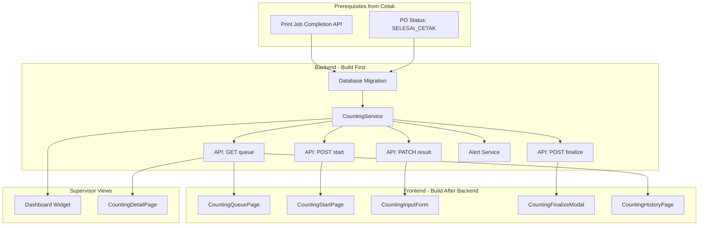

# Development Strategy: Epic 2 - Penghitungan (Counting)

---

## Phase 1: Feature Understanding

### Data yang Dikelola

- **Counting Results:** Jumlah baik, rusak, breakdown kerusakan, variance
- **Timestamps:** mulai, selesai, durasi penghitungan
- **Staff Assignment:** siapa yang menghitung
- **Status Tracking:** WAITING -> IN_PROGRESS -> COMPLETED

### Owner (Pembuat Data)

- **Staff Khazanah Awal (Counting):** Input hasil penghitungan
- **Role:** `STAFF_KHAZWAL_COUNTING`

### Consumer (Pengguna Data)

- **Supervisor Khazanah Awal:** Monitoring, approval, reporting
- **Staff Cutting:** Menerima PO untuk dipotong
- **Dashboard Analytics:** Agregasi data rusak/baik

---

## Phase 2: Cross-Frontend Impact Mapping

| Feature | Owner (Creates) | Consumer (Views) | Data Flow |

|---------|-----------------|------------------|-----------|

| View Counting Queue | Staff via `CountingQueuePage` | Staff via list | Cetak → Khazwal → Display |

| Start Counting | Staff via `CountingStartPage` | Supervisor via Dashboard | Action → Update Status → Notify |

| Input Counting Results | Staff via `CountingInputForm` | Supervisor & Cutting | Input → Validate → Store |

| Finalize Counting | Staff via Modal | Cutting Queue + Supervisor | Finalize → Status Update → Next Stage |

---

## Phase 3: Missing Implementation Detection

### Owner Side (Data Creation)

| Requirement | Status | Notes |

|-------------|--------|-------|

| UI Form/Interface | [CHECK] Defined | `CountingInputForm` di specs |

| Validation Rules | [CHECK] Defined | ±2% tolerance, >5% breakdown |

| Edit Before Finalize | [MISSING] | Tidak ada flow untuk edit |

| Delete/Cancel | [MISSING] | Tidak ada cancel counting flow |

| Preview Before Save | [PARTIAL] | Confirmation modal only |

| Bulk Operations | N/A | Single PO counting |

### Consumer Side (Data Display)

| Requirement | Status | Notes |

|-------------|--------|-------|

| Supervisor View Detail | [MISSING] | Dashboard overview saja |

| Counting History List | [MISSING] | Tidak ada history view |

| Search/Filter History | [MISSING] | Tidak disebutkan |

| Export Data | [MISSING] | Tidak disebutkan untuk counting |

| Mobile Responsive | [CHECK] Defined | Di task KW-007-FE-05 |

| Empty States | [MISSING] | Tidak disebutkan |

| Loading States | [PARTIAL] | Hanya di start counting |

### Integration Points

| Requirement | Status | Notes |

|-------------|--------|-------|

| API Endpoints | [CHECK] Defined | 4 endpoints detailed |

| Database Schema | [CHECK] Defined | `khazwal_counting_results` |

| Navigation Menu | [MISSING] | Route structure tidak jelas |

| Real-time Updates | [MISSING] | Supervisor perlu real-time |

| Notifications | [MISSING] | Alert >2jam, tapi channel? |

---

## Phase 4: Gap Analysis

### Critical Gaps (Harus di-address sebelum development)

**Gap 1: Edit Flow Before Finalize**

- Specs menyebutkan "data tidak bisa diubah setelah finalisasi"
- Tidak ada flow untuk edit/koreksi SEBELUM finalize
- **Recommendation:** Tambah `PATCH /api/khazwal/counting/{id}/result` bisa dipanggil multiple times sebelum finalize

**Gap 2: Re-print Decision Flow**

- US-KW-010 Acceptance Criteria: "Keputusan cetak ulang sudah dibuat (jika ada rusak)"
- Tidak ada User Story untuk membuat keputusan cetak ulang
- **Recommendation:** Tambah field `reprint_decision` (YES/NO/PENDING) + `reprint_quantity` di form

**Gap 3: Supervisor Detail Counting View**

- Dashboard menampilkan agregasi saja
- Supervisor perlu lihat detail per PO counting
- **Recommendation:** Tambah page `CountingDetailPage.vue` untuk supervisor

**Gap 4: Counting History Page**

- Tidak ada view untuk melihat history counting yang sudah selesai
- **Recommendation:** Tambah `CountingHistoryPage.vue` dengan filter/search

**Gap 5: Real-time Dashboard Updates**

- Supervisor dashboard membutuhkan auto-refresh
- Current spec: "Auto-refresh setiap 30 detik" (polling only)
- **Recommendation:** Consider WebSocket untuk real-time updates

---

## Phase 5: Implementation Sequencing

### Dependency Graph



### Priority Matrix

**P0 - Critical (MVP tidak berfungsi tanpa ini):**

- Database migration `khazwal_counting_results`
- API: GET counting queue
- API: POST start counting
- API: PATCH input result
- API: POST finalize
- CountingQueuePage.vue
- CountingStartPage.vue
- CountingInputForm.vue (embedded)
- CountingFinalizeModal.vue

**P1 - Important (Feature tidak lengkap tanpa ini):**

- Alert service untuk waiting >2 jam
- Defect breakdown component
- Variance reason field
- Dashboard counting widget
- Mobile responsive styling

**P2 - Enhancement (Bisa ship kemudian):**

- CountingHistoryPage.vue
- CountingDetailPage.vue (supervisor)
- Real-time WebSocket updates
- Export counting data

---

## Phase 6: Detailed Recommendations

### Backend

**New Files Needed:**

```
backend/
├── internal/
│   ├── counting/
│   │   ├── handler.go          # HTTP handlers
│   │   ├── service.go          # Business logic
│   │   ├── repository.go       # Database operations
│   │   └── model.go            # Structs
│   └── alert/
│       └── counting_alert.go   # Alert for >2h waiting
├── migrations/
│   └── 00X_create_counting_tables.sql
└── api/
    └── routes/
        └── counting.go         # Route registration
```

**API Endpoints:**

| Method | Endpoint | Purpose | Priority |

|--------|----------|---------|----------|

| GET | `/api/khazwal/counting/queue` | List PO menunggu hitung | P0 |

| GET | `/api/khazwal/counting/:id` | Detail counting record | P0 |

| POST | `/api/khazwal/counting/:po_id/start` | Mulai penghitungan | P0 |

| PATCH | `/api/khazwal/counting/:id/result` | Input/update hasil | P0 |

| POST | `/api/khazwal/counting/:id/finalize` | Finalisasi | P0 |

| GET | `/api/khazwal/counting/history` | History (filtered) | P2 |

### Frontend

**New Pages/Routes:**

| Page | Route | Purpose | Priority |

|------|-------|---------|----------|

| CountingQueuePage | `/khazwal/counting` | Daftar PO perlu dihitung | P0 |

| CountingWorkPage | `/khazwal/counting/:poId` | Start + Input + Finalize | P0 |

| CountingHistoryPage | `/khazwal/counting/history` | Riwayat counting | P2 |

| CountingDetailPage | `/supervisor/counting/:id` | Detail untuk supervisor | P2 |

**New Components:**

| Component | Used By | Priority |

|-----------|---------|----------|

| CountingQueueCard.vue | CountingQueuePage | P0 |

| CountingPrintInfo.vue | CountingWorkPage | P0 |

| CountingInputForm.vue | CountingWorkPage | P0 |

| CountingCalculation.vue | CountingWorkPage | P0 |

| DefectBreakdownForm.vue | CountingInputForm | P0 |

| CountingFinalizeModal.vue | CountingWorkPage | P0 |

| WaitingTimeAlert.vue | CountingQueueCard | P1 |

**Navigation Updates:**

```vue
// Sidebar menu untuk Staff Khazwal
{
  label: 'Penghitungan',
  icon: 'CalculatorIcon',
  children: [
    { label: 'Antrian Hitung', to: '/khazwal/counting' },
    { label: 'Riwayat', to: '/khazwal/counting/history' }
  ]
}
```

---

## Phase 7: User Journeys

### Journey 1: Staff Mulai & Selesai Counting (Primary Flow)

**Owner Journey:**

1. Staff login → Navigate ke `/khazwal/counting`
2. Melihat list PO dengan status "Menunggu Penghitungan" (FIFO sorted)
3. Klik pada PO card → Navigate ke `/khazwal/counting/:poId`
4. Melihat info cetak: Target, Mesin, Operator, Waktu
5. Klik "Mulai Penghitungan" → Status berubah IN_PROGRESS
6. Input: Jumlah Baik, Jumlah Rusak
7. Sistem auto-hitung: Total, Selisih, Persentase
8. Jika rusak >5% → Muncul DefectBreakdownForm → Input breakdown
9. Jika selisih != 0 → Input keterangan selisih
10. Klik "Selesai Penghitungan" → Modal konfirmasi
11. Review summary → Confirm → Status COMPLETED
12. Redirect ke queue → PO hilang dari list

**Consumer Journey (Supervisor):**

1. Supervisor login → Navigate ke Dashboard
2. Melihat widget "Penghitungan": Menunggu X, Sedang Y, Selesai Z
3. Melihat alert jika ada PO waiting >2 jam
4. Klik detail → Navigate ke `/supervisor/counting/:id`
5. Melihat detail: Staff, Duration, Good/Defect, Breakdown
6. Acknowledge alert jika ada

### Journey 2: Handling High Defect (>5%)

**Staff Journey:**

1. Input Jumlah Baik: 450, Jumlah Rusak: 55 (Target: 500)
2. Sistem hitung: Rusak 11% → Trigger breakdown form
3. Form DefectBreakdown muncul dengan opsi:

   - Warna pudar
   - Tinta blobor
   - Kertas sobek
   - Lainnya (input manual)

4. Staff input per jenis: Warna pudar: 30, Tinta blobor: 20, Kertas sobek: 5
5. Total breakdown = 55 (match with rusak)
6. Lanjut ke finalisasi

### Journey 3: Handling Variance (Selisih != 0)

**Staff Journey:**

1. Target: 500 lembar besar
2. Input: Baik 480, Rusak 10 → Total 490
3. Selisih: -10 (kurang dari target)
4. Field "Keterangan Selisih" muncul (required)
5. Staff input: "Ada 10 lembar jatuh saat transport"
6. Lanjut ke finalisasi

---

## File Structure Recommendation

```
frontend/src/
├── views/
│   └── khazwal/
│       └── counting/
│           ├── CountingQueuePage.vue      # List PO
│           ├── CountingWorkPage.vue       # Start + Input + Finalize
│           └── CountingHistoryPage.vue    # History view
├── components/
│   └── counting/
│       ├── CountingQueueCard.vue
│       ├── CountingPrintInfo.vue
│       ├── CountingInputForm.vue
│       ├── CountingCalculation.vue
│       ├── DefectBreakdownForm.vue
│       ├── CountingFinalizeModal.vue
│       └── WaitingTimeAlert.vue
├── composables/
│   └── useCounting.js                     # State & API calls
└── stores/
    └── countingStore.js                   # If using Pinia
```

---

## Questions Before Implementation

1. **Re-print Decision:** Siapa yang berhak memutuskan cetak ulang? Staff atau Supervisor saja?

2. **Defect Types:** Apakah jenis kerusakan predefined (dropdown) atau free-text? Jika predefined, apa saja opsinya?

3. **Cancel Flow:** Jika staff sudah start counting tapi perlu cancel (salah PO), bagaimana flownya?

4. **Photo Evidence:** Apakah perlu upload foto bukti kerusakan saat breakdown?

5. **Offline Mode:** Seberapa penting offline capability untuk counting? (Specs mention di Epic 7)