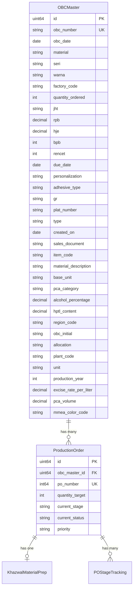

# OBC Master Table & Excel Import Implementation

## Overview

Implementasi tabel `obc_masters` yang terpisah dari `production_orders` untuk menyimpan semua data spesifikasi OBC dari SAP. Data akan di-import via Excel dengan mapping otomatis ke kolom database.

## Database Architecture



## File Structure

```
backend/
├── models/
│   ├── obc_master.go          # NEW - OBC Master model
│   ├── production_order.go    # MODIFY - Add OBCMasterID FK
│   └── ...
├── services/
│   ├── obc_import_service.go  # NEW - Excel import logic
│   └── ...
├── handlers/
│   ├── obc_handler.go         # NEW - Import endpoints
│   └── ...
└── database/
    └── models_registry.go     # MODIFY - Register OBCMaster
```

---

## Phase 1: OBC Master Model

### 1.1 Create OBC Master Model

File: `backend/models/obc_master.go`

Field mapping dari Excel SAP:

| Excel Column | Go Field | DB Column | Type | Index |

|---|---|---|---|---|

| No OBC | OBCNumber | obc_number | VARCHAR(20) | UNIQUE |

| Tgl OBC | OBCDate | obc_date | DATE | - |

| Material | Material | material | VARCHAR(50) | YES |

| SERI | Seri | seri | VARCHAR(50) | YES |

| WARNA | Warna | warna | VARCHAR(50) | YES |

| KODE_PABRIK | FactoryCode | factory_code | VARCHAR(50) | YES |

| QTY PESAN | QuantityOrdered | quantity_ordered | INT | - |

| JHT | JHT | jht | VARCHAR(100) | - |

| RPB | RPB | rpb | DECIMAL(15,2) | - |

| HJE | HJE | hje | DECIMAL(15,2) | - |

| BPB | BPB | bpb | INT | - |

| RENCET | Rencet | rencet | INT | - |

| Tgl JTempo | DueDate | due_date | DATE | - |

| Perso / non Perso | Personalization | personalization | VARCHAR(20) | - |

| Perekat | AdhesiveType | adhesive_type | VARCHAR(50) | - |

| GR | GR | gr | VARCHAR(50) | - |

| No Pelat | PlatNumber | plat_number | VARCHAR(50) | - |

| Type | Type | type | VARCHAR(50) | - |

| Created On | CreatedOn | created_on | DATE | - |

| Sales Doc. | SalesDocument | sales_document | VARCHAR(50) | - |

| Item | ItemCode | item_code | VARCHAR(50) | - |

| Material description | MaterialDescription | material_description | VARCHAR(255) | - |

| BUn | BaseUnit | base_unit | VARCHAR(20) | - |

| Gol. PCA | PCACategory | pca_category | VARCHAR(50) | - |

| Kadar Alkohol PCA | AlcoholPercentage | alcohol_percentage | DECIMAL(5,2) | - |

| Kadar HPTL | HPTLContent | hptl_content | DECIMAL(5,2) | - |

| Kode Wilayah | RegionCode | region_code | VARCHAR(20) | - |

| OBC Awal | OBCInitial | obc_initial | VARCHAR(50) | - |

| Peruntukan | Allocation | allocation | VARCHAR(255) | - |

| PESANAN | TotalOrderOBC | total_order_obc | INT | - |

| Plnt | PlantCode | plant_code | VARCHAR(10) | - |

| SATUAN | Unit | unit | VARCHAR(20) | - |

| Tahun | ProductionYear | production_year | INT | - |

| Tarif Per Liter | ExciseRatePerLiter | excise_rate_per_liter | DECIMAL(15,2) | - |

| Volume PCA | PCAVolume | pca_volume | DECIMAL(15,2) | - |

| Warna MMEA | MMEAColorCode | mmea_color_code | VARCHAR(50) | - |

Model struct dengan indexed fields untuk query optimization:

```go
type OBCMaster struct {
    ID                  uint64  `gorm:"primaryKey"`
    OBCNumber           string  `gorm:"uniqueIndex;type:varchar(20)"`
    Material            string  `gorm:"index;type:varchar(50)"`
    Seri                string  `gorm:"index;type:varchar(50)"`
    Warna               string  `gorm:"index;type:varchar(50)"`
    FactoryCode         string  `gorm:"index;type:varchar(50)"`
    // ... remaining 32 fields
    
    // Relationships
    ProductionOrders []ProductionOrder `gorm:"foreignKey:OBCMasterID"`
}
```

### 1.2 Modify Production Order Model

File: `backend/models/production_order.go`

Changes:

- Remove `OBCNumber` field (now in OBCMaster)
- Add `OBCMasterID` foreign key
- Add `OBCMaster` relationship
- Keep production-specific fields only
```go
type ProductionOrder struct {
    // ... existing fields
    OBCMasterID uint64     `gorm:"index;not null"`
    OBCMaster   *OBCMaster `gorm:"foreignKey:OBCMasterID"`
    // Remove: OBCNumber, SAPCustomerCode, SAPProductCode, ProductName
    // These now come from OBCMaster relationship
}
```


---

## Phase 2: Excel Import Service

### 2.1 Install Dependencies

```bash
cd backend && go get github.com/xuri/excelize/v2
```

### 2.2 Create Import Service

File: `backend/services/obc_import_service.go`

Key features:

- Parse Excel file dengan column header mapping
- Validate required fields
- Handle date format conversion (Excel serial date)
- Upsert logic (update if OBC exists, create if new)
- Transaction-based untuk rollback on error
- Progress tracking untuk large files
- Generate PO dari OBC dengan formula: `Total = QTY + (QTY * 6%)`, `PO Count = CEIL(Total / 40000)`
```go
type OBCImportService struct {
    db *gorm.DB
}

// Column mapping dari Excel header ke struct field
var excelColumnMapping = map[string]string{
    "No OBC":            "OBCNumber",
    "Tgl OBC":           "OBCDate",
    "Material":          "Material",
    "SERI":              "Seri",
    "WARNA":             "Warna",
    // ... all 39 columns
}

func (s *OBCImportService) ImportFromExcel(file io.Reader) (*ImportResult, error)
func (s *OBCImportService) GeneratePOsFromOBC(obcID uint64) ([]ProductionOrder, error)
```


### 2.3 Import Result Structure

```go
type ImportResult struct {
    TotalRows     int      `json:"total_rows"`
    SuccessCount  int      `json:"success_count"`
    FailedCount   int      `json:"failed_count"`
    FailedRows    []FailedRow `json:"failed_rows"`
    POsGenerated  int      `json:"pos_generated"`
}

type FailedRow struct {
    RowNumber int    `json:"row_number"`
    OBCNumber string `json:"obc_number"`
    Error     string `json:"error"`
}
```

---

## Phase 3: API Endpoints

### 3.1 Create Handler

File: `backend/handlers/obc_handler.go`

Endpoints:

- `POST /api/obc/import` - Upload Excel file untuk import
- `GET /api/obc` - List OBC dengan pagination & filter
- `GET /api/obc/:id` - Detail OBC dengan POs
- `POST /api/obc/:id/generate-po` - Generate PO dari OBC (manual trigger)

### 3.2 Update Routes

File: `backend/routes/routes.go`

```go
// OBC Routes (Admin/PPIC only)
obcRoutes := api.Group("/obc")
obcRoutes.Use(middleware.AuthRequired())
obcRoutes.Use(middleware.RoleRequired("ADMIN", "PPIC"))
{
    obcRoutes.POST("/import", obcHandler.Import)
    obcRoutes.GET("", obcHandler.List)
    obcRoutes.GET("/:id", obcHandler.Detail)
    obcRoutes.POST("/:id/generate-po", obcHandler.GeneratePO)
}
```

---

## Phase 4: Migration Strategy

### 4.1 Register Model

File: `backend/database/models_registry.go`

```go
// Register OBCMaster BEFORE ProductionOrder (dependency order)
registry.Register(&models.OBCMaster{}, "obc_masters")
registry.Register(&models.ProductionOrder{}, "production_orders")
```

### 4.2 Data Migration Script

Untuk existing data di `production_orders`:

1. Create temporary OBCMaster records dari existing OBC data
2. Link ProductionOrders ke OBCMaster via foreign key
3. Remove duplicate OBC columns dari ProductionOrder

---

## Phase 5: Service Layer Updates

### 5.1 Update Khazwal Service

File: `backend/services/khazwal_service.go`

Update queries untuk include OBCMaster relationship:

```go
// Update preload untuk include OBCMaster
query.Preload("OBCMaster")

// Update search untuk search across OBCMaster fields
query.Joins("LEFT JOIN obc_masters ON obc_masters.id = production_orders.obc_master_id").
    Where("obc_masters.obc_number LIKE ? OR obc_masters.material LIKE ? OR obc_masters.seri LIKE ?", ...)
```

### 5.2 Update Cetak Service

File: `backend/services/cetak_service.go`

Similar updates untuk preload OBCMaster data.

---

## Implementation Order

1. **Phase 1** - Create OBCMaster model, modify ProductionOrder model
2. **Phase 2** - Install excelize, create import service
3. **Phase 3** - Create handler & routes
4. **Phase 4** - Register models, run migration
5. **Phase 5** - Update existing services dengan new relationships
6. **Testing** - Test import dengan sample Excel file

---

## Testing Checklist

- [ ] OBCMaster CRUD operations
- [ ] Excel import dengan valid data
- [ ] Excel import dengan missing required fields
- [ ] Excel import dengan duplicate OBC (upsert)
- [ ] PO generation dari OBC
- [ ] Khazwal queue dengan OBCMaster preload
- [ ] Cetak queue dengan OBCMaster preload
- [ ] Filter by Material, Seri, Warna, Kode Pabrik