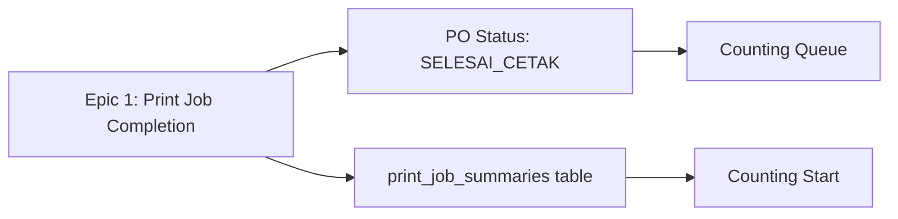
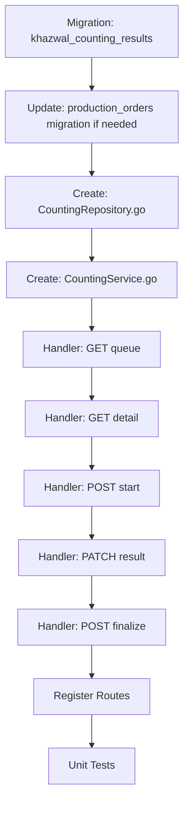
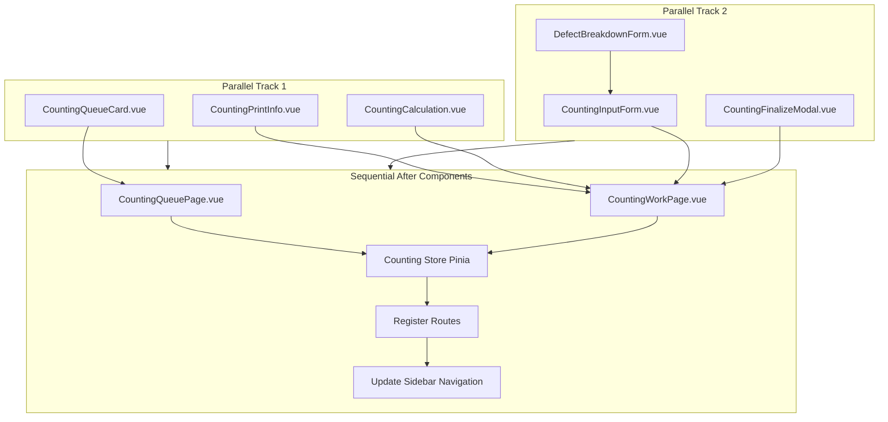

# Implementasi P0: Epic 2 Penghitungan (Counting)

## Executive Summary

Dokumen ini merupakan detailed implementation strategy untuk P0 (Critical) items dari Epic 2 Penghitungan yang HARUS dibangun agar MVP counting feature berfungsi. Tanpa items ini, staff tidak dapat melakukan proses penghitungan hasil cetak.

## Scope P0 (Minimum Viable Product)

### Backend

1. Database migration: `khazwal_counting_results` table
2. API Endpoint: `GET /api/khazwal/counting/queue`
3. API Endpoint: `GET /api/khazwal/counting/:id`
4. API Endpoint: `POST /api/khazwal/counting/:po_id/start`
5. API Endpoint: `PATCH /api/khazwal/counting/:id/result`
6. API Endpoint: `POST /api/khazwal/counting/:id/finalize`

### Frontend

1. Page: `CountingQueuePage.vue` - List PO menunggu penghitungan
2. Page: `CountingWorkPage.vue` - Start + Input + Finalize dalam satu flow
3. Component: `CountingQueueCard.vue` - Card item di queue
4. Component: `CountingPrintInfo.vue` - Display info cetak
5. Component: `CountingInputForm.vue` - Form input hasil
6. Component: `CountingCalculation.vue` - Real-time calculation display
7. Component: `DefectBreakdownForm.vue` - Input breakdown kerusakan
8. Component: `CountingFinalizeModal.vue` - Confirmation modal

## Prerequisites & Dependencies

### Dependencies from Previous Epics



**Critical:** Counting feature TIDAK BISA dimulai jika:

- Belum ada PO dengan status `SELESAI_CETAK`
- Table `print_job_summaries` belum ada atau kosong
- Field `finalized_at` di `print_job_summaries` NULL

### Tech Stack Verification

- **Backend:** Go (fiber framework assumed)
- **Database:** PostgreSQL 14+
- **Frontend:** Vue 3 + Composition API
- **State Management:** Pinia (assumed)
- **Routing:** Vue Router
- **HTTP Client:** Axios
- **Animation:** Motion-V (per design standard)

## Phase 1: Feature Understanding - P0 Items Only

### US-KW-007: View Counting Queue (P0)

**Data Created:** None (read-only)

**Owner:** Staff Khazwal (views queue)

**Consumer:** Staff Khazwal (works from queue)

**Primary Goal:** Staff dapat melihat PO mana yang perlu dihitung berdasarkan FIFO

**Data Flow:**

```
Print Job Finalized → PO Status = WAITING_COUNTING → Counting Queue → Display to Staff
```

### US-KW-008: Start Counting (P0)

**Data Created:**

- Record di `khazwal_counting_results` dengan status `IN_PROGRESS`
- Update `production_orders.current_status` = `SEDANG_DIHITUNG`
- Insert ke `po_stage_tracking` dengan `started_at` timestamp

**Owner:** Staff Khazwal (starts counting)

**Consumer:** Supervisor (monitors via dashboard), System (tracks progress)

**Primary Goal:** Tracking mulai penghitungan dengan timestamp akurat

**Data Flow:**

```
Staff clicks "Mulai" → Create counting record → Update PO status → Log activity → Display input form
```

### US-KW-009: Input Counting Result (P0)

**Data Created:**

- `quantity_good`, `quantity_defect` di `khazwal_counting_results`
- Auto-calculated: `total_counted`, `variance_from_target`, `percentage_good`, `percentage_defect`
- Optional: `defect_breakdown` (JSONB), `variance_reason` (TEXT)

**Owner:** Staff Khazwal (inputs results)

**Consumer:** Supervisor (reviews), Cutting Staff (uses good quantity), Dashboard (analytics)

**Primary Goal:** Capture akurat jumlah baik dan rusak dengan breakdown jika diperlukan

**Data Flow:**

```
Staff inputs numbers → Real-time calculation → Conditional breakdown form → Update counting record → Enable finalize
```

### US-KW-010: Finalize Counting (P0)

**Data Created:**

- Update `khazwal_counting_results.status` = `COMPLETED`
- Set `completed_at` timestamp, calculate `duration_minutes`
- Update `production_orders.current_status` = `SIAP_POTONG`
- Update `po_stage_tracking.completed_at`
- Create `activity_logs` entry (immutable)

**Owner:** Staff Khazwal (finalizes)

**Consumer:** Cutting Staff (receives PO in cutting queue), Supervisor (views completed), Audit Trail

**Primary Goal:** Lock data dan advance PO ke stage berikutnya

**Data Flow:**

```
Staff clicks "Selesai" → Validation → Confirmation modal → Update all tables → Redirect to queue
```

## Phase 2: Cross-Frontend Impact Mapping

| Feature | Owner (Creates Data) | Consumer (Views Data) | Frontend Affected | Data Flow |

|---------|---------------------|----------------------|-------------------|-----------|

| View Queue | N/A (Read-only) | Staff Khazwal | Khazwal Frontend | Query → Display List |

| Start Counting | Staff via CountingWorkPage | System (tracking) | Khazwal Frontend | Click → API → Status Update |

| Input Results | Staff via CountingInputForm | Dashboard, Cutting | Khazwal Frontend, Dashboard, Cutting Frontend | Input → Calculate → Store |

| Finalize | Staff via Modal | Cutting Staff, Supervisor | Khazwal Frontend, Cutting Frontend, Dashboard | Confirm → Lock → Next Stage |

### Missing Consumer Implementations (NOT P0, flagged for future)

⚠️ **Supervisor Detail View:** Supervisor dapat melihat agregasi di dashboard, tapi TIDAK ADA detail page per counting record

⚠️ **Cutting Queue Integration:** Cutting frontend belum defined, PO "Siap Potong" belum ada interface

⚠️ **Dashboard Real-time Widget:** Dashboard counting widget disebutkan tapi belum di-spec

## Phase 3: Missing Implementation Detection

### P0 Owner Side Checklist

| Requirement | Status | Notes |

|-------------|--------|-------|

| UI form for creating data | ✅ P0 | CountingInputForm |

| Validation rules | ✅ P0 | Backend + Frontend |

| Edit before finalize | ⚠️ CLARIFICATION NEEDED | Apakah PATCH result bisa dipanggil multiple times? |

| Delete/Cancel counting | ❌ NOT P0 | Akan di Epic 2 enhancement |

| Preview before finalize | ✅ P0 | Finalize modal shows summary |

| Bulk operations | N/A | Counting is always per PO |

### P0 Consumer Side Checklist

| Requirement | Status | Notes |

|-------------|--------|-------|

| Where to VIEW data | ⚠️ PARTIAL | Dashboard aggregate only, no detail page (NOT P0) |

| How to FIND data | ✅ P0 | Queue page (FIFO sorted) |

| What to DO with data | ✅ P0 | Input, calculate, finalize |

| Mobile responsive | ✅ P0 | Task KW-007-FE-05 |

| Empty states | ✅ P0 | "Tidak ada PO menunggu" |

| Loading states | ✅ P0 | Skeleton loaders |

### P0 Integration Points Checklist

| Requirement | Status | Notes |

|-------------|--------|-------|

| API endpoints | ✅ P0 | 5 endpoints defined |

| Database schema | ✅ P0 | khazwal_counting_results |

| Navigation menu | ✅ P0 | Add "Penghitungan" to sidebar |

| State management | ✅ P0 | Pinia store for counting |

| Search/filter | ❌ NOT P0 | Basic FIFO list only |

| Real-time updates | ❌ NOT P0 | Polling only (30s) |

## Phase 4: Gap Analysis & Clarifications Needed

### Critical Gaps (Must Address Before Implementation)

**Gap 1: Edit Flow Specification**

- **Issue:** Spec says "data tidak bisa diubah setelah finalisasi" tapi tidak jelas apakah bisa edit SEBELUM finalize
- **Question:** Apakah staff bisa update hasil (PATCH result) multiple times sebelum finalize?
- **Recommendation:** P0 should allow multiple PATCH calls before finalize, data locked ONLY after finalize
- **Implementation:** Backend validate status = IN_PROGRESS, reject if COMPLETED

**Gap 2: Defect Type Dropdown**

- **Issue:** Spec mention "breakdown jenis kerusakan" tapi tidak specify apakah predefined list atau free text
- **Question:** Apakah jenis kerusakan dari dropdown atau input manual?
- **Recommendation:** P0 use predefined list + "Lainnya" option dengan text input
- **Predefined List:**
  - Warna pudar
  - Tinta blobor
  - Kertas sobek
  - Register tidak pas
  - Lainnya (free text)

**Gap 3: Tolerance Validation UX**

- **Issue:** Spec says "toleransi ±2%" tapi tidak jelas bagaimana UX jika diluar toleransi
- **Question:** Jika variance >2%, apakah blocking (tidak bisa finalize) atau warning saja?
- **Recommendation:** P0 show warning, require `variance_reason`, but allow finalize (business decision)

**Gap 4: Navigation Structure**

- **Issue:** Route structure tidak jelas, terutama transition dari queue ke work page
- **Question:** Apakah CountingWorkPage route terpisah atau modal?
- **Recommendation:** Separate page `/khazwal/counting/:poId` untuk better UX dan deep linking

## Phase 5: Implementation Sequencing

### Backend Build Order (Sequential)



**Estimated Time:** 2-3 days backend dev

### Frontend Build Order (Parallel Possible)



**Estimated Time:** 3-4 days frontend dev (if 1 developer, can be parallel with 2 devs)

## Phase 6: Detailed Implementation Recommendations

### Backend Structure

```
backend/internal/counting/
├── handler.go          # HTTP handlers (5 endpoints)
├── service.go          # Business logic
├── repository.go       # Database operations
├── model.go           # Struct definitions
└── validator.go       # Input validation

backend/migrations/
└── 00X_create_counting_tables.sql

backend/internal/routes/
└── counting.go        # Route registration
```

### Backend API Specifications

#### 1. GET /api/khazwal/counting/queue

**Purpose:** Fetch list of POs ready for counting (FIFO)

**Query Params:**

- `machine_id` (optional): Filter by machine
- `date_from` (optional): Filter by print completion date
- `date_to` (optional): Filter by print completion date

**Response:**

```json
{
  "data": [
    {
      "po_id": 123,
      "po_number": 1234567890,
      "obc_number": "OBC123456",
      "target_quantity": 500,
      "print_completed_at": "2025-12-30T14:30:00+07:00",
      "waiting_minutes": 125,
      "is_overdue": false,
      "machine": {
        "id": 5,
        "name": "MC-01",
        "code": "MC-01"
      },
      "operator": {
        "id": 10,
        "name": "John Doe",
        "nip": "12345"
      }
    }
  ],
  "meta": {
    "total": 5,
    "overdue_count": 2
  }
}
```

**Business Logic:**

- Query PO dengan `current_stage = 'KHAZWAL_COUNTING'` AND `current_status = 'WAITING_COUNTING'`
- Join dengan `print_job_summaries` untuk data mesin & operator
- Calculate `waiting_minutes` = NOW - finalized_at
- Flag `is_overdue` jika waiting > 120 menit
- Sort by `finalized_at` ASC (FIFO)

**Priority:** P0

---

#### 2. GET /api/khazwal/counting/:id

**Purpose:** Get detail of a specific counting record (for resume/view)

**Response:**

```json
{
  "data": {
    "id": 456,
    "production_order_id": 123,
    "status": "IN_PROGRESS",
    "started_at": "2025-12-30T15:00:00+07:00",
    "quantity_good": 480,
    "quantity_defect": 15,
    "total_counted": 495,
    "variance_from_target": -5,
    "percentage_good": 96.97,
    "percentage_defect": 3.03,
    "defect_breakdown": [
      {"type": "Warna pudar", "quantity": 10},
      {"type": "Tinta blobor", "quantity": 5}
    ],
    "variance_reason": "Tumpah saat transport",
    "counted_by": {
      "id": 20,
      "name": "Jane Doe",
      "nip": "54321"
    },
    "po": {
      "po_number": 1234567890,
      "obc_number": "OBC123456",
      "target_quantity": 500
    },
    "print_info": {
      "machine_name": "MC-01",
      "operator_name": "John Doe",
      "finalized_at": "2025-12-30T14:30:00+07:00"
    }
  }
}
```

**Priority:** P0

---

#### 3. POST /api/khazwal/counting/:po_id/start

**Purpose:** Start counting process for a PO

**Request Body:**

```json
{}  // Empty body, user from auth token
```

**Response:**

```json
{
  "data": {
    "id": 456,
    "production_order_id": 123,
    "status": "IN_PROGRESS",
    "started_at": "2025-12-30T15:00:00+07:00",
    "counted_by": 20
  },
  "message": "Penghitungan berhasil dimulai"
}
```

**Business Logic:**

1. Validate PO exists dan status = `WAITING_COUNTING`
2. Check tidak ada counting record lain dengan status IN_PROGRESS untuk PO ini
3. Insert ke `khazwal_counting_results`:

   - `status = 'IN_PROGRESS'`
   - `started_at = NOW()`
   - `counted_by = auth.user_id`

4. Update `production_orders.current_status = 'SEDANG_DIHITUNG'`
5. Update `po_stage_tracking` set `started_at` untuk stage KHAZWAL_COUNTING
6. Log to `activity_logs`

**Error Cases:**

- 404: PO not found
- 400: PO not ready for counting (wrong status)
- 409: Counting already in progress

**Priority:** P0

---

#### 4. PATCH /api/khazwal/counting/:id/result

**Purpose:** Update counting results (can be called multiple times before finalize)

**Request Body:**

```json
{
  "quantity_good": 480,
  "quantity_defect": 15,
  "defect_breakdown": [
    {"type": "Warna pudar", "quantity": 10},
    {"type": "Tinta blobor", "quantity": 5}
  ],
  "variance_reason": "Tumpah saat transport"
}
```

**Validation Rules:**

- `quantity_good` >= 0
- `quantity_defect` >= 0
- If `defect_percentage` > 5%, `defect_breakdown` required dan sum must equal `quantity_defect`
- If `variance_from_target` != 0, `variance_reason` required
- Status must be `IN_PROGRESS` (locked if COMPLETED)

**Response:**

```json
{
  "data": {
    "id": 456,
    "quantity_good": 480,
    "quantity_defect": 15,
    "total_counted": 495,
    "variance_from_target": -5,
    "percentage_good": 96.97,
    "percentage_defect": 3.03,
    "defect_breakdown": [...],
    "variance_reason": "..."
  },
  "message": "Hasil penghitungan berhasil disimpan"
}
```

**Business Logic:**

1. Validate counting record exists dan status = IN_PROGRESS
2. Calculate auto fields:

   - `total_counted = good + defect`
   - `variance_from_target = total_counted - target`
   - `percentage_good = (good / total_counted) * 100`
   - `percentage_defect = (defect / total_counted) * 100`

3. Validate business rules
4. Update database
5. Return updated data dengan calculations

**Priority:** P0

---

#### 5. POST /api/khazwal/counting/:id/finalize

**Purpose:** Finalize counting (lock data, advance to next stage)

**Request Body:**

```json
{}  // Empty, all data already in counting record
```

**Response:**

```json
{
  "data": {
    "id": 456,
    "status": "COMPLETED",
    "completed_at": "2025-12-30T15:30:00+07:00",
    "duration_minutes": 30
  },
  "message": "Penghitungan berhasil diselesaikan. PO siap untuk pemotongan."
}
```

**Business Logic:**

1. Validate counting record exists dan status = IN_PROGRESS
2. Validate all required fields filled:

   - `quantity_good` and `quantity_defect` not NULL
   - If defect > 5%, `defect_breakdown` filled
   - If variance != 0, `variance_reason` filled

3. Update `khazwal_counting_results`:

   - `status = 'COMPLETED'`
   - `completed_at = NOW()`
   - `duration_minutes = (completed_at - started_at) in minutes`

4. Update `production_orders`:

   - `current_stage = 'KHAZWAL_CUTTING'`
   - `current_status = 'SIAP_POTONG'`

5. Update `po_stage_tracking` set `completed_at` untuk stage KHAZWAL_COUNTING
6. Create immutable `activity_logs` entry
7. Return success

**Error Cases:**

- 400: Required fields not filled
- 400: Status not IN_PROGRESS (already finalized)
- 422: Business validation failed

**Priority:** P0

---

### Frontend Structure

```
frontend/src/
├── views/khazwal/counting/
│   ├── CountingQueuePage.vue      # List view
│   └── CountingWorkPage.vue       # Work flow (start + input + finalize)
│
├── components/counting/
│   ├── CountingQueueCard.vue      # Queue item card
│   ├── CountingPrintInfo.vue      # Display print job info
│   ├── CountingInputForm.vue      # Main input form
│   ├── CountingCalculation.vue    # Real-time calculation display
│   ├── DefectBreakdownForm.vue    # Breakdown input
│   └── CountingFinalizeModal.vue  # Finalize confirmation
│
├── stores/
│   └── countingStore.js           # Pinia store
│
└── composables/
    └── useCounting.js             # Composable for API calls & logic
```

### Frontend Page Specifications

#### CountingQueuePage.vue

**Route:** `/khazwal/counting`

**Purpose:** Display FIFO list of POs waiting for counting

**Layout:**

```
┌─────────────────────────────────────────┐
│  [🏠] Penghitungan                      │
│  ┌─────────────────────────────────┐   │
│  │ 🔍 Filter (collapsed by default)│   │
│  └─────────────────────────────────┘   │
│                                         │
│  ┌─────────────────────────────────┐   │
│  │ [CountingQueueCard] - PO 123    │   │
│  │ ⚠️ Menunggu 2.5 jam              │   │
│  └─────────────────────────────────┘   │
│  ┌─────────────────────────────────┐   │
│  │ [CountingQueueCard] - PO 124    │   │
│  │ ✅ Menunggu 45 menit             │   │
│  └─────────────────────────────────┘   │
│  ...                                    │
│                                         │
│  [Empty State if no PO]                 │
└─────────────────────────────────────────┘
```

**Key Features:**

- Auto-refresh every 30 seconds (polling)
- Visual indicator for overdue (>2 hours)
- Click card → Navigate to `/khazwal/counting/:poId`
- Mobile responsive (stacked cards)
- Loading skeleton while fetching

**Animation (Motion-V):**

- Page entrance: `fadeUp`
- Card stagger: `delay: index * 0.05`

**Priority:** P0

---

#### CountingWorkPage.vue

**Route:** `/khazwal/counting/:poId`

**Purpose:** Complete counting workflow in one page (start → input → finalize)

**Layout States:**

**State 1: Before Start**

```
┌─────────────────────────────────────────┐
│  [← Back] PO 1234567890                 │
│                                         │
│  [CountingPrintInfo]                    │
│  - Target: 500 lembar besar            │
│  - Mesin: MC-01                        │
│  - Operator: John Doe                  │
│  - Waktu Cetak: 30 Des 14:30          │
│                                         │
│  [Button: Mulai Penghitungan] ────────►│
└─────────────────────────────────────────┘
```

**State 2: Input Form (After Start)**

```
┌─────────────────────────────────────────┐
│  [← Back] PO 1234567890                 │
│  Status: Sedang Dihitung (30 menit)     │
│                                         │
│  [CountingPrintInfo] (collapsed)        │
│                                         │
│  [CountingInputForm]                    │
│  Input Hasil Penghitungan              │
│  ┌─────────────────────────────────┐   │
│  │ Jumlah Baik: [____480_____] 📱│   │
│  │ Jumlah Rusak: [_____15_____] 📱│   │
│  └─────────────────────────────────┘   │
│                                         │
│  [CountingCalculation] (real-time)      │
│  Total: 495 | Selisih: -5 (-1%)       │
│  Baik: 96.97% | Rusak: 3.03%           │
│                                         │
│  [DefectBreakdownForm] (if rusak >5%)   │
│                                         │
│  [Input: Keterangan Selisih] (if !=0)  │
│                                         │
│  [Button: Selesai Penghitungan] ───────►│
└─────────────────────────────────────────┘
```

**State 3: Finalize Modal**

```
┌─────────────────────────────────────────┐
│  [Modal: Konfirmasi Finalisasi]        │
│                                         │
│  ⚠️ Data tidak bisa diubah setelah     │
│  finalisasi. Pastikan semua benar.     │
│                                         │
│  Ringkasan:                            │
│  - Baik: 480 (96.97%)                  │
│  - Rusak: 15 (3.03%)                   │
│  - Total: 495                          │
│  - Selisih: -5 lembar                  │
│  - Kerusakan: Warna pudar (10), ...    │
│  - Alasan Selisih: Tumpah saat...     │
│                                         │
│  [Batal]  [Selesaikan Penghitungan]   │
└─────────────────────────────────────────┘
```

**Key Features:**

- State management: Handle 3 states (before start, input, finalize)
- Auto-save input results (debounced PATCH calls)
- Real-time calculation as user types
- Conditional rendering (defect breakdown, variance reason)
- Mobile-optimized input fields (large touch targets)
- Loading states for all API calls

**Animation (Motion-V):**

- Page transition: `fadeUp`
- Form sections: `fadeScale` with stagger
- Modal: `popIn` for icon, `fadeScale` for container

**Priority:** P0

---

### Component Specifications

#### CountingQueueCard.vue

**Props:**

```javascript
{
  po: Object,  // Queue item dari API
}
```

**Template Structure:**

```vue
<Motion v-bind="entranceAnimations.fadeUp">
  <div class="glass-card p-4 cursor-pointer active-scale">
    <!-- Header: PO Number + OBC -->
    <div class="flex justify-between">
      <h3>PO {{ po.po_number }}</h3>
      <span class="badge">{{ po.obc_number }}</span>
    </div>
    
    <!-- Stats Grid -->
    <div class="grid grid-cols-2 gap-3 mt-3">
      <div>
        <p class="text-sm text-gray-500">Target</p>
        <p class="font-semibold">{{ po.target_quantity }} LB</p>
      </div>
      <div>
        <p class="text-sm text-gray-500">Mesin</p>
        <p class="font-semibold">{{ po.machine.name }}</p>
      </div>
    </div>
    
    <!-- Waiting Time Alert -->
    <div v-if="po.is_overdue" class="alert alert-warning mt-3">
      ⚠️ Menunggu {{ formatWaitingTime(po.waiting_minutes) }}
    </div>
    <div v-else class="text-gray-500 text-sm mt-2">
      Menunggu {{ formatWaitingTime(po.waiting_minutes) }}
    </div>
  </div>
</Motion>
```

**Priority:** P0

---

#### CountingInputForm.vue

**Props:**

```javascript
{
  modelValue: Object,  // { quantity_good, quantity_defect, ... }
  target: Number,
  isLoading: Boolean,
}
```

**Emits:**

```javascript
{
  'update:modelValue': Object,
}
```

**Key Features:**

- Large input fields (min 56px height for mobile)
- Number keyboard on mobile (`inputmode="numeric"`)
- Validation: tidak boleh negatif
- Debounced emit (500ms)

**Priority:** P0

---

#### DefectBreakdownForm.vue

**Props:**

```javascript
{
  modelValue: Array,  // [{ type, quantity }]
  totalDefect: Number,
}
```

**Template Structure:**

```vue
<div class="bg-red-50 p-4 rounded-lg border border-red-200">
  <h4 class="text-red-800 font-semibold mb-3">
    Breakdown Kerusakan (Wajib karena rusak >5%)
  </h4>
  
  <div v-for="(item, index) in defectTypes" :key="index" class="mb-3">
    <label>{{ item.label }}</label>
    <input 
      type="number" 
      v-model.number="breakdown[item.type]"
      class="input-field"
      :disabled="item.type === 'Lainnya' && !showOther"
    />
  </div>
  
  <div class="mt-3 p-3 bg-white rounded">
    <p class="text-sm">Total: {{ sumBreakdown }} / {{ totalDefect }}</p>
    <p v-if="sumBreakdown !== totalDefect" class="text-red-600 text-sm">
      ⚠️ Total breakdown harus sama dengan jumlah rusak
    </p>
  </div>
</div>
```

**Predefined Types:**

```javascript
const defectTypes = [
  { type: 'Warna pudar', label: 'Warna Pudar' },
  { type: 'Tinta blobor', label: 'Tinta Blobor' },
  { type: 'Kertas sobek', label: 'Kertas Sobek' },
  { type: 'Register tidak pas', label: 'Register Tidak Pas' },
  { type: 'Lainnya', label: 'Lainnya' },
]
```

**Priority:** P0

---

## Phase 7: User Journeys (P0 Only)

### Journey 1: Staff Completes Full Counting Flow (Happy Path)

**Step 1: View Queue**

1. Staff login dengan NIP: `12345`
2. Sidebar → Click "Penghitungan"
3. Navigate to `/khazwal/counting`
4. Page loads → API call `GET /api/khazwal/counting/queue`
5. Sees 3 PO cards, sorted FIFO
6. First PO (PO 1234567890) has ⚠️ warning (waiting 2.5 hours)

**Step 2: Start Counting**

7. Click on PO card
8. Navigate to `/khazwal/counting/:poId`
9. Sees print info: Target 500 LB, Mesin MC-01, Operator John Doe
10. Click "Mulai Penghitungan" button
11. API call `POST /api/khazwal/counting/:po_id/start`
12. Loading state → Success
13. Page updates: Shows input form, status "Sedang Dihitung"

**Step 3: Input Results**

14. Focus on "Jumlah Baik" input → Number keyboard appears (mobile)
15. Types: `480` → CountingCalculation updates real-time
16. Focus on "Jumlah Rusak" input
17. Types: `15` → Calculation shows: Rusak 3.03%
18. System shows "Total: 495, Selisih: -5 (-1%)"
19. Because selisih != 0, "Keterangan Selisih" field appears
20. Types: "Ada 5 lembar jatuh saat transport dari Unit Cetak"
21. Auto-save triggers → API call `PATCH /api/khazwal/counting/:id/result`
22. Success feedback (subtle animation)

**Step 4: Finalize**

23. Click "Selesai Penghitungan" button
24. Modal appears with summary
25. Reviews: Baik 480, Rusak 15, Selisih -5, Alasan terisi
26. Click "Selesaikan Penghitungan"
27. API call `POST /api/khazwal/counting/:id/finalize`
28. Loading → Success
29. Toast: "Penghitungan berhasil diselesaikan. PO siap untuk pemotongan."
30. Redirect to `/khazwal/counting` (queue page)
31. PO 1234567890 no longer in queue

**Total Time:** ~3-5 minutes

---

### Journey 2: Staff Handles High Defect (>5%)

**Context:** PO 9999999, Target 500, Staff finds 50 defect (10%)

**Steps 1-13:** Same as Journey 1

**Step 14:** Input Baik: `450`, Rusak: `50`

**Step 15:** System calculates: Rusak 10% → **Triggers defect breakdown requirement**

**Step 16:** DefectBreakdownForm appears (red background, prominent)

**Step 17:** Staff inputs breakdown:

- Warna pudar: `30`
- Tinta blobor: `15`
- Kertas sobek: `5`

**Step 18:** System validates: Sum = 50 ✅ (matches total defect)

**Step 19:** Auto-save triggers with breakdown data

**Step 20-31:** Continue to finalize (same as Journey 1)

---

### Journey 3: Staff Needs to Edit Before Finalize

**Context:** Staff realizes they made typo, needs to correct

**Steps 1-22:** (Already input 480 baik, 15 rusak, saved)

**Step 23:** Staff notices mistake: Should be 485 baik, 10 rusak

**Step 24:** Changes "Jumlah Baik" to `485`

**Step 25:** Changes "Jumlah Rusak" to `10`

**Step 26:** Calculation updates: Total 495, Selisih -5

**Step 27:** Because rusak now 2% (<5%), DefectBreakdownForm hides automatically

**Step 28:** Auto-save triggers → `PATCH /api/khazwal/counting/:id/result` (2nd call)

**Step 29:** Success → Proceeds to finalize

**Note:** This confirms PATCH can be called multiple times before finalize

---

## File Structure Summary

### Backend Files to Create

```
backend/
├── internal/counting/
│   ├── handler.go         # ~300 lines (5 endpoints + helpers)
│   ├── service.go         # ~400 lines (business logic)
│   ├── repository.go      # ~250 lines (DB queries)
│   ├── model.go          # ~150 lines (structs + validation)
│   └── validator.go      # ~100 lines (custom validations)
│
├── migrations/
│   └── 00X_create_khazwal_counting_results.sql  # ~80 lines
│
└── internal/routes/
    └── counting.go       # ~50 lines (route registration)
```

**Total Backend Estimate:** ~1,330 lines

---

### Frontend Files to Create

```
frontend/src/
├── views/khazwal/counting/
│   ├── CountingQueuePage.vue      # ~200 lines
│   └── CountingWorkPage.vue       # ~350 lines (state management)
│
├── components/counting/
│   ├── CountingQueueCard.vue      # ~120 lines
│   ├── CountingPrintInfo.vue      # ~100 lines
│   ├── CountingInputForm.vue      # ~180 lines
│   ├── CountingCalculation.vue    # ~150 lines
│   ├── DefectBreakdownForm.vue    # ~200 lines
│   └── CountingFinalizeModal.vue  # ~180 lines
│
├── stores/
│   └── countingStore.js           # ~250 lines (Pinia)
│
└── composables/
    └── useCounting.js             # ~200 lines (API calls)
```

**Total Frontend Estimate:** ~1,930 lines

---

## Testing Strategy

### Backend Tests

```
backend/internal/counting/
├── handler_test.go      # Integration tests untuk 5 endpoints
├── service_test.go      # Unit tests untuk business logic
├── repository_test.go   # DB tests dengan mock/testdb
└── validator_test.go    # Validation rule tests
```

**Critical Test Cases:**

1. Start counting when PO not ready → 400 error
2. Start counting when already in progress → 409 error
3. PATCH result with invalid data (negative numbers) → 400 error
4. PATCH result when status COMPLETED → 400 error (locked)
5. Defect > 5% without breakdown → 422 error
6. Variance != 0 without reason → 422 error
7. Finalize when required fields missing → 400 error
8. Finalize success → PO status updated to SIAP_POTONG
9. Calculate percentages correctly
10. Calculate duration correctly

**Estimated Test Lines:** ~800 lines

---

### Frontend Tests (Optional for MVP)

```
frontend/src/components/counting/__tests__/
├── CountingInputForm.spec.js
├── CountingCalculation.spec.js
└── DefectBreakdownForm.spec.js
```

**Critical Test Cases:**

1. Input validation (no negative numbers)
2. Real-time calculation accuracy
3. Conditional rendering (breakdown, variance reason)
4. Defect breakdown sum validation
5. Auto-save debounce
6. Modal confirmation flow

---

## Integration Checklist

### Pre-Development

- [ ] Confirm backend tech stack (Go + Fiber?)
- [ ] Confirm database schema alignment with `Database_Architecture.md`
- [ ] Setup development database with test data
- [ ] Clarify edit flow (multiple PATCH before finalize?)
- [ ] Finalize defect types (dropdown vs free text?)
- [ ] Decide tolerance validation UX (warning vs blocking?)

### Backend Development

- [ ] Create migration file
- [ ] Run migration (dev & staging)
- [ ] Implement CountingRepository
- [ ] Implement CountingService
- [ ] Implement 5 HTTP handlers
- [ ] Register routes
- [ ] Write unit tests (aim for >80% coverage)
- [ ] Test API with Postman/curl
- [ ] Document API in Swagger/OpenAPI (optional)

### Frontend Development

- [ ] Create 6 components
- [ ] Create 2 pages
- [ ] Create Pinia store
- [ ] Create composable for API calls
- [ ] Register routes in router
- [ ] Add navigation menu item to sidebar
- [ ] Test on desktop browser
- [ ] Test on mobile viewport
- [ ] Test input validation
- [ ] Test auto-save
- [ ] Test modal flow

### Integration Testing

- [ ] End-to-end test: Complete counting flow
- [ ] Test defect breakdown scenario
- [ ] Test variance scenario
- [ ] Test edit before finalize
- [ ] Test error handling (network errors, validation errors)
- [ ] Test loading states
- [ ] Test empty states
- [ ] Test mobile responsiveness

### Deployment

- [ ] Run migration on production
- [ ] Deploy backend
- [ ] Deploy frontend
- [ ] Smoke test on production
- [ ] Monitor logs for errors
- [ ] Setup alert for counting >2 hours (P1, not P0)

---

## Risks & Mitigation

### Risk 1: Counting Locked Mid-Process (Staff Exits)

**Risk:** Staff starts counting, exits page, cannot resume

**Mitigation:** P0 does not require auto-save on exit. Staff must complete in one session. Future: Add resume capability (P1)

### Risk 2: Concurrent Counting (2 Staff Same PO)

**Risk:** Two staff try to count same PO simultaneously

**Mitigation:** Backend validates no duplicate IN_PROGRESS record. Second staff gets 409 error.

### Risk 3: Print Job Not Finalized Yet

**Risk:** PO shows in queue but print summary not finalized

**Mitigation:** Queue API only shows PO where `print_job_summaries.finalized_at IS NOT NULL`

### Risk 4: Network Error During Finalize

**Risk:** Finalize API call fails mid-way (partial update)

**Mitigation:** Use database transaction. Rollback if any step fails. Return 500 error, staff can retry.

### Risk 5: Mobile Number Keyboard Issues

**Risk:** Number input not triggering number keyboard on mobile

**Mitigation:** Use `inputmode="numeric"` attribute on input fields

---

## Success Criteria

### P0 Implementation Complete When:

✅ Staff can view list of PO waiting for counting (FIFO sorted)

✅ Staff can start counting process (status tracking works)

✅ Staff can input jumlah baik & rusak with real-time calculation

✅ System auto-triggers defect breakdown form when rusak >5%

✅ System requires variance reason when selisih != 0

✅ Staff can edit results before finalize (multiple PATCH calls)

✅ Staff can finalize counting with confirmation modal

✅ PO status updates to SIAP_POTONG after finalize

✅ Data is locked (immutable) after finalize

✅ All pages/components are mobile responsive

✅ No critical bugs in happy path flow

### Key Metrics (Post-Launch):

- Average counting duration: < 5 minutes per PO
- Data entry error rate: < 2%
- Mobile usage: > 60% of counting done on tablet/mobile
- Overdue alert effectiveness: Response time < 30 minutes

---

## Questions Requiring User Confirmation

1. **Edit Before Finalize:** Confirm PATCH result dapat dipanggil multiple times sebelum finalize?
2. **Defect Types:** Confirm predefined list (Warna pudar, Tinta blobor, dll) + "Lainnya" option?
3. **Tolerance Validation:** Jika variance >2%, apakah warning saja atau blocking (tidak bisa finalize)?
4. **Cancel Flow:** P0 tidak include cancel counting. Jika staff salah pilih PO, apakah cukup refresh page dan start ulang? (Data IN_PROGRESS akan tertinggal di DB, perlu cleanup job?)

---

## Appendix: Database Schema (P0)

```sql
CREATE TABLE khazwal_counting_results (
    id BIGSERIAL PRIMARY KEY,
    production_order_id BIGINT NOT NULL UNIQUE,
    
    -- Counting Results (Lembar Besar)
    quantity_good INTEGER NOT NULL DEFAULT 0,
    quantity_defect INTEGER NOT NULL DEFAULT 0,
    total_counted INTEGER GENERATED ALWAYS AS (quantity_good + quantity_defect) STORED,
    variance_from_target INTEGER,
    
    -- Percentages (calculated in application, stored for reporting)
    percentage_good DECIMAL(5,2),
    percentage_defect DECIMAL(5,2),
    
    -- Defect Breakdown (JSONB: [{ "type": "...", "quantity": N }])
    defect_breakdown JSONB,
    
    -- Status & Timing
    status VARCHAR(50) NOT NULL DEFAULT 'PENDING',
    started_at TIMESTAMP WITH TIME ZONE,
    completed_at TIMESTAMP WITH TIME ZONE,
    duration_minutes INTEGER,
    
    -- Staff
    counted_by BIGINT,
    
    -- Notes
    variance_reason TEXT,
    
    -- Timestamps
    created_at TIMESTAMP WITH TIME ZONE DEFAULT CURRENT_TIMESTAMP,
    updated_at TIMESTAMP WITH TIME ZONE DEFAULT CURRENT_TIMESTAMP,
    
    -- Constraints
    CONSTRAINT fk_po_counting FOREIGN KEY (production_order_id) 
        REFERENCES production_orders(id) ON DELETE CASCADE,
    CONSTRAINT fk_counted_by FOREIGN KEY (counted_by) 
        REFERENCES users(id) ON DELETE SET NULL,
    CONSTRAINT chk_quantities CHECK (quantity_good >= 0 AND quantity_defect >= 0),
    CONSTRAINT chk_status CHECK (status IN ('PENDING', 'IN_PROGRESS', 'COMPLETED'))
);

-- Indexes
CREATE INDEX idx_counting_status ON khazwal_counting_results(status);
CREATE INDEX idx_counting_po ON khazwal_counting_results(production_order_id);
CREATE INDEX idx_counting_staff ON khazwal_counting_results(counted_by, started_at);
```

**Note:** Table already defined di `Database_Architecture.md`, ini adalah copy untuk reference