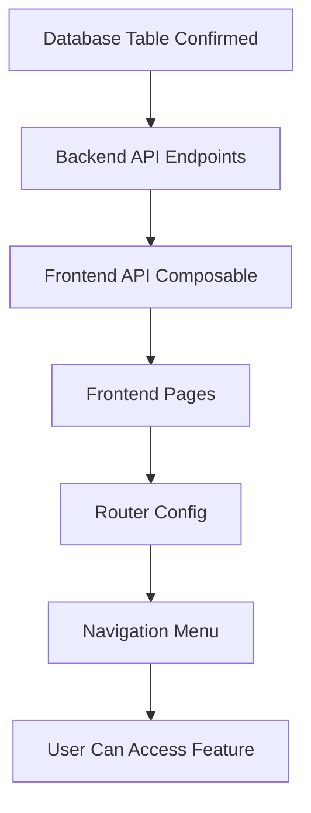

# Sprint 1 Cutting Queue & Start Process - Implementation Strategy

## PHASE 1: FEATURE UNDERSTANDING

### What Data is Being Created/Managed?

Sprint 1 manages **cutting process initiation** with these data entities:

- **Cutting Queue List** - PO yang siap dipotong dari hasil counting
- **Cutting Process Records** - Tracking siapa memotong, pakai mesin apa, kapan mulai
- **Status Transitions** - PO berubah dari "SIAP_POTONG" → "SEDANG_DIPOTONG"

### Who Creates This Data? (Owner)

**STAFF_KHAZWAL** - Staff Khazanah Awal shift siang (counting & cutting specialist)

### Who Needs to See/Use This Data? (Consumer)

- **STAFF_KHAZWAL** - Melihat queue & start cutting
- **SUPERVISOR_KHAZWAL** - Monitoring progress cutting (existing dashboard)
- **STAFF_VERIFIKASI** - Akan melihat hasil (di Sprint 3 setelah finalize)

### Primary User Goal

Staff dapat melihat PO yang siap dipotong (sorted by priority) dan memulai proses cutting dengan assign mesin + operator.

---

## PHASE 2: CROSS-FRONTEND IMPACT MAPPING

| Feature Name | Owner (Who Creates) | Consumer (Who Views) | Data Flow |

|--------------|---------------------|----------------------|-----------|

| **Cutting Queue List** | Backend Auto-generates from Counting | STAFF_KHAZWAL views queue | Counting Result (finalized) → Auto-populate cutting queue → Staff views list |

| **Priority Sorting** | PPIC sets priority on PO | STAFF_KHAZWAL sees sorted list | PO.priority → Backend sorts → Frontend displays ordered |

| **Estimated Output Calc** | Backend calculates (input × 2) | STAFF_KHAZWAL sees estimate | counting_result.quantity_good × 2 → Display in queue card |

| **Start Cutting Action** | STAFF_KHAZWAL initiates | STAFF_KHAZWAL sees status change | Staff clicks "Mulai" → Backend creates cutting_result → PO status updates |

| **Machine Assignment** | STAFF_KHAZWAL selects | Backend stores, Supervisor monitors | Staff selects from dropdown → Saved to DB → Visible in monitoring |

| **Operator Auto-fill** | System auto-fills from login | STAFF_KHAZWAL sees pre-filled | Auth user → Auto-populate operator field |

---

## PHASE 3: MISSING IMPLEMENTATION DETECTION

### US-KW-011: View Cutting Queue

#### Owner Side (Data Creation):

- ✅ **NO manual creation** - Queue auto-generates from counting finalization
- ✅ Priority set by PPIC earlier (no edit needed here)
- ⚠️ **MISSING**: Filter UI controls (date range picker, priority dropdown)

#### Consumer Side (Data Display):

- ⚠️ **MISSING**: Navigation menu item "Pemotongan" in Sidebar
- ⚠️ **MISSING**: `CuttingQueuePage.vue` component
- ⚠️ **MISSING**: `CuttingQueueCard.vue` component  
- ⚠️ **MISSING**: Empty state UI (when no PO ready for cutting)
- ⚠️ **MISSING**: Loading skeleton while fetching queue
- ✅ Mobile responsive (required by cursor rules)
- ⚠️ **MISSING**: Search/filter for specific PO number

#### Integration Points:

- ⚠️ **MISSING**: Backend API `GET /api/khazwal/cutting/queue`
- ⚠️ **MISSING**: Frontend route `/khazwal/cutting` in router
- ⚠️ **MISSING**: `useCuttingApi.js` composable for API calls
- ⚠️ **MISSING**: Cutting store `stores/cutting.js` (optional, can use composable only)
- ⚠️ **MISSING**: Database query joining `production_orders` + `khazwal_counting_results`

---

### US-KW-012: Start Cutting Process

#### Owner Side (Data Creation):

- ⚠️ **MISSING**: `CuttingStartPage.vue` with form
- ⚠️ **MISSING**: Cutting machine dropdown (data source: hardcoded or DB table?)
- ✅ Operator auto-fill from auth (can use existing auth store)
- ⚠️ **MISSING**: "Mulai Pemotongan" button with confirmation
- ⚠️ **MISSING**: Preview info card (PO details, estimated output)
- ⚠️ **MISSING**: Success feedback after starting
- ⚠️ **MISSING**: Error handling (e.g., PO already started by someone else)

#### Consumer Side (Data Display):

- ⚠️ **MISSING**: Navigation from queue card → start page (router link)
- ⚠️ **MISSING**: Breadcrumb showing current location
- ⚠️ **MISSING**: Back button to return to queue
- ✅ Mobile responsive form design
- ⚠️ **MISSING**: Real-time status update (jika user lain mulai cutting PO yang sama)

#### Integration Points:

- ⚠️ **MISSING**: Backend API `POST /api/khazwal/cutting/{po_id}/start`
- ⚠️ **MISSING**: `CuttingService.php` (backend service layer)
- ⚠️ **MISSING**: Database table `khazwal_cutting_results` insert logic
- ⚠️ **MISSING**: Update `production_orders.current_status` = 'SEDANG_DIPOTONG'
- ⚠️ **MISSING**: Update `po_stage_tracking.started_at` timestamp
- ⚠️ **MISSING**: Activity log entry for audit trail
- ⚠️ **MISSING**: Frontend route `/khazwal/cutting/start/:poId`

---

## PHASE 4: GAP ANALYSIS

### 🔴 Critical Gaps (P0 - Feature Unusable Without This)

1. **No Backend API Endpoints**

   - `GET /api/khazwal/cutting/queue` does NOT exist yet
   - `POST /api/khazwal/cutting/{po_id}/start` does NOT exist yet
   - Frontend CANNOT function without these

2. **No Frontend Pages**

   - `CuttingQueuePage.vue` does NOT exist
   - `CuttingStartPage.vue` does NOT exist
   - Users have NO way to access cutting features

3. **No Navigation Menu**

   - Sidebar does NOT have "Pemotongan" menu item
   - Users CANNOT discover cutting feature

4. **No Router Routes**

   - Routes for `/khazwal/cutting` do NOT exist
   - Even if user types URL, page won't load

5. **Missing Database Operations**

   - INSERT into `khazwal_cutting_results` NOT implemented
   - UPDATE `production_orders` status NOT implemented
   - Data won't persist

### 🟡 Important Gaps (P1 - Feature Incomplete Without This)

1. **Missing Filter/Sort UI**

   - Spec says "filter by date & priority" but no UI designed
   - Users will struggle with long queue lists

2. **Missing Empty States**

   - What does user see when queue is empty?
   - Spec doesn't define empty state UX

3. **Missing Loading States**

   - No skeleton loader mentioned
   - Poor UX during API calls

4. **Missing Error Handling**

   - What if two users start same PO simultaneously?
   - No locking mechanism specified

5. **Missing Cutting Machine Data Source**

   - Dropdown values not defined (hardcoded list? DB table?)
   - Inconsistent machine names could cause analytics issues

### 🟢 Enhancement Gaps (P2 - Nice to Have)

1. **Real-time Updates**

   - No WebSocket or polling for queue changes
   - If another staff starts PO, current user won't know until refresh

2. **Search by PO Number**

   - Spec only mentions filter by date/priority
   - Search would improve UX for finding specific PO

3. **Barcode Scanner Integration**

   - Existing component `BarcodeScanner.vue` could scan PO number
   - Faster workflow for staff

---

## PHASE 5: IMPLEMENTATION SEQUENCING

### What Must Be Built FIRST (Dependencies)



**Sequence:**

1. **Verify Database Schema** - Ensure `khazwal_cutting_results` table exists with correct columns
2. **Backend Service Layer** - Create `CuttingService.php` with business logic
3. **Backend Routes** - Implement API endpoints
4. **Frontend API Layer** - Create `useCuttingApi.js` composable
5. **Frontend Components** - Build `CuttingQueueCard.vue` first (reusable)
6. **Frontend Pages** - Build `CuttingQueuePage.vue`, then `CuttingStartPage.vue`
7. **Router Integration** - Add routes to `router/index.js`
8. **Navigation Menu** - Add "Pemotongan" to Sidebar

### What Can Be Built in PARALLEL (Independent Work)

**IF Backend & Frontend are separate developers:**

**Backend Developer:**

- Task KW-011-BE-01 to KW-011-BE-05 (Queue API) - 9 hours
- Task KW-012-BE-01 to KW-012-BE-07 (Start API) - 11 hours
- TOTAL: 20 hours backend work

**Frontend Developer (AFTER backend contract defined):**

- Mock API responses
- Build all frontend components in parallel:
  - `CuttingQueueCard.vue` (2h)
  - `CuttingQueuePage.vue` (3h)
  - `CuttingStartPage.vue` (3h)
  - Filter UI (2h)
  - Router + Navigation (1h)
- TOTAL: 11 hours frontend work

**Solo Developer (current situation):**

- CANNOT parallelize - must do backend FIRST
- Frontend depends on API response structure
- Follow sequential Day 1-5 plan in sprint doc

### What Should Be Built LAST (Dependent on Other Work)

1. **Filter UI** - Needs queue data structure finalized first
2. **Empty States** - Need to test with actual API to see edge cases
3. **Error Handling** - Need to test API failure scenarios first
4. **Integration Testing** - After all components built

---

## PHASE 6: DETAILED RECOMMENDATIONS

### NEW Pages/Routes Needed

#### Frontend Pages

**P0 (Critical):**

- [x] **Page:** `frontend/src/views/khazwal/cutting/CuttingQueuePage.vue`  

**Purpose:** Display list of PO ready for cutting with filters

**Priority:** P0 - Main entry point for cutting feature

- [x] **Page:** `frontend/src/views/khazwal/cutting/CuttingStartPage.vue`  

**Purpose:** Form to start cutting process (select machine, confirm operator)

**Priority:** P0 - Cannot start cutting without this

**P1 (Important):**

- [ ] **Page:** `frontend/src/views/khazwal/cutting/CuttingInProgressPage.vue`  

**Purpose:** List of PO currently being cut (not in Sprint 1 spec but logical need)

**Priority:** P1 - Users need to see their in-progress work

**Note:** Not in Sprint 1 tasks but consider adding

---

### Updates to Existing Pages

**P1 (Important):**

- [x] **Page:** `frontend/src/views/khazwal/SupervisorMonitoringPage.vue`  

**Add:** Cutting progress stats in monitoring dashboard

**Location:** Add new card "Sedang Dipotong" with count & staff names

**Priority:** P1 - Supervisor needs visibility

**P2 (Enhancement):**

- [ ] **Page:** `frontend/src/views/dashboards/StaffDashboard.vue`  

**Add:** Quick link to cutting queue if user has STAFF_KHAZWAL role

**Location:** In "Quick Actions" section

**Priority:** P2 - Improves navigation UX

---

### Navigation/Menu Changes

**P0 (Critical):**

- [x] **Frontend:** Sidebar (all staff views)  

**Add Menu Item:** "Pemotongan"

**Parent:** Under "Khazanah Awal" group

**Icon:** Scissors/Cut icon

**Route:** `/khazwal/cutting`

**Visible To:** STAFF_KHAZWAL, SUPERVISOR_KHAZWAL, ADMIN, MANAGER

**Priority:** P0 - Without menu, feature is hidden

**Suggested Menu Structure:**

```
Khazanah Awal
├─ Persiapan Material
├─ Penghitungan
└─ Pemotongan ← NEW
```

---

### Component Library Additions

**P0 (Critical):**

- [x] **Component:** `frontend/src/components/cutting/CuttingQueueCard.vue`  

**Used By:** CuttingQueuePage.vue

**Purpose:** Display single PO in queue with priority badge, estimated output, action button

**Priority:** P0 - Main display component

**P1 (Important):**

- [ ] **Component:** `frontend/src/components/cutting/CuttingMachineSelector.vue`  

**Used By:** CuttingStartPage.vue

**Purpose:** Dropdown with cutting machine options (with icon & description)

**Priority:** P1 - Improves UX over plain select

- [ ] **Component:** `frontend/src/components/cutting/CuttingPreviewCard.vue`  

**Used By:** CuttingStartPage.vue

**Purpose:** Summary card showing PO details before starting

**Priority:** P1 - Reduces errors

**P2 (Enhancement):**

- [ ] **Component:** `frontend/src/components/common/DateRangePicker.vue`  

**Used By:** CuttingQueuePage.vue, future reporting pages

**Purpose:** Reusable date filter component

**Priority:** P2 - Improves filter UX

---

### Backend Routes Additions

**P0 (Critical):**

- [x] **Endpoint:** `GET /api/khazwal/cutting/queue`  

**File:** `backend/routes/routes.go`

**Handler:** `cuttingHandler.GetCuttingQueue`

**Purpose:** Return list of PO with status SIAP_POTONG

**Priority:** P0

- [x] **Endpoint:** `POST /api/khazwal/cutting/po/:po_id/start`  

**File:** `backend/routes/routes.go`

**Handler:** `cuttingHandler.StartCutting`

**Purpose:** Initialize cutting process

**Priority:** P0

**Backend Service Files to Create:**

- [x] `backend/internal/cutting/handler.go` - HTTP handlers
- [x] `backend/internal/cutting/service.go` - Business logic
- [x] `backend/internal/cutting/repository.go` - Database operations
- [x] `backend/internal/cutting/types.go` - Request/response structs

---

### API Composables Additions

**P0 (Critical):**

- [x] **File:** `frontend/src/composables/useCuttingApi.js`  

**Methods:**

    - `getCuttingQueue(filters)` - Fetch queue with filters
    - `getCuttingDetail(id)` - Get single cutting record
    - `startCutting(poId, payload)` - Start cutting process

**Priority:** P0

**Example Implementation:**

```javascript
// frontend/src/composables/useCuttingApi.js
import { useApi } from './useApi'

export function useCuttingApi() {
  const api = useApi()

  const getCuttingQueue = async (filters = {}) => {
    const params = new URLSearchParams(filters)
    return await api.get(`/khazwal/cutting/queue?${params}`)
  }

  const startCutting = async (poId, payload) => {
    return await api.post(`/khazwal/cutting/po/${poId}/start`, payload)
  }

  return {
    getCuttingQueue,
    startCutting,
  }
}
```

---

## PHASE 7: EXAMPLE USER JOURNEYS

### TOP 1: Staff Melihat Queue & Memulai Cutting (Happy Path)

#### Owner Journey (STAFF_KHAZWAL):

**Scenario:** Siti Aminah (staff shift siang) selesai counting, sekarang mau mulai cutting PO prioritas tinggi.

1. **User navigates to:** Sidebar → Click "Pemotongan"  

**System routes to:** `/khazwal/cutting` (CuttingQueuePage.vue)

**User sees:** Loading skeleton → Queue list muncul dengan 5 PO

2. **User sees list:**

   - PO-2024-001 (URGENT) - 15,000 lembar besar → Estimasi: 30,000 lembar kirim
   - PO-2024-003 (NORMAL) - 10,000 lembar besar → Estimasi: 20,000 lembar kirim
   - ... (sorted by priority + FIFO)

3. **User clicks:** Button "Mulai Pemotongan" on PO-2024-001 card  

**System routes to:** `/khazwal/cutting/start/PO-2024-001`

**Page displays:** CuttingStartPage.vue with:

   - PO Details (OBC number, quantity)
   - Input: 15,000 lembar besar (read-only)
   - Estimasi Output: 30,000 lembar kirim (calculated)
   - Dropdown: Pilih Mesin Potong (options: Mesin A, Mesin B, Mesin C)
   - Operator: Siti Aminah (auto-filled, read-only)

4. **User fills:**

   - Selects "Mesin A" from dropdown

5. **User clicks:** Button "Mulai Pemotongan"  

**System does:**

   - Shows loading spinner on button
   - POST to `/api/khazwal/cutting/po/PO-2024-001/start`
   - Backend inserts record to `khazwal_cutting_results`
   - Backend updates `production_orders.current_status` = 'SEDANG_DIPOTONG'
   - Backend logs activity to `activity_logs`

6. **User sees:**

   - Success toast notification: "Pemotongan dimulai untuk PO-2024-001"
   - Auto-redirect to: `/khazwal/cutting/work/PO-2024-001` (Sprint 2 page - input hasil)
   - OR redirect back to queue (Sprint 1 only)

7. **User achieves:** PO successfully marked as "being cut", can proceed to actual cutting work

---

### TOP 2: Staff Filter Queue by Priority (Search Scenario)

#### Owner Journey (STAFF_KHAZWAL):

**Scenario:** Ada 20 PO di queue, staff cuma mau lihat yang URGENT.

1. **User navigates to:** `/khazwal/cutting` (already on queue page)

2. **User sees:** 20 PO cards (mixed URGENT & NORMAL)

3. **User clicks:** Filter dropdown "Prioritas"  

**System shows:** Dropdown options:

   - Semua Prioritas (default selected)
   - URGENT
   - NORMAL

4. **User selects:** "URGENT"  

**System does:**

   - Updates filter state
   - Calls `getCuttingQueue({ priority: 'URGENT' })`
   - Shows loading skeleton

5. **User sees:** Only 5 URGENT PO displayed

6. **User can:** Click "Mulai Pemotongan" on filtered PO

7. **User achieves:** Focused view on high-priority work

---

### TOP 3: Supervisor Monitoring Cutting Progress (Consumer Journey)

#### Consumer Journey (SUPERVISOR_KHAZWAL):

**Scenario:** Bambang (supervisor) mau cek berapa PO yang sedang dipotong.

1. **User navigates to:** Sidebar → Click "Monitoring Khazwal"  

**System routes to:** `/khazwal/monitoring` (existing SupervisorMonitoringPage.vue)

2. **User sees:** Dashboard with stats cards:

   - Material Prep: 3 sedang proses
   - Counting: 2 sedang proses
   - **Cutting: 1 sedang proses** ← NEW DATA from Sprint 1

3. **User clicks:** "Cutting" card to expand details (future enhancement)  

**System shows:** (Not in Sprint 1 scope - but logical next feature):

   - PO-2024-001 - Siti Aminah - Mesin A - Mulai: 15:30

4. **User achieves:** Visibility into cutting progress without manually checking

**Note:** Sprint 1 doesn't explicitly mention supervisor monitoring updates, but it's a CRITICAL missing piece. Backend data is available after start cutting, just needs frontend display.

---

## PHASE 8: ADDITIONAL RECOMMENDATIONS

### Data Consistency Concerns

**Problem:** Cutting machine dropdown values

**Current Spec:** Says "dropdown mesin potong" but no data source defined

**Recommendation:**

- **Short-term (Sprint 1):** Hardcode array in frontend `['Mesin A', 'Mesin B', 'Mesin C']`  
- **Long-term:** Create DB table `cutting_machines` untuk maintainability  
- **Rationale:** Hardcoding is fast for MVP, but inconsistent naming across entries will break analytics

**Action:** Ask stakeholder if machine list is fixed or needs DB table

---

### Missing Validation Rules

**Problem:** Spec doesn't define what happens if user tries to start cutting on PO that's already being cut

**Recommendation:**

- Backend MUST check `production_orders.current_status` before allowing start  
- If status = 'SEDANG_DIPOTONG', return 409 Conflict error  
- Frontend shows error toast: "PO ini sudah dimulai oleh user lain"  

**SQL Check:**

```sql
SELECT current_status FROM production_orders WHERE id = :po_id
-- If 'SEDANG_DIPOTONG', reject request
```

---

### Mobile UX Considerations

**Problem:** Queue page with 20+ PO akan scroll panjang di mobile

**Recommendation:**

- Implement pagination (20 items per page)  
- OR infinite scroll with intersection observer  
- Add "Back to Top" floating button  
- Per cursor rules: prioritize mobile UX

---

### Empty State Design

**Problem:** Spec doesn't define empty state when no PO ready for cutting

**Recommendation:**

**Scenario 1: No PO in queue**

```
┌─────────────────────┐
│   🔍 Icon           │
│ Tidak Ada PO        │
│ Menunggu Pemotongan │
│                     │
│ Semua PO sudah      │
│ selesai dipotong    │
└─────────────────────┘
```

**Scenario 2: Filtered result empty**

```
┌─────────────────────┐
│   🔍 Icon           │
│ Tidak Ada Hasil     │
│                     │
│ Coba ubah filter    │
│ pencarian Anda      │
└─────────────────────┘
[Reset Filter Button]
```

---

## PHASE 9: TECHNICAL DEBT & FUTURE CONCERNS

### Potential Issues from Sprint 1 Decisions

1. **Hardcoded Machine List**

   - Will cause technical debt if machines change
   - Recommend: Plan to migrate to DB table in Sprint 4

2. **No Real-time Updates**

   - If two staff open queue simultaneously, they see stale data
   - User A might try to start PO that User B just started
   - Recommend: Add polling (refresh every 30s) or WebSocket in future

3. **No Locking Mechanism**

   - Database race condition possible
   - Two POST requests to start same PO could both succeed
   - Recommend: Add unique constraint or transaction lock

---

## PHASE 10: ACCEPTANCE CRITERIA VERIFICATION

### Sprint 1 Checklist (from sprint doc):

**US-KW-011:**

- [ ] Tampil daftar PO dengan status "Siap Potong" ✅ Covered
- [ ] Sorting berdasarkan prioritas dan FIFO berfungsi ✅ Backend task KW-011-BE-04
- [ ] Filter berdasarkan tanggal dan prioritas berfungsi ✅ Backend task KW-011-BE-05
- [ ] Estimasi hasil (input × 2) dihitung otomatis ✅ Backend task KW-011-BE-03

**US-KW-012:**

- [ ] Button "Mulai Pemotongan" berfungsi ✅ Frontend task KW-012-FE-05
- [ ] Status PO berubah menjadi "Sedang Dipotong" ✅ Backend task KW-012-BE-05
- [ ] Timestamp mulai pemotongan tercatat ✅ Backend task KW-012-BE-06
- [ ] Nama staff & mesin tercatat ✅ Backend tasks KW-012-BE-04

**All acceptance criteria have corresponding implementation tasks. ✅**

---

## IMPLEMENTATION PRIORITY MATRIX

### P0 (Critical - Must Build)

- Backend API endpoints (queue + start)
- Frontend pages (CuttingQueuePage + CuttingStartPage)
- Router routes
- Navigation menu
- API composable
- Database operations

### P1 (Important - Feature Incomplete Without)

- Filter UI (date + priority)
- Empty states
- Loading states
- Error handling
- Cutting machine dropdown
- Breadcrumb navigation

### P2 (Enhancement - Can Ship Later)

- Search by PO number
- Real-time updates (polling/WebSocket)
- Barcode scanner integration
- Pagination for long lists
- Export queue to Excel
- Supervisor monitoring card update

---

## FINAL RECOMMENDATIONS

### Critical Questions for Stakeholder (MUST ANSWER BEFORE STARTING):

1. **Cutting Machine Data Source:** Should machine list be hardcoded or DB table?  

**Impact:** Affects backend design & future maintainability

2. **Empty State UX:** What should staff see when queue is empty?  

**Impact:** Affects frontend component design

3. **Concurrent Start Prevention:** What happens if two staff start same PO?  

**Impact:** Affects database locking strategy

4. **Supervisor Monitoring:** Should Sprint 1 include monitoring dashboard updates?  

**Impact:** Adds 2-3 hours of work, but critical for supervisor visibility

### Suggested Adjustments to Sprint 1 Plan:

**Add to Day 5 (Testing):**

- Test concurrent start scenario (two users, same PO)
- Test empty state rendering
- Test filter reset functionality

**Consider Adding:**

- Task: Update `SupervisorMonitoringPage.vue` dengan cutting stats (2h)
- Task: Create `cutting_machines` DB table (1h) - for long-term maintainability

---

## SUCCESS METRICS

After Sprint 1, system should:

- ✅ Staff dapat melihat queue dalam < 2 detik
- ✅ Staff dapat filter by priority & date
- ✅ Staff dapat start cutting dengan 2 clicks (select PO → confirm)
- ✅ PO status updated correctly in database
- ✅ Supervisor dapat lihat cutting progress (if monitoring task added)
- ✅ Mobile responsive pada semua screen sizes
- ✅ Zero console errors
- ✅ Passing lint checks (`yarn run lint`)

---

**Analysis Completed:** 2026-01-10

**Analyzed By:** AI Assistant

**Sprint Duration:** 5 days (38 hours solo developer)

**Total Tasks:** Backend (9) + Frontend (10) = 19 tasks

**Critical Dependencies:** Epic 02 (Counting) must be completed first ✅