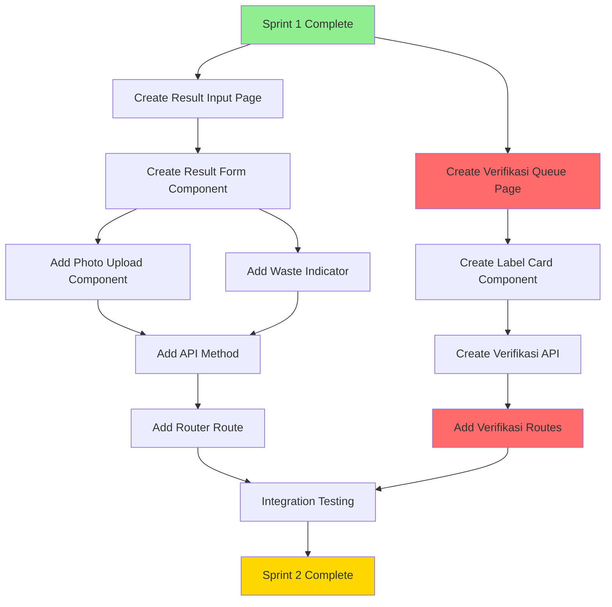

# Sprint 2 Cutting - Cross-Frontend Implementation Strategy

## PHASE 1: FEATURE UNDERSTANDING

### Feature Summary

Sprint 2 focuses on **US-KW-013: Input Hasil Pemotongan** - allowing Staff Khazwal to input cutting results (sisiran kiri & kanan) with automatic waste calculation, validation, and photo upload for waste evidence.

### Core Data Flow

```
Staff Khazwal (Owner) → Creates Cutting Results → System Stores → Tim Verifikasi (Consumer) Views
```

### Primary User Goal

Staff Khazwal needs to accurately record cutting output (left/right sheets) with waste tracking to ensure production quality and prepare data for verification team.

---

## PHASE 2: CROSS-FRONTEND IMPACT MAPPING

| Feature Name | Owner (Who Creates) | Consumer (Who Views) | Data Flow |

|--------------|---------------------|----------------------|-----------|

| **Input Sisiran Kiri & Kanan** | Staff Khazwal via Cutting Input Form | Tim Verifikasi via Verification Queue | Create → khazwal_cutting_results → Display in verification labels |

| **Waste Calculation** | Auto-calculated by system | Staff Khazwal (immediate feedback) + Supervisor (monitoring) | Calculate → Display real-time → Store → Report |

| **Waste Photo Upload** | Staff Khazwal (when waste > 2%) | Supervisor Khazwal (audit) + Manager (review) | Upload → Store URL → Display in history/monitoring |

| **Waste Reason Documentation** | Staff Khazwal (when waste > 2%) | Supervisor Khazwal (analysis) + Manager (reporting) | Input → Store → Display in reports |

| **Real-time Validation** | System validates input | Staff Khazwal (prevents errors) | Validate → Show feedback → Prevent submission |

| **Cutting Result Record** | Staff Khazwal finalizes | Multiple: Verifikasi Queue, Supervisor Dashboard, Activity Logs | Create → Update PO status → Trigger notifications |

---

## PHASE 3: MISSING IMPLEMENTATION DETECTION

### ✅ OWNER SIDE (Data Creation) - Staff Khazwal Frontend

**Existing (Sprint 1):**

- [x] UI to view cutting queue (`CuttingQueuePage.vue`)
- [x] UI to start cutting process (`CuttingStartPage.vue`)
- [x] Component for queue cards (`CuttingQueueCard.vue`)
- [x] API composable (`useCuttingApi.js`)
- [x] Router setup for cutting routes

**Missing (Sprint 2 - CRITICAL):**

- [ ] **Page: Cutting Result Input** (`CuttingResultPage.vue`) - P0
  - Purpose: Main page for inputting sisiran kiri & kanan
  - Location: `/khazwal/cutting/result/:id`
  - Why: Without this, Staff cannot input cutting results at all

- [ ] **Component: Cutting Result Form** (`CuttingResultForm.vue`) - P0
  - Purpose: Form with sisiran kiri/kanan inputs + waste calculation display
  - Features: Real-time calculation, validation, conditional photo upload
  - Why: Core UI for data entry

- [ ] **Component: Waste Indicator** (`WasteIndicator.vue`) - P1
  - Purpose: Visual feedback (green ≤2%, red >2%) with percentage display
  - Why: Immediate visual feedback for quality control

- [ ] **Component: Waste Photo Upload** (`WastePhotoUpload.vue`) - P0
  - Purpose: Photo upload UI that appears when waste > 2%
  - Why: Required for waste documentation (business rule)

- [ ] **API Method: Update Cutting Result** - P0
  - Method: `cuttingApi.updateCuttingResult(id, data)`
  - Endpoint: `PATCH /api/khazwal/cutting/:id/result`
  - Why: Backend endpoint to save cutting results

- [ ] **Validation Logic: Waste Threshold** - P0
  - Logic: Check if waste > 2%, require reason + photo
  - Why: Business rule enforcement

- [ ] **Router: Result Input Route** - P0
  - Path: `/khazwal/cutting/result/:id`
  - Component: `CuttingResultPage.vue`
  - Why: Navigation to result input page

---

### ⚠️ CONSUMER SIDE (Data Display) - MAJOR GAPS IDENTIFIED

**Tim Verifikasi Frontend - COMPLETELY MISSING:**

- [ ] **Page: Verification Queue** (`VerificationQueuePage.vue`) - P0
  - Purpose: Display POs ready for verification (from cutting)
  - Location: `/verifikasi/queue`
  - Why: ⚠️ **CRITICAL GAP** - Cutting creates data but Verifikasi has NO way to see it

- [ ] **Component: Verification Label Card** (`VerificationLabelCard.vue`) - P0
  - Purpose: Display verification label info (500 sheets per label)
  - Why: Show what needs to be verified

- [ ] **API Composable: Verification API** (`useVerifikasiApi.js`) - P0
  - Methods: `getVerificationQueue()`, `getVerificationDetail()`
  - Why: Fetch verification data

- [ ] **Router: Verification Routes** - P0
  - Paths: `/verifikasi/queue`, `/verifikasi/:id`
  - Why: Navigation for verification team

- [ ] **Store: Verification Store** (`verifikasi.js`) - P1
  - Purpose: State management for verification data
  - Why: Centralized data management

**Supervisor Khazwal Dashboard - PARTIAL:**

- [x] Page exists: `SupervisorMonitoringPage.vue`
- [ ] **Missing: Cutting Results Section** - P1
  - Purpose: Show cutting progress, waste statistics
  - Why: Supervisor needs to monitor cutting quality

- [ ] **Missing: Waste Analytics** - P2
  - Purpose: Waste trends, high-waste POs, reasons breakdown
  - Why: Data-driven quality improvement

**Activity Logs - PARTIAL:**

- [x] Activity logs system exists
- [ ] **Missing: Cutting Activity Filters** - P2
  - Purpose: Filter by cutting activities specifically
  - Why: Audit trail for cutting operations

---

### 🔗 INTEGRATION POINTS

**Missing Integrations:**

- [ ] **Navigation Menu: Verifikasi Section** - P0
  - Add: "Verifikasi" menu item in Sidebar
  - Target: Tim Verifikasi role
  - Why: Users cannot navigate to verification pages

- [ ] **Notification: Cutting Complete → Verifikasi** - P0
  - Trigger: When cutting finalized (Sprint 3)
  - Recipient: Tim Verifikasi
  - Why: Alert verification team about new work

- [ ] **Dashboard Widget: Cutting Stats** - P1
  - Location: Staff Dashboard
  - Show: Today's cutting count, average waste
  - Why: Quick overview for staff

- [ ] **Search/Filter: By Cutting Status** - P2
  - Location: PO search/filter components
  - Add: Filter by cutting status
  - Why: Find POs in cutting stage

---

## PHASE 4: GAP ANALYSIS

### 🚨 CRITICAL GAPS

1. **⚠️ Owner can create cutting results BUT Consumer (Verifikasi) has NO frontend to view them**

   - Impact: HIGH - Breaks entire workflow
   - Cutting data will be stored but verification team cannot access it
   - Recommendation: Build Verifikasi frontend in parallel with Sprint 2

2. **⚠️ No navigation path to Verification pages**

   - Impact: HIGH - Even if pages exist, users cannot reach them
   - Recommendation: Update Sidebar component with Verifikasi menu

3. **⚠️ Waste photo upload UI missing**

   - Impact: CRITICAL - Business rule requires photo when waste > 2%
   - Cannot finalize cutting without this feature
   - Recommendation: Prioritize photo upload component

4. **⚠️ Real-time waste calculation logic not specified**

   - Impact: MEDIUM - Core UX feature for immediate feedback
   - Recommendation: Implement reactive computed properties in form

---

### ⚡ WORKFLOW BREAKS

**Scenario: Staff completes cutting with 3% waste**

1. ✅ Staff can view queue (Sprint 1)
2. ✅ Staff can start cutting (Sprint 1)
3. ❌ **BREAK**: No page to input results (Sprint 2 missing)
4. ❌ **BREAK**: No photo upload UI (Sprint 2 missing)
5. ❌ **BREAK**: Cannot finalize without photo (validation missing)
6. ❌ **BREAK**: Verifikasi team has no UI to see completed cutting

**Result: Feature is UNUSABLE end-to-end**

---

## PHASE 5: IMPLEMENTATION SEQUENCING

### Priority Matrix

**P0 (Critical - Feature Unusable Without):**

1. `CuttingResultPage.vue` - Main input page
2. `CuttingResultForm.vue` - Form component
3. `WastePhotoUpload.vue` - Photo upload (required for waste > 2%)
4. API method: `updateCuttingResult()`
5. Router: `/khazwal/cutting/result/:id`
6. Validation: Waste threshold logic
7. `VerificationQueuePage.vue` - Consumer frontend (CRITICAL)
8. Navigation: Add Verifikasi menu item

**P1 (Important - Feature Incomplete Without):**

1. `WasteIndicator.vue` - Visual feedback component
2. `VerificationLabelCard.vue` - Display verification labels
3. `useVerifikasiApi.js` - Verification API composable
4. Supervisor Dashboard: Cutting results section
5. Dashboard Widget: Cutting stats

**P2 (Enhancement - Can Ship Later):**

1. Waste analytics in supervisor dashboard
2. Cutting activity filters in audit logs
3. Search by cutting status
4. Empty states for verification queue
5. Loading skeletons for all new pages

---

### Dependency Graph



**Red nodes = CRITICAL missing consumer frontend**

---

### Build Sequence (Solo Developer)

**Week 1 (Sprint 2): Owner Side**

- Day 1-2: Backend API (as planned)
- Day 3: `CuttingResultPage.vue` + `CuttingResultForm.vue`
- Day 4: `WastePhotoUpload.vue` + `WasteIndicator.vue`
- Day 5: Testing + Router setup

**Week 1.5 (URGENT): Consumer Side**

- Day 6-7: `VerificationQueuePage.vue` + `VerificationLabelCard.vue`
- Day 8: `useVerifikasiApi.js` + Router setup
- Day 9: Navigation menu updates + integration testing

**Parallel Work (Can be done simultaneously):**

- Backend API development (Day 1-2)
- Frontend component scaffolding (Day 1-2)
- Photo upload component (Day 3) while backend handles photo storage

---

## PHASE 6: DETAILED RECOMMENDATIONS

### NEW PAGES/ROUTES NEEDED

**Khazwal Frontend:**

- [x] Page: `CuttingResultPage.vue` - P0
  - Purpose: Input cutting results with waste tracking
  - Location: `/khazwal/cutting/result/:id`
  - Features: Form, real-time calculation, photo upload, validation
  - Why: Core data entry page for cutting results

**Verifikasi Frontend (NEW MODULE):**

- [ ] Page: `VerificationQueuePage.vue` - P0
  - Purpose: Display POs ready for verification
  - Location: `/verifikasi/queue`
  - Features: List of verification labels, filters, search
  - Why: ⚠️ **CRITICAL** - Without this, verification team cannot work

- [ ] Page: `VerificationDetailPage.vue` - P1
  - Purpose: Detail view of verification label
  - Location: `/verifikasi/:id`
  - Features: Label info, cutting results, start verification button
  - Why: Detailed view before starting verification

---

### UPDATES TO EXISTING PAGES

**`SupervisorMonitoringPage.vue`:**

- [ ] Add: Cutting Results Section - P1
  - Location: New tab or section in monitoring dashboard
  - Show: Active cutting, completed today, waste statistics
  - Why: Supervisor needs cutting visibility

**`Sidebar.vue` (Navigation):**

- [ ] Add: Verifikasi Menu Item - P0
  - Parent: Main navigation
  - Children: "Antrian Verifikasi", "Riwayat Verifikasi"
  - Visible to: QC_INSPECTOR, SUPERVISOR_VERIFIKASI, ADMIN, MANAGER
  - Why: ⚠️ **CRITICAL** - Users need navigation to verification pages

**`StaffDashboard.vue`:**

- [ ] Add: Cutting Stats Widget - P1
  - Show: Today's cutting count, average waste percentage
  - Location: Dashboard cards section
  - Why: Quick overview for staff

---

### NAVIGATION/MENU CHANGES

**Sidebar Component Updates:**

```javascript
// Add to router/index.js
{
  path: '/verifikasi',
  name: 'VerifikasiModule',
  redirect: '/verifikasi/queue',
  meta: {
    requiresAuth: true,
    roles: ['QC_INSPECTOR', 'SUPERVISOR_VERIFIKASI', 'ADMIN', 'MANAGER']
  },
  children: [
    {
      path: 'queue',
      name: 'verification-queue',
      component: () => import('../views/verifikasi/VerificationQueuePage.vue'),
      meta: { title: 'Antrian Verifikasi' }
    },
    {
      path: ':id',
      name: 'verification-detail',
      component: () => import('../views/verifikasi/VerificationDetailPage.vue'),
      meta: { title: 'Detail Verifikasi' }
    }
  ]
}
```

**Menu Structure:**

```
Sidebar
├─ Dashboard
├─ Khazwal
│  ├─ Persiapan Material
│  ├─ Penghitungan
│  └─ Pemotongan ✅ (exists)
├─ Verifikasi ⚠️ (MISSING - ADD THIS)
│  ├─ Antrian Verifikasi
│  └─ Riwayat Verifikasi
├─ Cetak
└─ Profile
```

---

### COMPONENT LIBRARY ADDITIONS

**New Components Needed:**

1. **`CuttingResultForm.vue`** - P0

   - Used by: `CuttingResultPage.vue`
   - Props: `cuttingId`, `inputLembarBesar`, `expectedOutput`
   - Emits: `@submit`, `@cancel`
   - Features: Sisiran inputs, real-time calculation, validation

2. **`WasteIndicator.vue`** - P1

   - Used by: `CuttingResultForm.vue`, `SupervisorMonitoringPage.vue`
   - Props: `wastePercentage`, `threshold` (default: 2)
   - Features: Color-coded display (green/red), percentage badge

3. **`WastePhotoUpload.vue`** - P0

   - Used by: `CuttingResultForm.vue`
   - Props: `required`, `maxSize` (default: 2MB)
   - Emits: `@upload`, `@remove`
   - Features: Drag & drop, camera capture, preview

4. **`VerificationLabelCard.vue`** - P0

   - Used by: `VerificationQueuePage.vue`
   - Props: `label` (object with label data)
   - Emits: `@start-verification`
   - Features: Label info, quantity, sisiran type, status badge

5. **`CuttingSummaryCard.vue`** - P2

   - Used by: `SupervisorMonitoringPage.vue`, `CuttingResultPage.vue`
   - Props: `cuttingData`
   - Features: Summary display, waste visualization

---

## PHASE 7: EXAMPLE USER JOURNEYS

### Journey 1: Input Cutting Results (Normal Waste ≤ 2%)

**Owner Journey - Staff Khazwal (Siti Aminah):**

1. **User navigates to:** `/khazwal/cutting` (Cutting Queue)

   - Sees: List of POs with "Sedang Dipotong" status
   - Finds: PO-2024-001 that she started earlier

2. **User clicks:** "Input Hasil" button on PO card

   - System navigates to: `/khazwal/cutting/result/456`
   - Page loads: `CuttingResultPage.vue`

3. **User sees:** Form with PO info and input fields

   - Input Lembar Besar: 15,000 (read-only, from counting)
   - Estimasi Output: 30,000 (read-only, calculated)
   - Sisiran Kiri: [empty input field]
   - Sisiran Kanan: [empty input field]

4. **User fills:**

   - Sisiran Kiri: 14,950
   - Sisiran Kanan: 14,950

5. **System calculates (real-time):**

   - Total Output: 29,900 (auto-calculated)
   - Waste: 100 lembar (auto-calculated)
   - Waste %: 0.33% (auto-calculated)
   - Waste Indicator: 🟢 GREEN (≤ 2%)

6. **User sees:** Green indicator with "Waste dalam toleransi" message

   - Photo upload: NOT required (waste ≤ 2%)
   - Reason field: NOT required

7. **User clicks:** "Simpan Hasil" button

   - System validates: ✅ All fields valid
   - API call: `PATCH /api/khazwal/cutting/456/result`

8. **System does:**

   - Updates `khazwal_cutting_results` record
   - Calculates and stores waste data
   - Shows success message: "Hasil pemotongan berhasil disimpan"

9. **User sees:**

   - Success toast notification
   - Button changes to "Lanjut ke Finalisasi" (Sprint 3)
   - Haptic feedback: Success vibration

**Consumer Journey - Tim Verifikasi (After Sprint 3 Finalization):**

1. **User navigates to:** `/verifikasi/queue`

   - Sees: List of POs ready for verification
   - Finds: PO-2024-001 with 60 labels (29,900 ÷ 500 = 59.8 → 60 labels)

2. **User sees:** Verification label cards

   - Label 1: 500 lembar, Sisiran KIRI
   - Label 2: 500 lembar, Sisiran KANAN
   - ... (alternating pattern)
   - Label 60: 400 lembar, Sisiran KANAN (remainder)

3. **User can:** Click label to start verification

   - System navigates to: `/verifikasi/1234` (label detail)

4. **When user clicks:** "Mulai Verifikasi" button

   - System starts verification process (Epic 04)

5. **User achieves:** Can see and process cutting results

---

### Journey 2: Input Cutting Results (High Waste > 2%)

**Owner Journey - Staff Khazwal:**

1. **User navigates to:** `/khazwal/cutting/result/457`

2. **User fills:**

   - Sisiran Kiri: 14,500
   - Sisiran Kanan: 14,600

3. **System calculates (real-time):**

   - Total Output: 29,100
   - Waste: 900 lembar
   - Waste %: 3.0%
   - Waste Indicator: 🔴 RED (> 2%)

4. **System shows:**

   - Red indicator with "⚠️ Waste melebihi toleransi 2%"
   - Reason field: APPEARS (required)
   - Photo upload: APPEARS (required)
   - Submit button: DISABLED (until reason + photo filled)

5. **User fills:**

   - Alasan Waste: "Kertas robek saat proses cutting, mesin kurang tajam"
   - Photo: [uploads photo via camera/gallery]

6. **System validates:**

   - ✅ Reason filled (min 10 characters)
   - ✅ Photo uploaded (max 2MB)
   - Submit button: ENABLED

7. **User clicks:** "Simpan Hasil"

   - API call includes: `waste_reason` + `waste_photo_url`

8. **System does:**

   - Uploads photo to storage
   - Saves waste documentation
   - Creates activity log with waste flag
   - ⚠️ Sends notification to Supervisor (high waste alert)

9. **User sees:**

   - Success message
   - Warning badge: "Waste tinggi - Menunggu review supervisor"

**Consumer Journey - Supervisor Khazwal:**

1. **User receives:** Notification "Waste tinggi pada PO-2024-002 (3.0%)"

2. **User navigates to:** `/khazwal/monitoring`

   - Sees: Cutting results section
   - Finds: PO-2024-002 with red waste indicator

3. **User clicks:** PO card to view details

   - Sees: Waste reason, waste photo, staff name, timestamp

4. **User can:**

   - Review waste documentation
   - Approve or request re-cutting
   - Add supervisor notes

5. **User achieves:** Quality control oversight

---

### Journey 3: Verification Team Receives Cutting Results

**Consumer Journey - QC Inspector:**

1. **User navigates to:** `/verifikasi/queue`

   - Sees: Empty state (no POs yet)
   - Message: "Belum ada PO siap verifikasi"

2. **When cutting finalized (Sprint 3):**

   - User receives: Notification "PO-2024-001 siap verifikasi (60 label)"
   - Notification bell: Badge shows "1"

3. **User clicks:** Notification

   - System navigates to: `/verifikasi/queue`
   - Page refreshes: Shows PO-2024-001

4. **User sees:** Verification label cards

   - PO info: PO-2024-001, OBC-2024-001
   - Total labels: 60
   - Total quantity: 29,900 lembar
   - Cutting info: Completed by Siti Aminah, Waste: 0.33%

5. **User can:**

   - View cutting results summary
   - See waste information
   - Start verification process label by label

6. **User achieves:** Seamless handoff from cutting to verification

---

## PHASE 8: CRITICAL REMINDERS

### 🚨 MUST-DO ITEMS

1. **Build Verifikasi frontend in Sprint 2 or 2.5**

   - Cutting data without verification UI = broken workflow
   - Recommendation: Add 2-3 days after Sprint 2 for basic Verifikasi pages

2. **Photo upload is MANDATORY for waste > 2%**

   - Cannot finalize without photo (business rule)
   - Must implement photo upload component in Sprint 2

3. **Real-time waste calculation is core UX**

   - Users need immediate feedback
   - Implement reactive computed properties

4. **Navigation menu MUST include Verifikasi**

   - Update Sidebar component
   - Add role-based visibility

5. **Notification system integration**

   - Cutting complete → notify Verifikasi
   - High waste → notify Supervisor
   - Ensure notification system is working

6. **Mobile-first design**

   - Photo upload must work on mobile (camera access)
   - Form inputs must be touch-friendly
   - Real-time calculation must be performant on mobile

---

## PHASE 9: RISK MITIGATION

### Technical Risks

| Risk | Impact | Mitigation |

|------|--------|------------|

| Photo upload fails on mobile | HIGH | Test camera API early, fallback to file picker |

| Real-time calculation lag | MEDIUM | Debounce input, use computed properties |

| Waste validation complex | MEDIUM | Write unit tests for validation logic |

| Verifikasi frontend delayed | CRITICAL | Start Verifikasi pages in parallel with Sprint 2 |

### Timeline Risks

| Risk | Impact | Mitigation |

|------|--------|------------|

| Sprint 2 scope too large | HIGH | Prioritize P0 items, defer P2 to Sprint 2.5 |

| Solo developer bottleneck | HIGH | Build backend + frontend scaffolding in parallel |

| Integration testing time | MEDIUM | Allocate full Day 5 for testing |

---

## PHASE 10: IMPLEMENTATION CHECKLIST

### Sprint 2 (Week 1) - Owner Side

**Backend (Day 1-2):**

- [ ] API: `PATCH /api/khazwal/cutting/:id/result`
- [ ] Waste calculation logic
- [ ] Photo upload handling
- [ ] Validation: waste threshold
- [ ] Activity logging

**Frontend (Day 3-5):**

- [ ] Page: `CuttingResultPage.vue`
- [ ] Component: `CuttingResultForm.vue`
- [ ] Component: `WastePhotoUpload.vue`
- [ ] Component: `WasteIndicator.vue`
- [ ] API method: `updateCuttingResult()`
- [ ] Router: `/khazwal/cutting/result/:id`
- [ ] Validation logic (frontend)
- [ ] Real-time calculation
- [ ] Mobile testing (photo upload)

### Sprint 2.5 (Week 1.5) - Consumer Side (URGENT)

**Backend (if needed):**

- [ ] API: `GET /api/verifikasi/queue`
- [ ] API: `GET /api/verifikasi/:id`

**Frontend (Day 6-9):**

- [ ] Page: `VerificationQueuePage.vue`
- [ ] Component: `VerificationLabelCard.vue`
- [ ] Composable: `useVerifikasiApi.js`
- [ ] Store: `verifikasi.js`
- [ ] Router: Verifikasi routes
- [ ] Navigation: Add Verifikasi menu
- [ ] Integration testing

### Sprint 3 (Week 2) - Finalization

- [ ] Finalization API + frontend
- [ ] Label generation logic
- [ ] Notification: Cutting → Verifikasi
- [ ] End-to-end testing

---

## CONCLUSION

### Summary of Findings

1. **CRITICAL GAP IDENTIFIED:** Cutting creates data but Verifikasi has NO frontend to consume it
2. **MISSING COMPONENTS:** 8 new components needed (5 P0, 2 P1, 1 P2)
3. **MISSING PAGES:** 3 new pages needed (2 P0, 1 P1)
4. **MISSING ROUTES:** 3 new routes needed (all P0)
5. **MISSING NAVIGATION:** Verifikasi menu item (P0)

### Recommendations

1. **Extend Sprint 2 by 2-3 days** to include basic Verifikasi frontend
2. **Prioritize photo upload component** (business rule dependency)
3. **Build Verifikasi pages in parallel** with Sprint 2 backend work
4. **Update navigation menu** as soon as Verifikasi routes are ready
5. **Test end-to-end flow** from cutting input → verification queue

### Success Metrics

- [ ] Staff can input cutting results with waste < 2% (no photo)
- [ ] Staff can input cutting results with waste > 2% (with photo + reason)
- [ ] Real-time waste calculation works on mobile
- [ ] Photo upload works via camera on mobile
- [ ] Verifikasi team can view cutting results in queue
- [ ] Supervisor can monitor cutting with waste statistics
- [ ] End-to-end flow: Queue → Start → Input → Verifikasi Queue works

---

**Status:** Ready for Implementation

**Estimated Total Effort:** 12 days (8 days Sprint 2 + 4 days Verifikasi frontend)

**Critical Path:** Photo upload component → Verifikasi frontend → Integration testing