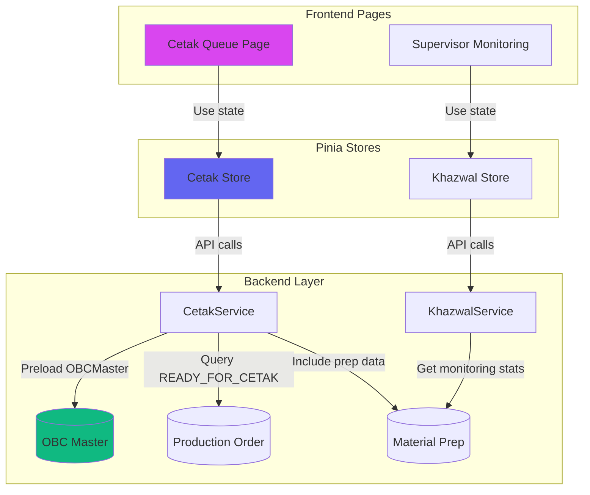

# Sprint 6: Consumer Side, Polish & Testing with OBC Master Integration

## Context

Sprint 6 is the final sprint from the original Material Preparation plan ([01_Material_Preparation.md](plans/01_Khazwal/01_Material_Preparation.md) lines 643-659). Several components already exist but need enhancement to integrate with OBC Master architecture completed in Phase 6.

**Existing Components:**

- Backend: `cetak_service.go`, `cetak_handler.go` (basic implementation)
- Frontend: `CetakQueuePage.vue`, `SupervisorMonitoringPage.vue` (using direct API calls)
- Store: `khazwal.js` (has monitoring endpoint)

**Goals:**

1. Enhance backend for OBC Master integration
2. Create Cetak Pinia store for state management
3. Update frontend to use stores and display OBC Master data
4. Polish UI with empty states and mobile enhancements
5. E2E testing

## Architecture Overview



## Implementation Tasks

### Task 1: Backend Enhancement - Cetak Service with OBC Master

**Files to Modify:**

- [`backend/services/cetak_service.go`](backend/services/cetak_service.go)
- [`backend/handlers/cetak_handler.go`](backend/handlers/cetak_handler.go)

**Changes:**

1. **Update `GetCetakQueue` method** to preload OBC Master:
```go
query := s.db.Model(&models.ProductionOrder{}).
    Where("current_status = ?", models.StatusReadyForCetak).
    Preload("OBCMaster").  // Add this
    Preload("KhazwalMaterialPrep.PreparedByUser")
```

2. **Enhance DTOs** to include OBC Master fields in `CetakQueueItem`:
```go
type CetakQueueItem struct {
    // Existing fields...
    OBCMaster *OBCMasterInfo `json:"obc_master"`  // Add this
}

type OBCMasterInfo struct {
    ID                  uint64 `json:"id"`
    OBCNumber           string `json:"obc_number"`
    Material            string `json:"material"`
    MaterialDescription string `json:"material_description"`
    Seri                string `json:"seri"`
    Warna               string `json:"warna"`
    FactoryCode         string `json:"factory_code"`
    PlatNumber          string `json:"plat_number"`
    Personalization     string `json:"personalization"`
}
```

3. **Update transformation logic** in handler to populate OBC Master data from relationship.

---

### Task 2: Create Cetak Pinia Store

**File to Create:**

- `frontend/src/stores/cetak.js` (NEW)

**Structure:**

```javascript
export const useCetakStore = defineStore('cetak', {
  state: () => ({
    queue: [],
    queueLoading: false,
    queueError: null,
    queuePagination: { total: 0, page: 1, per_page: 20, total_pages: 0 },
    currentDetail: null,
    detailLoading: false,
    detailError: null
  }),
  
  getters: {
    urgentQueue: (state) => state.queue.filter(item => item.priority === 'URGENT'),
    pastDueQueue: (state) => state.queue.filter(item => item.is_past_due)
  },
  
  actions: {
    async getCetakQueue(filters = {}),
    async getCetakDetail(poId),
    clearQueue(),
    clearDetail()
  }
})
```

**Reference:** Follow pattern from [`khazwal.js`](frontend/src/stores/khazwal.js) for consistency.

---

### Task 3: Update Cetak Queue Page

**File to Modify:**

- [`frontend/src/views/cetak/CetakQueuePage.vue`](frontend/src/views/cetak/CetakQueuePage.vue)

**Changes:**

1. **Replace direct API calls with Cetak store:**
```vue
<script setup>
import { useCetakStore } from '@/stores/cetak'

const cetakStore = useCetakStore()
const loading = computed(() => cetakStore.queueLoading)
const queueItems = computed(() => cetakStore.queue)
const pagination = computed(() => cetakStore.queuePagination)

// Replace fetchQueue() with:
const fetchQueue = () => cetakStore.getCetakQueue(filters.value)
</script>
```

2. **Enhance `CetakQueueCard` component** to display OBC Master data:

- Show Material, Seri, Warna badges (similar to POQueueCard)
- Display Personalization indicator
- Show Plat Number info
- Factory Code display

3. **Verify empty state** has proper messaging and actions.

4. **Add pull-to-refresh** for mobile:
```vue
<template>
  <div @touchstart="handleTouchStart" @touchend="handleTouchEnd">
    <!-- Content -->
  </div>
</template>

<script>
// Implement pull-to-refresh gesture
const handlePullRefresh = () => {
  if (pullDistance > 80) {
    fetchQueue()
  }
}
</script>
```


---

### Task 4: Update Supervisor Monitoring Page

**File to Modify:**

- [`frontend/src/views/khazwal/SupervisorMonitoringPage.vue`](frontend/src/views/khazwal/SupervisorMonitoringPage.vue)

**Changes:**

1. **Use Khazwal store** instead of direct API:
```vue
<script setup>
import { useKhazwalStore } from '@/stores/khazwal'

const khazwalStore = useKhazwalStore()
const stats = computed(() => khazwalStore.monitoringStats)
const loading = computed(() => khazwalStore.monitoringLoading)

const refreshData = () => khazwalStore.getMonitoringStats()
</script>
```

2. **Enhance staff activity cards** to show OBC context:

- Display current PO's OBC Number
- Show Material being prepared
- Add visual indicators for work type

3. **Add real-time refresh** with auto-refresh every 30 seconds:
```javascript
let refreshInterval
onMounted(() => {
  refreshData()
  refreshInterval = setInterval(refreshData, 30000) // 30s
})
onUnmounted(() => clearInterval(refreshInterval))
```


---

### Task 5: Create/Enhance Cetak Queue Card Component

**File to Create/Modify:**

- `frontend/src/components/cetak/CetakQueueCard.vue` (verify if exists, create if not)

**Features:**

1. Display OBC Master information (Material, Seri, Warna, Personalization)
2. Show material prep completion info (who prepared, when, duration)
3. Material photos thumbnail gallery
4. Priority badge
5. Due date with urgency indicator
6. Responsive design for mobile
7. Motion-V animations on entrance

**Reference:** Base structure on [`POQueueCard.vue`](frontend/src/components/khazwal/POQueueCard.vue) but adapt for Cetak context.

---

### Task 6: Empty State Enhancements

**Files to Check/Enhance:**

- [`CetakQueuePage.vue`](frontend/src/views/cetak/CetakQueuePage.vue) - Empty queue state
- [`MaterialPrepQueuePage.vue`](frontend/src/views/khazwal/MaterialPrepQueuePage.vue) - Already has good empty state
- [`SupervisorMonitoringPage.vue`](frontend/src/views/khazwal/SupervisorMonitoringPage.vue) - Add empty states

**Empty State Pattern:**

```vue
<Motion v-bind="entranceAnimations.fadeScale" class="glass-card rounded-2xl p-12 text-center">
  <Motion v-bind="iconAnimations.popIn">
    <div class="inline-flex items-center justify-center w-20 h-20 rounded-full bg-gradient-to-br from-indigo-100 to-fuchsia-100 mb-6">
      <Icon class="w-10 h-10 text-indigo-600" />
    </div>
  </Motion>
  <h3 class="text-xl font-bold text-gray-900 mb-2">Empty State Title</h3>
  <p class="text-gray-500 mb-6">Descriptive message</p>
  <button v-if="hasAction">Action Button</button>
</Motion>
```

**States to Cover:**

- No items in queue (with/without filters)
- No active staff (monitoring page)
- No recent completions (monitoring page)
- Network error state
- Loading skeleton state

---

### Task 7: Mobile Enhancements

**Files to Enhance:**

- All main pages (CetakQueue, MaterialPrepQueue, Monitoring)

**Features to Add:**

1. **Pull-to-refresh gesture:**
```javascript
const touchStart = ref(null)
const pulling = ref(false)

const handleTouchStart = (e) => {
  if (window.scrollY === 0) {
    touchStart.value = e.touches[0].clientY
  }
}

const handleTouchMove = (e) => {
  if (touchStart.value) {
    const pullDistance = e.touches[0].clientY - touchStart.value
    if (pullDistance > 0 && pullDistance < 100) {
      pulling.value = true
      // Show pull indicator
    }
  }
}

const handleTouchEnd = () => {
  if (pulling.value && pullDistance > 80) {
    fetchQueue()
  }
  touchStart.value = null
  pulling.value = false
}
```

2. **Haptic feedback** on actions (already partially implemented, ensure consistency):
```javascript
if ('vibrate' in navigator) {
  navigator.vibrate(10) // Light tap
}
```

3. **Bottom sheet for filters** instead of dropdowns on mobile.

4. **Swipe gestures** for card actions (optional enhancement).

---

### Task 8: E2E Testing

**Files to Create:**

- `frontend/cypress/e2e/khazwal-workflow.cy.js` (NEW)
- `frontend/cypress/e2e/cetak-queue.cy.js` (NEW)

**Test Scenarios:**

**Khazwal Workflow Test:**

```javascript
describe('Material Prep Workflow', () => {
  it('completes full material preparation flow', () => {
    cy.login('staff_khazwal', 'password')
    cy.visit('/khazwal/material-prep')
    
    // Should see queue with OBC Master info
    cy.contains('Material:').should('be.visible')
    cy.contains('Seri:').should('be.visible')
    
    // Click first PO
    cy.get('[data-testid="po-queue-card"]').first().click()
    
    // Start preparation
    cy.contains('Mulai Persiapan').click()
    cy.contains('Material preparation dimulai').should('be.visible')
    
    // Confirm plat
    cy.get('[data-testid="plat-input"]').type('P001')
    cy.contains('Konfirmasi Plat').click()
    
    // Input kertas
    cy.get('[data-testid="kertas-actual"]').type('1000')
    cy.contains('Simpan Kertas').click()
    
    // Confirm tinta
    cy.get('[data-testid="tinta-checkbox"]').check()
    cy.contains('Konfirmasi Tinta').click()
    
    // Finalize
    cy.contains('Selesai').click()
    cy.contains('berhasil diselesaikan').should('be.visible')
  })
})
```

**Cetak Queue Test:**

```javascript
describe('Cetak Queue', () => {
  it('displays ready materials with OBC Master info', () => {
    cy.login('operator_cetak', 'password')
    cy.visit('/cetak/queue')
    
    // Should see queue
    cy.contains('Antrian Cetak').should('be.visible')
    
    // Check OBC Master data visible
    cy.get('[data-testid="cetak-card"]').first().within(() => {
      cy.contains('Material:').should('be.visible')
      cy.contains('Plat:').should('be.visible')
    })
    
    // Click card to view detail
    cy.get('[data-testid="cetak-card"]').first().click()
    
    // Should see material photos
    cy.get('[data-testid="material-photo"]').should('exist')
  })
  
  it('filters by priority', () => {
    cy.visit('/cetak/queue')
    cy.get('[data-testid="priority-filter"]').click()
    cy.contains('Urgent').click()
    
    // Verify filtered results
    cy.get('[data-testid="priority-badge"]').each($badge => {
      expect($badge.text()).to.equal('URGENT')
    })
  })
})
```

**Monitoring Test:**

```javascript
describe('Supervisor Monitoring', () => {
  it('shows real-time stats', () => {
    cy.login('supervisor_khazwal', 'password')
    cy.visit('/khazwal/monitoring')
    
    // Check stats visible
    cy.contains('Antrian').should('be.visible')
    cy.contains('Sedang Diproses').should('be.visible')
    
    // Check active staff section
    cy.get('[data-testid="staff-activity"]').should('exist')
  })
})
```

---

### Task 9: Documentation Updates

**Files to Update:**

- [`PHASE6_IMPLEMENTATION_COMPLETE.md`](plans/01_Khazwal/PHASE6_IMPLEMENTATION_COMPLETE.md) - Add Sprint 6 completion notes
- [`QUICK_START_GUIDE.md`](plans/01_Khazwal/QUICK_START_GUIDE.md) - Add Cetak store usage examples
- Create `SPRINT6_COMPLETION_REPORT.md` (NEW)

**Sprint 6 Completion Report Structure:**

- What was implemented
- OBC Master integration points
- Store architecture
- Testing results
- Known issues/limitations
- Next steps

---

## Implementation Order

### Week 1: Backend & Store Foundation

1. Task 1: Enhance Cetak Service (4h)
2. Task 2: Create Cetak Store (3h)
3. Testing backend changes (2h)

### Week 2: Frontend Pages Update

4. Task 3: Update Cetak Queue Page (4h)
5. Task 5: Cetak Queue Card Component (3h)
6. Task 4: Update Monitoring Page (3h)

### Week 3: Polish & Testing

7. Task 6: Empty State Enhancements (3h)
8. Task 7: Mobile Enhancements (4h)
9. Task 8: E2E Testing (6h)
10. Task 9: Documentation (2h)

## Key Integration Points

1. **OBC Master Preloading Pattern:**
```go
// Always preload in Cetak Service
query.Preload("OBCMaster").Preload("KhazwalMaterialPrep.PreparedByUser")
```

2. **Store Usage Pattern:**
```javascript
// In components
const cetakStore = useCetakStore()
const data = computed(() => cetakStore.queue)
await cetakStore.getCetakQueue(filters)
```

3. **OBC Display Pattern:**
```vue
<div v-if="obcMaster" class="obc-badges">
  <span>Material: {{ obcMaster.material }}</span>
  <span>Seri: {{ obcMaster.seri }}</span>
  <span>Warna: {{ obcMaster.warna }}</span>
</div>
```


## Testing Checklist

- [ ] Cetak queue loads with OBC Master data
- [ ] Search and filters work correctly
- [ ] Cetak store state management works
- [ ] Monitoring page shows real-time stats
- [ ] Empty states display properly
- [ ] Pull-to-refresh works on mobile
- [ ] All E2E tests pass
- [ ] No console errors
- [ ] Performance acceptable (< 2s page load)

## Success Criteria

1. Cetak queue fully functional with OBC Master integration
2. Supervisor monitoring enhanced with store-based state
3. All pages have proper empty states
4. Mobile enhancements (pull-to-refresh) implemented
5. E2E test suite covering main workflows
6. Documentation complete
7. No breaking changes to existing features