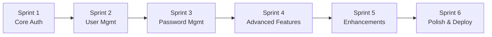
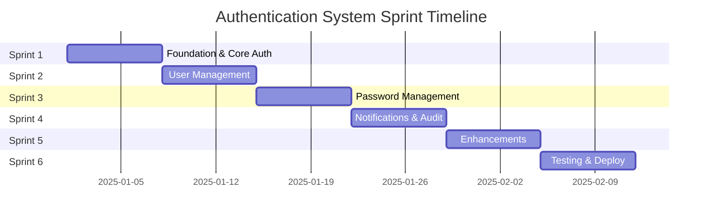

# Sprint Plan - Authentication System Implementation

**Duration**: 6 sprints x 1 minggu (6 weeks total)

**Approach**: Feature-by-feature vertical slice (backend + frontend per feature)

**Team**: Solo developer

**Estimated Effort**: 210-240 total dev hours

---

## Sprint Architecture Overview

---

## SPRINT 1: Foundation & Core Authentication (Week 1)

**Goal**: Sistem login/logout yang berfungsi dengan JWT, user dapat login dan mengakses dashboard sesuai role-nya.

**Priority**: P0 (Critical MVP)

**Estimated Effort**: 35-40 hours

### Backend Tasks

#### Database Setup

- Update [`backend/database/setup.sql`](backend/database/setup.sql) dengan:
  - Enhanced `users` table (tambah: `profile_photo_url`, `must_change_password`, `last_login_at`, `failed_login_attempts`, `locked_until`)
  - Create `user_sessions` table untuk token tracking
  - Create `password_reset_tokens` table
  - Create indexes untuk NIP dan email
- Run migration dan seed initial admin user (NIP: 99999, password: Admin@123)

#### Models

- Create [`backend/models/user.go`](backend/models/user.go)
  - User struct dengan GORM tags
  - Enum untuk roles: ADMIN, MANAGER, STAFF_KHAZWAL, OPERATOR_CETAK, QC_INSPECTOR, VERIFIKATOR, STAFF_KHAZKHIR
  - Enum untuk departments: KHAZWAL, CETAK, VERIFIKASI, KHAZKHIR
  - Validation tags (max NIP 5 char, required fields)

#### Services

- Create [`backend/services/password_service.go`](backend/services/password_service.go)
  - `HashPassword(password string) (string, error)` - bcrypt dengan cost 12
  - `VerifyPassword(hashedPassword, password string) bool`
  - Password validation: min 8 char, 1 uppercase, 1 number, 1 special char

- Create [`backend/services/auth_service.go`](backend/services/auth_service.go)
  - `Login(nip, password string, rememberMe bool) (token, refreshToken string, user User, error)`
  - `Logout(userID uint64, token string) error`
  - `GenerateJWT(user User) (string, error)` - JWT expiry 15 min
  - `GenerateRefreshToken(user User) (string, error)` - Refresh token expiry 30 days
  - `ValidateToken(token string) (User, error)`
  - Rate limiting: max 5 failed attempts per 15 minutes

#### Handlers

- Create [`backend/handlers/auth_handler.go`](backend/handlers/auth_handler.go)
  - `POST /api/auth/login` - Accept {nip, password, remember_me}
  - `POST /api/auth/logout` - Invalidate token
  - `GET /api/auth/me` - Get current user info

#### Middleware

- Create [`backend/middleware/auth_middleware.go`](backend/middleware/auth_middleware.go)
  - `AuthRequired()` - Validate JWT dari header Authorization
  - Return 401 jika token invalid/expired

- Create [`backend/middleware/role_middleware.go`](backend/middleware/role_middleware.go)
  - `RequireRole(...roles string)` - Check user role
  - Return 403 jika user tidak memiliki role yang diizinkan

#### Routes

- Update [`backend/routes/routes.go`](backend/routes/routes.go)
  - Public routes: `/api/auth/login`
  - Protected routes: `/api/auth/logout`, `/api/auth/me`

### Frontend Tasks

#### State Management

- Create [`frontend/src/stores/auth.js`](frontend/src/stores/auth.js) (Pinia store)
  - State: `user`, `token`, `refreshToken`, `isAuthenticated`
  - Actions: `login()`, `logout()`, `fetchCurrentUser()`, `refreshAuth()`
  - Persist token ke localStorage

#### Composables

- Create [`frontend/src/composables/useAuth.js`](frontend/src/composables/useAuth.js)
  - `login(nip, password, rememberMe)` - Call API dan update store
  - `logout()` - Clear token dan redirect ke login
  - `checkAuth()` - Validate token masih valid

- Create [`frontend/src/composables/useApi.js`](frontend/src/composables/useApi.js)
  - Axios instance dengan auto token injection
  - Intercept 401 untuk auto-logout
  - Handle refresh token flow

#### Router Guards

- Create [`frontend/src/router/index.js`](frontend/src/router/index.js)
  - Navigation guard: redirect ke `/login` jika belum auth
  - Navigation guard: redirect ke role dashboard jika sudah login
  - Role-based route protection

#### Pages

- Create [`frontend/src/views/auth/Login.vue`](frontend/src/views/auth/Login.vue)
  - Form: NIP input (max 5 digit), Password input, Remember Me checkbox
  - Validation: required fields, NIP numeric only
  - Error handling: "NIP atau password salah", "Akun terkunci"
  - Loading state dengan spinner
  - Design: Glass effect card, backdrop blur, iOS spring animation pada button

- Create [`frontend/src/views/dashboards/AdminDashboard.vue`](frontend/src/views/dashboards/AdminDashboard.vue) (placeholder)
- Create [`frontend/src/views/dashboards/StaffDashboard.vue`](frontend/src/views/dashboards/StaffDashboard.vue) (placeholder untuk roles lain)

#### Components

- Create [`frontend/src/components/layout/Navbar.vue`](frontend/src/components/layout/Navbar.vue)
  - Logo, app title
  - User avatar dropdown (kanan atas): Profile, Ganti Password, Keluar
  - Mobile responsive dengan hamburger menu

#### Styling

- Update [`frontend/src/style.css`](frontend/src/style.css)
  - iOS-inspired animations (spring physics)
  - Glass effect utilities
  - Indigo & Fuchsia theme colors

### Deliverables

- User dapat login dengan NIP dan password
- Token JWT disimpan dan digunakan untuk subsequent requests
- Auto-redirect ke dashboard sesuai role setelah login
- Navbar dengan user dropdown dan logout button
- Protected routes tidak bisa diakses tanpa login
- Login form dengan validation dan error handling

### Acceptance Criteria

- [ ] Login success dengan credentials valid → redirect ke dashboard
- [ ] Login failed dengan credentials invalid → show error message
- [ ] Token tersimpan di localStorage setelah login
- [ ] Refresh page → user tetap logged in (token valid)
- [ ] Logout → token dihapus, redirect ke login
- [ ] Access protected route tanpa token → redirect ke login
- [ ] Rate limiting: 5 failed login → account locked 15 menit

### Testing

- Manual test: Login admin (NIP: 99999), verify redirect ke AdminDashboard
- Test invalid credentials
- Test remember me functionality
- Test token expiry (set JWT expiry 1 min untuk testing)

---

## SPRINT 2: User Management & Profile (Week 2)

**Goal**: Admin dapat CRUD users, user dapat melihat dan edit profile sendiri.

**Priority**: P0 + P1

**Estimated Effort**: 38-42 hours

### Backend Tasks

#### Models

- Create [`backend/models/user_session.go`](backend/models/user_session.go)
  - Track active sessions dengan device info dan IP address

#### Services

- Create [`backend/services/user_service.go`](backend/services/user_service.go)
  - `GetAllUsers(filters UserFilters, pagination Pagination) ([]User, int, error)`
  - `GetUserByID(id uint64) (User, error)`
  - `CreateUser(user User) (User, error)` - Auto-generate random password
  - `UpdateUser(id uint64, updates User) (User, error)`
  - `DeleteUser(id uint64) error` - Soft delete
  - `SearchUsers(query string) ([]User, error)`

- Update [`backend/services/auth_service.go`](backend/services/auth_service.go)
  - `UpdateProfile(userID uint64, updates ProfileUpdate) (User, error)`

#### Handlers

- Create [`backend/handlers/user_handler.go`](backend/handlers/user_handler.go)
  - `GET /api/users` - List users dengan filters (role, department, search)
  - `GET /api/users/:id` - Get user detail
  - `POST /api/users` - Create new user (Admin only)
  - `PUT /api/users/:id` - Update user (Admin only)
  - `DELETE /api/users/:id` - Soft delete user (Admin only)

- Create [`backend/handlers/profile_handler.go`](backend/handlers/profile_handler.go)
  - `GET /api/profile` - Get own profile
  - `PUT /api/profile` - Update own profile (full_name, email, phone only)

#### Middleware

- Create [`backend/middleware/activity_logger.go`](backend/middleware/activity_logger.go)
  - Auto-log critical actions (CREATE, UPDATE, DELETE users) ke `activity_logs` table
  - Include: user_id, action, entity_type, entity_id, changes (before/after JSON)

#### Routes

- Update [`backend/routes/routes.go`](backend/routes/routes.go)
  - Admin routes: `/api/users/*` dengan `RequireRole("ADMIN", "MANAGER")`
  - Protected routes: `/api/profile`, `/api/profile` (PUT)

### Frontend Tasks

#### State Management

- Create [`frontend/src/stores/user.js`](frontend/src/stores/user.js)
  - State: `users[]`, `currentEditUser`, `filters`, `pagination`
  - Actions: `fetchUsers()`, `createUser()`, `updateUser()`, `deleteUser()`

#### Pages

- Create [`frontend/src/views/admin/users/UserList.vue`](frontend/src/views/admin/users/UserList.vue)
  - Table: NIP, Nama, Role, Department, Status, Actions (Edit, Delete)
  - Search bar: "Cari berdasarkan NIP atau Nama" (debounced 300ms)
  - Filters: Role dropdown, Department dropdown
  - Pagination: Show 20 users per page
  - Button: "Tambah User Baru" (kanan atas)
  - Staggered animations saat list muncul (iOS-style)

- Create [`frontend/src/views/admin/users/UserForm.vue`](frontend/src/views/admin/users/UserForm.vue)
  - Form fields: NIP (5 digit max), Full Name, Email, Phone, Role, Department, Shift
  - Validation: NIP unique, email format, phone format (08xxx)
  - Auto-generate password, show once dengan copy button
  - Option: "Kirim kredensial via email" (future)
  - Submit → Success notification dengan credentials display

- Create [`frontend/src/views/profile/Profile.vue`](frontend/src/views/profile/Profile.vue)
  - ProfileCard dengan foto placeholder
  - Display: NIP (read-only), Nama, Email, Phone, Role (read-only), Department (read-only)
  - Button: "Edit Profile"
  - Section: Total Points, Achievements (placeholder untuk gamification)

- Create [`frontend/src/views/profile/EditProfile.vue`](frontend/src/views/profile/EditProfile.vue)
  - Form: Full Name, Email, Phone (editable)
  - NIP, Role, Department (read-only, greyed out)
  - Button: Simpan, Batal
  - Success notification setelah update

#### Components

- Create [`frontend/src/components/admin/UserTable.vue`](frontend/src/components/admin/UserTable.vue)
  - Reusable table component dengan sort dan filter

- Create [`frontend/src/components/admin/UserFormModal.vue`](frontend/src/components/admin/UserFormModal.vue)
  - Modal untuk create/edit user (slide-up animation dari bawah)

- Create [`frontend/src/components/admin/RoleBadge.vue`](frontend/src/components/admin/RoleBadge.vue)
  - Color-coded role badges (Indigo untuk Admin, Fuchsia untuk Operator, dll)

- Create [`frontend/src/components/profile/ProfileCard.vue`](frontend/src/components/profile/ProfileCard.vue)
  - Card dengan user info dan avatar

#### Navigation

- Update [`frontend/src/components/layout/Sidebar.vue`](frontend/src/components/layout/Sidebar.vue) (create if not exists)
  - Menu item: "Manajemen User" (icon: UsersIcon) - visible untuk ADMIN/MANAGER only
  - Menu item: "Profile" (icon: UserIcon) - visible untuk semua role

### Deliverables

- Admin dapat create, read, update, delete users
- Admin dapat search dan filter users
- User dapat view dan edit profile sendiri
- Activity logs tercatat untuk semua user management actions
- Role badges dengan color coding

### Acceptance Criteria

- [ ] Admin dapat create user baru, credentials ter-generate otomatis
- [ ] Admin dapat edit user role/department
- [ ] Admin dapat soft delete user
- [ ] Admin dapat search user by NIP atau nama
- [ ] Admin dapat filter by role dan department
- [ ] User dapat view profile sendiri
- [ ] User dapat update full_name, email, phone
- [ ] User tidak bisa update NIP, role, department
- [ ] Activity logs tercatat dengan before/after values
- [ ] Pagination berfungsi dengan baik (20 users per page)

### Testing

- Create 3 users dengan role berbeda
- Search user by name
- Filter by role OPERATOR_CETAK
- Edit user profile (self-service)
- Verify activity logs tercatat

---

## SPRINT 3: Password Management & Security (Week 3)

**Goal**: User dapat change password, reset password via email, first-time login flow, dan enhanced security features.

**Priority**: P0 + P1

**Estimated Effort**: 36-40 hours

### Backend Tasks

#### Models

- Create [`backend/models/password_reset_token.go`](backend/models/password_reset_token.go)
  - Token hash, user_id, expires_at, used_at

#### Services

- Update [`backend/services/password_service.go`](backend/services/password_service.go)
  - `ChangePassword(userID uint64, currentPassword, newPassword string) error`
  - `ValidatePasswordPolicy(password string) error` - Min 8 char, 1 uppercase, 1 number, 1 special
  - `GenerateResetToken(userID uint64) (string, error)` - Token expiry 1 hour
  - `ResetPassword(token, newPassword string) error`
  - `SendResetEmail(email, token string) error` - Integration dengan email service (SMTP/SendGrid)

- Update [`backend/services/auth_service.go`](backend/services/auth_service.go)
  - Check `must_change_password` flag saat login
  - Return flag `require_password_change: true` dalam response

#### Handlers

- Update [`backend/handlers/auth_handler.go`](backend/handlers/auth_handler.go)
  - `POST /api/auth/forgot-password` - Request password reset (input: NIP + email)
  - `POST /api/auth/reset-password` - Reset password dengan token
  - `POST /api/auth/refresh` - Refresh JWT token

- Create [`backend/handlers/password_handler.go`](backend/handlers/password_handler.go)
  - `PUT /api/profile/password` - Change own password (input: current_password, new_password)
  - `POST /api/users/:id/reset-password` - Admin force reset user password

#### Routes

- Update [`backend/routes/routes.go`](backend/routes/routes.go)
  - Public: `/api/auth/forgot-password`, `/api/auth/reset-password`
  - Protected: `/api/profile/password`, `/api/auth/refresh`
  - Admin: `/api/users/:id/reset-password`

#### Config

- Update [`backend/config/config.go`](backend/config/config.go) (create if not exists)
  - Add email service configuration (SMTP host, port, username, password)
  - Add JWT secret, expiry configs
  - Load from environment variables

### Frontend Tasks

#### Pages

- Create [`frontend/src/views/auth/ForgotPassword.vue`](frontend/src/views/auth/ForgotPassword.vue)
  - Form: NIP, Email
  - Validation: NIP dan email harus match dengan user di database
  - Submit → "Link reset password telah dikirim ke email Anda"
  - Link: "Kembali ke Login"

- Create [`frontend/src/views/auth/ResetPassword.vue`](frontend/src/views/auth/ResetPassword.vue)
  - Parse token dari URL query param: `/reset-password?token=xxx`
  - Form: New Password, Confirm Password
  - Password strength indicator (weak/medium/strong)
  - Submit → Success, redirect ke login dengan message

- Create [`frontend/src/views/profile/ChangePassword.vue`](frontend/src/views/profile/ChangePassword.vue)
  - Form: Current Password, New Password, Confirm Password
  - Password strength indicator
  - Validation: new password tidak boleh sama dengan current
  - Submit → Success notification, auto-logout semua session

- Create [`frontend/src/views/auth/ForceChangePassword.vue`](frontend/src/views/auth/ForceChangePassword.vue)
  - Triggered jika `must_change_password = true` setelah login
  - Fullscreen modal (tidak bisa di-close)
  - Message: "Anda harus mengubah password sebelum melanjutkan"
  - Form: Current Password (dari admin), New Password, Confirm
  - Submit → Update password, set `must_change_password = false`, redirect ke dashboard

#### Components

- Create [`frontend/src/components/auth/PasswordStrength.vue`](frontend/src/components/auth/PasswordStrength.vue)
  - Visual indicator: progress bar dengan color (red → yellow → green)
  - Text: "Lemah", "Sedang", "Kuat"
  - Check: length, uppercase, number, special char

- Create [`frontend/src/components/auth/SessionExpired.vue`](frontend/src/components/auth/SessionExpired.vue)
  - Modal muncul saat token expired (401 response)
  - Message: "Sesi Anda telah berakhir, silakan login kembali"
  - Button: "Login Kembali"

#### Composables

- Update [`frontend/src/composables/useAuth.js`](frontend/src/composables/useAuth.js)
  - Add `forgotPassword(nip, email)`
  - Add `resetPassword(token, password)`
  - Add `changePassword(currentPassword, newPassword)`
  - Handle refresh token flow

### Deliverables

- User dapat change password sendiri
- Forgot password flow dengan email
- Reset password via link email
- First-time login force password change
- Password strength indicator
- Token refresh mechanism

### Acceptance Criteria

- [ ] User dapat change password dengan current password valid
- [ ] Password policy enforced: min 8 char, 1 uppercase, 1 number, 1 special
- [ ] User dapat request password reset via email
- [ ] Email reset dikirim dengan link valid (expiry 1 hour)
- [ ] User dapat reset password via link email
- [ ] Token invalid/expired → error message
- [ ] First-time login → force change password screen
- [ ] After change password → `must_change_password` set to false
- [ ] Logout all sessions setelah password change
- [ ] JWT refresh token flow berfungsi

### Testing

- Change password dengan current password wrong → error
- Change password dengan new password weak → validation error
- Request forgot password dengan email tidak terdaftar → error
- Reset password dengan token expired → error
- First-time login user baru → verify force change password
- Verify email diterima (use Mailtrap/MailHog untuk testing)

---

## SPRINT 4: Advanced Features - Notifications & Audit (Week 4)

**Goal**: In-app notifications, audit logs viewer (admin), dan real-time updates.

**Priority**: P1 + P2

**Estimated Effort**: 38-42 hours

### Backend Tasks

#### Models

- Verify [`backend/models/notification.go`](backend/models/notification.go) sudah ada dari database architecture
- Verify [`backend/models/activity_log.go`](backend/models/activity_log.go) sudah ada

#### Services

- Create [`backend/services/notification_service.go`](backend/services/notification_service.go)
  - `GetUserNotifications(userID uint64, unreadOnly bool) ([]Notification, error)`
  - `MarkAsRead(notificationID uint64) error`
  - `MarkAllAsRead(userID uint64) error`
  - `CreateNotification(userID uint64, title, message, type string) (Notification, error)`
  - `GetUnreadCount(userID uint64) (int, error)`

- Create [`backend/services/activity_log_service.go`](backend/services/activity_log_service.go)
  - `GetActivityLogs(filters ActivityLogFilters, pagination Pagination) ([]ActivityLog, int, error)`
  - `GetUserActivity(userID uint64) ([]ActivityLog, error)`
  - `CreateActivityLog(log ActivityLog) error` - Called by activity_logger middleware

#### Handlers

- Create [`backend/handlers/notification_handler.go`](backend/handlers/notification_handler.go)
  - `GET /api/notifications` - Get user notifications (query: ?unread_only=true)
  - `PUT /api/notifications/:id/read` - Mark as read
  - `PUT /api/notifications/read-all` - Mark all as read
  - `GET /api/notifications/unread-count` - Get count badge

- Create [`backend/handlers/activity_log_handler.go`](backend/handlers/activity_log_handler.go)
  - `GET /api/admin/activity-logs` - Get all logs (Admin only)
  - `GET /api/admin/activity-logs/user/:id` - Get logs by user
  - Filters: user, action type (CREATE/UPDATE/DELETE), entity type, date range

#### Routes

- Update [`backend/routes/routes.go`](backend/routes/routes.go)
  - Protected: `/api/notifications/*`
  - Admin: `/api/admin/activity-logs/*`

#### Real-time (Optional for P2)

- Create [`backend/websocket/notification_hub.go`](backend/websocket/notification_hub.go) (if time permits)
  - WebSocket hub untuk push notifications
  - Broadcast notification ke specific user

### Frontend Tasks

#### State Management

- Create [`frontend/src/stores/notification.js`](frontend/src/stores/notification.js)
  - State: `notifications[]`, `unreadCount`
  - Actions: `fetchNotifications()`, `markAsRead()`, `markAllAsRead()`
  - Real-time update via polling (setiap 30 detik) atau WebSocket

#### Pages

- Create [`frontend/src/views/admin/audit/ActivityLogs.vue`](frontend/src/views/admin/audit/ActivityLogs.vue)
  - Table: Timestamp, User, Action, Entity Type, Entity ID, Changes (expand/collapse)
  - Filters: User dropdown, Action type, Entity type, Date range picker
  - Search: by user name atau entity ID
  - Pagination
  - Export button: "Download CSV" (future)
  - Display changes dalam JSON diff format (before vs after)

- Create [`frontend/src/views/notifications/NotificationCenter.vue`](frontend/src/views/notifications/NotificationCenter.vue)
  - List notifications dengan tabs: "Semua", "Belum Dibaca"
  - Each notification: icon (based on type), title, message, timestamp
  - Action: Mark as read (swipe gesture atau button)
  - Empty state: "Tidak ada notifikasi"

#### Components

- Create [`frontend/src/components/layout/NotificationBell.vue`](frontend/src/components/layout/NotificationBell.vue)
  - Bell icon dengan badge count (unread)
  - Dropdown saat diklik: recent 5 notifications
  - Button: "Lihat Semua" → redirect ke NotificationCenter
  - Button: "Tandai Semua Sudah Dibaca"
  - Real-time update badge count

- Create [`frontend/src/components/admin/ActivityLogTable.vue`](frontend/src/components/admin/ActivityLogTable.vue)
  - Table dengan collapsible rows untuk changes detail
  - Color-coded action types (CREATE: green, UPDATE: blue, DELETE: red)

- Create [`frontend/src/components/admin/JsonDiff.vue`](frontend/src/components/admin/JsonDiff.vue)
  - Display before/after JSON dengan syntax highlighting
  - Highlight differences

#### Layout Updates

- Update [`frontend/src/components/layout/Navbar.vue`](frontend/src/components/layout/Navbar.vue)
  - Add NotificationBell component sebelum user dropdown

- Update [`frontend/src/components/layout/Sidebar.vue`](frontend/src/components/layout/Sidebar.vue)
  - Add menu: "Audit Logs" (Admin only)
  - Add menu: "Notifikasi" (All users)

### Deliverables

- User dapat melihat notifications in-app
- Notification bell dengan unread count badge
- Admin dapat view audit logs dengan filters
- Real-time notification updates (polling atau WebSocket)
- Activity logs dengan before/after changes display

### Acceptance Criteria

- [ ] Notification bell menampilkan unread count
- [ ] User dapat view notifications list
- [ ] User dapat mark notification as read
- [ ] User dapat mark all notifications as read
- [ ] Admin dapat view activity logs dengan filters
- [ ] Activity logs menampilkan before/after changes
- [ ] Filters berfungsi: user, action type, date range
- [ ] Real-time: notification count auto-update setiap 30 detik
- [ ] Empty state ditampilkan saat tidak ada notifications

### Testing

- Create notification via backend (welcome notification saat user dibuat)
- Verify notification muncul di bell
- Mark as read → verify count berkurang
- Admin view activity logs, filter by specific user
- Verify changes JSON displayed correctly

---

## SPRINT 5: Enhancements & Gamification (Week 5)

**Goal**: Achievements, points, bulk operations, profile photo upload, dan UX polish.

**Priority**: P2 (Enhancements)

**Estimated Effort**: 35-40 hours

### Backend Tasks

#### Services

- Create [`backend/services/achievement_service.go`](backend/services/achievement_service.go)
  - `GetUserAchievements(userID uint64) ([]Achievement, error)`
  - `AwardAchievement(userID uint64, achievementID uint64) error`
  - `CheckAndAwardAchievements(userID uint64) error` - Auto-check criteria
  - Achievements contoh:
    - "First Login" - Login pertama kali
    - "100 Jobs Completed" - Complete 100 PO
    - "Perfect Week" - 7 hari berturut-turut tanpa error
    - "Speed Demon" - Complete job < 5 menit

- Update [`backend/services/user_service.go`](backend/services/user_service.go)
  - `BulkImportUsers(csvFile []byte) (imported int, failed []UserImportError, error)`
  - Parse CSV: NIP, Full Name, Email, Phone, Role, Department
  - Validate setiap row, skip jika error
  - Return summary: X imported, Y failed dengan reasons

- Create [`backend/services/file_service.go`](backend/services/file_service.go)
  - `UploadProfilePhoto(userID uint64, file multipart.File) (photoURL string, error)`
  - Resize image to 200x200px
  - Save to `public/uploads/profiles/:userID.jpg`
  - Update user.profile_photo_url

#### Handlers

- Create [`backend/handlers/achievement_handler.go`](backend/handlers/achievement_handler.go)
  - `GET /api/achievements` - List all available achievements
  - `GET /api/profile/achievements` - Get user achievements

- Update [`backend/handlers/user_handler.go`](backend/handlers/user_handler.go)
  - `POST /api/users/bulk-import` - Upload CSV file (Admin only)
  - `GET /api/users/export` - Download users as CSV (Admin only)

- Update [`backend/handlers/profile_handler.go`](backend/handlers/profile_handler.go)
  - `POST /api/profile/photo` - Upload profile photo

#### Routes

- Update [`backend/routes/routes.go`](backend/routes/routes.go)
  - Protected: `/api/achievements`, `/api/profile/achievements`, `/api/profile/photo`
  - Admin: `/api/users/bulk-import`, `/api/users/export`

### Frontend Tasks

#### Pages

- Update [`frontend/src/views/profile/Profile.vue`](frontend/src/views/profile/Profile.vue)
  - Display profile photo dengan option "Upload Foto"
  - Display points dengan progress bar
  - Display achievements grid (badge icons)

- Create [`frontend/src/views/profile/Achievements.vue`](frontend/src/views/profile/Achievements.vue)
  - Grid layout untuk achievement badges
  - Each badge: icon, name, description, earned date
  - Locked badges (grey out) untuk yang belum didapat
  - Progress tracker: "80% to next achievement"

- Update [`frontend/src/views/admin/users/UserList.vue`](frontend/src/views/admin/users/UserList.vue)
  - Add button: "Import CSV"
  - Add button: "Export CSV"
  - Import modal: upload CSV file, validate, show preview, confirm
  - Import result: "X users imported, Y failed" dengan error list

#### Components

- Create [`frontend/src/components/profile/AchievementBadge.vue`](frontend/src/components/profile/AchievementBadge.vue)
  - Badge dengan icon, name, locked/unlocked state
  - Hover effect: show tooltip dengan description
  - Animation: shake/bounce saat baru unlocked

- Create [`frontend/src/components/profile/PointsDisplay.vue`](frontend/src/components/profile/PointsDisplay.vue)
  - Current points dengan animated counter (number tween)
  - Progress bar ke next level
  - Level badge (Bronze/Silver/Gold)

- Create [`frontend/src/components/profile/PhotoUpload.vue`](frontend/src/components/profile/PhotoUpload.vue)
  - Avatar dengan overlay "Change Photo" on hover
  - Click → file picker (accept image/* only)
  - Preview before upload
  - Crop/resize interface (optional)
  - Upload → show loading → update avatar

- Create [`frontend/src/components/admin/CsvImport.vue`](frontend/src/components/admin/CsvImport.vue)
  - Drag & drop area untuk CSV file
  - Show preview tabel sebelum import
  - Validation errors per row
  - Confirm button
  - Result summary

#### UX Enhancements

- Add haptic feedback (vibration) saat:
  - Login success (200ms pulse)
  - Achievement unlocked (3 short pulses)
  - Error (single long pulse)

- Add spring animations saat:
  - Notification badge count change (bounce)
  - Achievement unlocked (scale + rotate)
  - Button press (scale down 0.97)

- Add loading skeletons untuk:
  - User list loading
  - Profile loading
  - Notification list loading

### Deliverables

- User dapat upload profile photo
- Achievements system dengan badge display
- Points tracking dengan level system
- Bulk import users via CSV (Admin)
- Export users to CSV (Admin)
- Enhanced UX dengan animations dan haptic feedback

### Acceptance Criteria

- [ ] User dapat upload profile photo, preview, dan save
- [ ] Profile photo ditampilkan di navbar dan profile page
- [ ] Achievements displayed dengan locked/unlocked state
- [ ] User dapat view achievement details
- [ ] Points displayed dengan progress bar
- [ ] Admin dapat import users via CSV
- [ ] CSV validation errors ditampilkan per row
- [ ] Import summary displayed: X imported, Y failed
- [ ] Admin dapat export users to CSV
- [ ] Haptic feedback berfungsi pada mobile
- [ ] Spring animations smooth dan responsive

### Testing

- Upload profile photo berbagai format (jpg, png, webp)
- Upload profile photo large size → verify resize
- Import CSV dengan 10 users (5 valid, 5 invalid)
- Verify validation errors displayed correctly
- Export users, download CSV, re-import
- Test animations pada berbagai devices (iOS, Android)
- Test haptic feedback pada device yang support

---

## SPRINT 6: Testing, Optimization & Deployment (Week 6)

**Goal**: End-to-end testing, performance optimization, PWA setup, dan deployment preparation.

**Priority**: Production Ready

**Estimated Effort**: 36-40 hours

### Testing Tasks

#### Unit Tests (Backend)

- Create [`backend/tests/services/password_service_test.go`](backend/tests/services/password_service_test.go)
  - Test password hashing
  - Test password verification
  - Test password policy validation

- Create [`backend/tests/services/auth_service_test.go`](backend/tests/services/auth_service_test.go)
  - Test JWT generation
  - Test JWT validation
  - Test login flow
  - Test rate limiting

- Create [`backend/tests/middleware/auth_middleware_test.go`](backend/tests/middleware/auth_middleware_test.go)
  - Test token validation
  - Test expired token handling
  - Test missing token handling

- Create [`backend/tests/middleware/role_middleware_test.go`](backend/tests/middleware/role_middleware_test.go)
  - Test role checking
  - Test unauthorized access

#### Integration Tests (Backend)

- Create [`backend/tests/integration/auth_flow_test.go`](backend/tests/integration/auth_flow_test.go)
  - Test complete login flow
  - Test logout flow
  - Test refresh token flow
  - Test forgot password flow

- Create [`backend/tests/integration/user_management_test.go`](backend/tests/integration/user_management_test.go)
  - Test create user
  - Test update user
  - Test delete user
  - Test search users

#### E2E Tests (Frontend)

- Create [`frontend/tests/e2e/auth.spec.js`](frontend/tests/e2e/auth.spec.js) (Playwright/Cypress)
  - Test login dengan valid credentials
  - Test login dengan invalid credentials
  - Test logout
  - Test session persistence
  - Test auto-redirect setelah login

- Create [`frontend/tests/e2e/user-management.spec.js`](frontend/tests/e2e/user-management.spec.js)
  - Test create user (Admin)
  - Test edit user (Admin)
  - Test delete user (Admin)
  - Test search users

- Create [`frontend/tests/e2e/profile.spec.js`](frontend/tests/e2e/profile.spec.js)
  - Test view profile
  - Test edit profile
  - Test change password

### Performance Optimization

#### Backend

- Add database indexes:
  - Index pada `users.nip`
  - Index pada `users.email`
  - Index pada `activity_logs.user_id`
  - Composite index pada `notifications(user_id, is_read)`

- Implement caching dengan Redis (optional):
  - Cache user data (invalidate on update)
  - Cache JWT blacklist untuk logout
  - Cache notification count

- Add rate limiting middleware:
  - Login endpoint: 5 requests per 15 minutes per IP
  - General API: 100 requests per minute per user

#### Frontend

- Code splitting dengan dynamic imports:
  - Split by routes (lazy load pages)
  - Split admin components (only load untuk admin users)

- Image optimization:
  - Lazy load images
  - Use WebP format untuk profile photos
  - Add loading placeholder (skeleton)

- Bundle optimization:
  - Tree shaking untuk unused code
  - Minification
  - Gzip compression

- Add loading states everywhere:
  - Skeleton loaders untuk tables
  - Spinner untuk buttons saat submit
  - Progress bar untuk file uploads

### PWA Setup

#### Service Worker

- Update [`frontend/vite.config.js`](frontend/vite.config.js)
  - Configure vite-plugin-pwa
  - Set caching strategies:
    - NetworkFirst untuk login/auth APIs
    - CacheFirst untuk static assets
    - StaleWhileRevalidate untuk user data

- Create [`frontend/public/manifest.json`](frontend/public/manifest.json)
  - App name: "Sistem Produksi Pita Cukai"
  - Icons: 192x192, 512x512
  - Theme color: Indigo
  - Background color: White
  - Display: standalone

#### Offline Capability

- Implement offline detection:
  - Show banner "Anda sedang offline" (orange)
  - Disable actions yang require network
  - Queue failed requests ke IndexedDB

- Cache critical pages:
  - Login page
  - Dashboard
  - Profile page

### Deployment Preparation

#### Environment Configuration

- Create [`backend/.env.example`](backend/.env.example)
  - `DB_HOST`, `DB_PORT`, `DB_USER`, `DB_PASSWORD`, `DB_NAME`
  - `JWT_SECRET`, `JWT_EXPIRY`, `REFRESH_TOKEN_EXPIRY`
  - `BCRYPT_COST`
  - `FRONTEND_URL` (untuk CORS)
  - `EMAIL_SMTP_HOST`, `EMAIL_SMTP_PORT`, `EMAIL_USERNAME`, `EMAIL_PASSWORD`

- Create [`frontend/.env.example`](frontend/.env.example)
  - `VITE_API_BASE_URL`
  - `VITE_APP_NAME`
  - `VITE_TIMEZONE` (Asia/Jakarta)

#### Documentation

- Create [`docs/AUTHENTICATION.md`](docs/AUTHENTICATION.md)
  - API endpoints documentation
  - Authentication flow diagram
  - Error codes reference
  - Security best practices

- Update [`README.md`](README.md)
  - Add authentication system section
  - Add setup instructions
  - Add testing instructions

#### Deployment Checklist

- [ ] Environment variables set di production
- [ ] Database migrations run
- [ ] Seed initial admin user
- [ ] HTTPS enabled
- [ ] CORS configured correctly
- [ ] Rate limiting enabled
- [ ] Email service configured
- [ ] Service worker registered
- [ ] Error monitoring setup (Sentry optional)
- [ ] Performance monitoring setup

### Security Hardening

- [ ] Enable httpOnly cookies untuk tokens (instead of localStorage)
- [ ] Add CSRF protection
- [ ] Add Content Security Policy headers
- [ ] Sanitize all user inputs
- [ ] Add SQL injection protection (GORM handles this)
- [ ] Add XSS protection headers
- [ ] Enable rate limiting
- [ ] Add monitoring untuk suspicious activities (5+ failed logins)

### Deliverables

- Comprehensive test coverage (unit, integration, E2E)
- Performance optimized (< 500ms login, < 1s dashboard load)
- PWA configured dengan offline capability
- Production-ready deployment
- Complete documentation
- Security hardened

### Acceptance Criteria

- [ ] Unit tests pass (> 80% coverage)
- [ ] Integration tests pass
- [ ] E2E tests pass
- [ ] Performance targets met (login < 500ms, dashboard < 1s)
- [ ] PWA installable pada mobile
- [ ] Offline mode berfungsi
- [ ] Security checklist completed
- [ ] Documentation complete
- [ ] Production environment configured
- [ ] Initial admin user seeded
- [ ] All linter errors fixed

### Testing

- Run full test suite: `yarn test`
- Run E2E tests: `yarn test:e2e`
- Test pada different browsers (Chrome, Firefox, Safari)
- Test pada different devices (Desktop, Tablet, Mobile)
- Test PWA installation pada mobile
- Test offline functionality
- Load testing dengan 100 concurrent users (optional)

---

## Cross-Sprint Continuous Tasks

### Daily Tasks (Sepanjang Sprint)

- Code review (self-review jika solo)
- Commit dengan descriptive messages (format: `[Sprint X] Feature: description`)
- Update progress di TODO list
- Manual testing setiap feature selesai
- Fix linter errors setiap hari

### Weekly Tasks (Akhir Sprint)

- Sprint retrospective (self-reflection)
- Update documentation
- Backup database
- Deploy ke staging environment (jika ada)
- Review code quality metrics

---

## Risk Mitigation

### Potential Blockers

1. **Email service setup** (Sprint 3)

   - Mitigation: Use Mailtrap untuk development, configure real SMTP later

2. **Performance issues dengan large dataset** (Sprint 2)

   - Mitigation: Implement pagination early, add indexes

3. **WebSocket complexity** (Sprint 4)

   - Mitigation: Start dengan polling, upgrade ke WebSocket jika time permits

4. **PWA compatibility issues** (Sprint 6)

   - Mitigation: Test early pada target devices, use progressive enhancement

### Scope Creep Prevention

- Stick to defined priorities (P0 → P1 → P2)
- Move non-critical features to backlog
- Time-box complex features (max 2 days)
- Use feature flags untuk incomplete features

---

## Success Metrics

### Technical Metrics

- Login response time: < 500ms (target: 300ms)
- Dashboard load time: < 1s (target: 800ms)
- API response time (avg): < 300ms
- Test coverage: > 80%
- Bundle size: < 500KB gzipped
- Lighthouse score: > 90 (Performance, Accessibility)

### User Metrics

- Login success rate: > 95%
- Failed login rate: < 5%
- Password reset completion rate: > 80%
- User profile update frequency: Track engagement
- Admin user management efficiency: < 2 min per user creation

---

## Post-Sprint Backlog (Future Enhancements)

### P3 Features (Not in Current Scope)

- Two-factor authentication (2FA)
- Social login (Google, Microsoft)
- Single Sign-On (SSO) integration
- Advanced permissions matrix (granular RBAC)
- User groups/teams management
- Audit log export to PDF/Excel
- Real-time activity feed (live updates)
- User analytics dashboard (login patterns, active users)
- Dark mode toggle
- Multi-language support (EN/ID switch)

---

## Summary Timeline

**Total Duration**: 6 weeks (42 days)

**Total Estimated Effort**: 218-244 hours

**Average per Sprint**: 36-41 hours (~5-6 hours per day untuk solo developer)

---

## Getting Started

### Sprint 1 Kickoff Checklist

- [ ] Setup development environment (Go, Node.js, MySQL)
- [ ] Clone repository
- [ ] Install dependencies (`go mod download`, `yarn install`)
- [ ] Create development database
- [ ] Copy `.env.example` to `.env` dan configure
- [ ] Run existing migrations
- [ ] Start backend: `make run` atau `go run cmd/main.go`
- [ ] Start frontend: `yarn dev`
- [ ] Verify current state: test existing example endpoints
- [ ] Create branch: `feature/sprint-1-core-auth`
- [ ] Open plan file dan mulai dari task pertama: Database Setup

**Good luck dengan sprint implementation! 🚀**