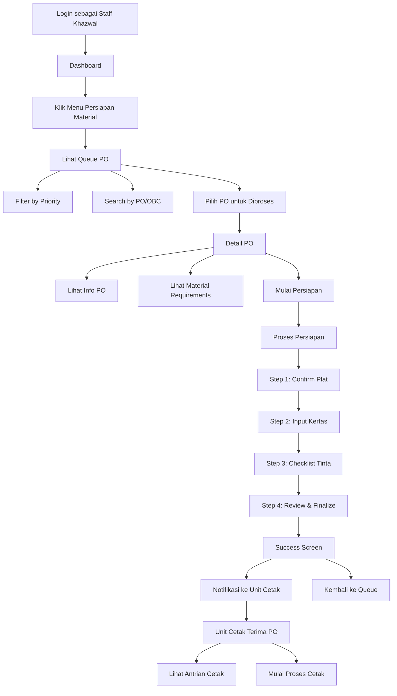

# User Journey: Khazwal Material Preparation

**Feature**: Material Preparation System  
**Actor**: Staff Khazwal, Supervisor Khazwal, Operator Cetak  
**Version**: 1.0.0  
**Last Updated**: 29 Desember 2025

---

## Overview

User journey ini menggambarkan alur lengkap proses penyiapan material di Unit Khazanah Awal, yaitu: melihat queue PO, memulai persiapan, konfirmasi plat/kertas/tinta, finalisasi, dan handoff ke Unit Cetak.

---

## Journey Map



---

## Detailed Flow

### 1. Staff Khazwal - Melihat Queue PO

**Trigger**: Staff login dan akses menu Persiapan Material

**Steps**:

1. **Login**
   - Staff login dengan NIP dan password
   - Role: STAFF_KHAZWAL
   - Redirect ke Dashboard

2. **Navigation**
   - Sidebar menampilkan "Khazanah Awal" section
   - Click "Persiapan Material"
   - Route: `/khazwal/material-prep`

3. **Queue Display**
   - System fetch PO dengan status WAITING_MATERIAL_PREP
   - Display sebagai card list
   - Sort by: priority_score DESC, due_date ASC
   - Show: PO number, OBC, product name, priority badge, due date

4. **Filter & Search**
   - Filter dropdown untuk priority (URGENT, NORMAL, LOW)
   - Search box untuk PO/OBC/product name
   - Debounced search (500ms)
   - Real-time filter results

5. **Animations** (iOS-inspired)
   - Page entrance: fadeUp dengan spring physics
   - Cards: staggered animation (0.05s delay)
   - Filter bar: slide down animation

**UI Elements**:
- Priority badges dengan color coding (🔴 URGENT, 🟡 NORMAL, 🟢 LOW)
- Due date indicator dengan color (red = overdue, yellow = near, green = normal)
- Quantity dan status display
- Mobile-first responsive layout

---

### 2. Staff Khazwal - Detail PO & Mulai Persiapan

**Trigger**: Staff click PO card dari queue

**Steps**:

1. **Navigate to Detail**
   - Click PO card
   - Route: `/khazwal/material-prep/:id`
   - System fetch detail PO dengan relations

2. **Display PO Information**
   - Header: PO Number, OBC Number, Status Badge
   - Info Card:
     - Product Name
     - SAP Customer Code & Product Code
     - Quantity Ordered & Target Lembar Besar
     - Order Date & Due Date
     - Notes (jika ada)

3. **Display Material Requirements**
   - Plat Code dengan blue styling
   - Kertas Blanko quantity dengan amber styling
   - Tinta list dengan purple styling dan color swatches

4. **Start Preparation Action**
   - Button "Mulai Persiapan" (visible jika status = WAITING)
   - Click → Show confirmation dialog
   - Confirm → API call POST /start
   - Success → Navigate to Process page

5. **Animations**
   - Content fadeUp dengan stagger
   - Button scale effect on press
   - Dialog fadeScale entrance
   - Haptic feedback on action

---

### 3. Staff Khazwal - Proses Persiapan Material

**Trigger**: Staff click "Mulai Persiapan" dan confirm

**Route**: `/khazwal/material-prep/:id/process`

#### Step 1: Confirm Plat

**Actions**:
1. Display expected plat code
2. Option A: Scan barcode via camera
   - Request camera permission
   - Real-time barcode detection
   - Validate against expected code
3. Option B: Manual input
   - Text input untuk kode plat
   - Submit untuk validasi

**Validations**:
- Code must match expected (case-insensitive)
- Match → Green checkmark, auto advance
- Mismatch → Red warning, cannot proceed

**API**: POST `/material-prep/:id/confirm-plat`

#### Step 2: Input Kertas Blanko

**Actions**:
1. Display target quantity
2. Input actual quantity (numeric keyboard mobile)
3. Real-time variance calculation
4. If variance > 5%:
   - Show warning banner
   - Require reason input (min 10 chars)

**Variance Display**:
- Progress bar menunjukkan actual vs target
- Color coding: green (0%), yellow (<5%), red (>5%)
- Percentage display

**API**: PATCH `/material-prep/:id/kertas`

#### Step 3: Checklist Tinta

**Actions**:
1. Display tinta list dari requirements
2. Per warna:
   - Checkbox untuk konfirmasi
   - Quantity input (kg, decimal)
   - Color swatch indicator
3. Low stock warning jika < 10kg
4. Progress bar (checked / total)

**Validations**:
- All checked items must have quantity > 0
- Cannot proceed jika tidak semua checked

**API**: PATCH `/material-prep/:id/tinta`

#### Step 4: Review & Finalize

**Actions**:
1. Summary Checklist:
   - ✅ Plat dikonfirmasi (timestamp)
   - ✅ Kertas disiapkan (qty, variance)
   - ✅ Tinta disiapkan (breakdown per warna)
2. Photo Upload (optional):
   - Max 5 photos
   - Auto compress > 2MB
   - Camera capture support
3. Notes Input (optional)
4. Finalize Button

**Validations**:
- All previous steps must be completed
- Photos optional but recommended

**API**: POST `/material-prep/:id/finalize`

#### Navigation

- Stepper component menunjukkan progress
- Can navigate back to completed steps
- Back button di step 1 → return to detail page

---

### 4. Success & Handoff ke Unit Cetak

**Trigger**: Staff click "Selesai & Kirim ke Unit Cetak"

**Steps**:

1. **Finalize Process**
   - Show confirmation dialog
   - Confirm → API call
   - System updates:
     - Material prep status → COMPLETED
     - PO stage → CETAK
     - PO status → READY_FOR_CETAK
     - Calculate duration
     - Store photos

2. **Create Notifications**
   - System create notification untuk semua OPERATOR_CETAK
   - Title: "Material Siap - PO #[OBC]"
   - Message: "Material untuk PO #[OBC] telah siap..."

3. **Success Screen**
   - Animated checkmark icon (popIn)
   - Success message dengan PO number
   - Duration display (formatted: "45 menit" atau "1 jam 30 menit")
   - Completion details (by who, when, photo count)
   - Navigation buttons:
     - "Kembali ke Queue"
     - "Lihat Detail PO"

4. **Haptic Feedback**
   - Success vibration pattern
   - Celebratory animation

---

### 5. Supervisor Khazwal - Monitoring

**Route**: `/khazwal/monitoring`

**Role Required**: SUPERVISOR_KHAZWAL, ADMIN, MANAGER

**Dashboard Elements**:

1. **Stats Cards**
   - Queue Count: PO menunggu
   - In Progress: PO sedang diproses
   - Completed Today: Selesai hari ini
   - Avg Duration: Rata-rata waktu proses

2. **Staff Activity**
   - List active staff
   - Current PO being processed
   - Duration since start
   - Status indicator (active/idle)

3. **Recent Completions**
   - Timeline dengan recent completions
   - PO number, staff name, duration
   - Timestamp

4. **Auto-Refresh**
   - Data refresh setiap 30 detik
   - Manual refresh button available

---

### 6. Operator Cetak - Receive Material

**Route**: `/cetak/queue`

**Role Required**: OPERATOR_CETAK, SUPERVISOR_CETAK, ADMIN, MANAGER

**Steps**:

1. **Receive Notification**
   - Notification bell badge +1
   - Click → See notification detail
   - Click notification → Navigate to Cetak Queue

2. **View Cetak Queue**
   - Filter: READY_FOR_CETAK status
   - Show: PO info, priority, prepared by
   - Photo indicator jika ada foto

3. **View Material Details**
   - Click PO card → Detail modal
   - See material summary
   - View uploaded photos (swipe gallery)
   - Read notes dari Khazwal staff

---

## State Transitions

### Production Order Status Flow

```
WAITING_MATERIAL_PREP
       ↓ (Staff starts prep)
MATERIAL_PREP_IN_PROGRESS
       ↓ (Staff finalizes)
READY_FOR_CETAK
       ↓ (Operator starts cetak)
[Next stage...]
```

### Material Prep Status Flow

```
PENDING
   ↓ (Start)
IN_PROGRESS
   ↓ (Finalize)
COMPLETED
```

---

## Error Scenarios

### Scanner Errors

**Scenario**: Camera tidak tersedia atau permission denied

**Handling**:
1. Show error message
2. Offer manual input fallback
3. Staff dapat input kode manual

### Network Errors

**Scenario**: API call gagal

**Handling**:
1. Show error toast
2. Offer retry button
3. Data tidak hilang (form state preserved)

### Concurrent Access

**Scenario**: 2 staff mencoba start PO yang sama

**Handling**:
1. First request wins
2. Second gets error: "PO sedang diproses oleh [nama]"
3. Redirect back to queue

---

## Mobile Considerations

### Touch Optimization
- Minimum tap target: 44x44px
- Press feedback (scale 0.97)
- Haptic feedback on actions

### Camera Usage
- Landscape orientation support
- Auto-focus for barcode
- Flash control available

### Offline Handling
- Queue cached for viewing
- Actions require online
- Clear offline indicator

---

## Related Documentation

- **API Reference**: [Khazwal API](../../04-api-reference/khazwal.md)
- **Testing Guide**: [Khazwal Testing](../../06-testing/khazwal-testing.md)
- **Sprint Documentation**: [Sprint Khazwal](../../10-sprints/sprint-khazwal-material-prep.md)

---

*Last Updated: 29 Desember 2025*
