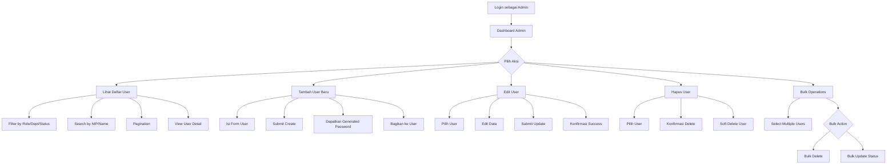
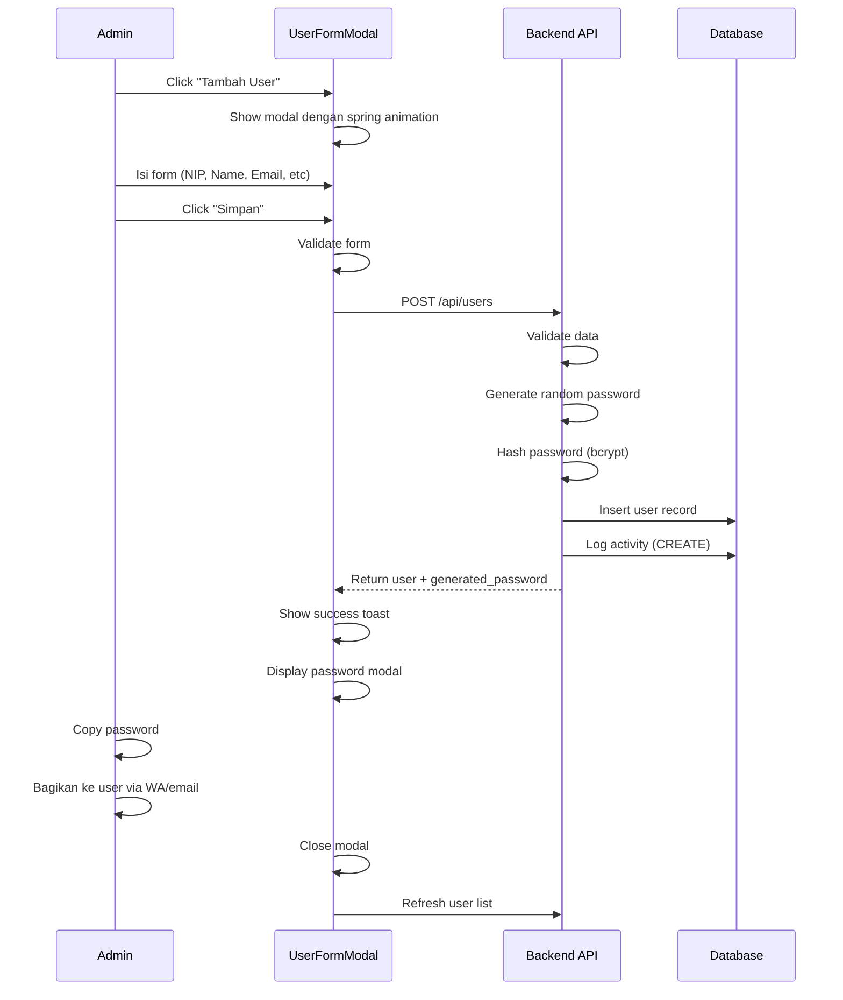

# User Journey: Admin User Management

**Feature**: User Management System  
**Actor**: Administrator  
**Version**: 1.1.0  
**Last Updated**: 28 Desember 2025

---

## Overview

User journey ini menggambarkan alur lengkap Administrator dalam mengelola users, yaitu: create, read, update, delete users, serta bulk operations untuk efisiensi management.

---

## Journey Map



---

## Detailed Flow

### 1. Akses User Management

**Trigger**: Admin click menu "Manajemen User" di sidebar

**Steps**:
1. **Navigation**
   - Admin login dengan role ADMIN
   - Sidebar menampilkan menu "Manajemen User" (hanya untuk Admin/Manager)
   - Click menu → redirect ke `/admin/users`

2. **Initial Load**
   - System fetch users dengan pagination default (page 1, 20 items)
   - Display user table dengan columns:
     - NIP
     - Nama Lengkap
     - Email
     - Role (dengan color badge)
     - Department
     - Status (dengan color badge)
     - Actions (Edit, Delete)

3. **Animations** (iOS-inspired)
   - Page entrance: Spring animation dari bottom
   - Table rows: Staggered fade-in (50ms delay per row)
   - Filters: Slide-down dengan spring physics

**API Call**:
```javascript
GET /api/users?page=1&per_page=20
```

**Success Criteria**:
- ✅ User list displayed dengan data lengkap
- ✅ Pagination controls visible
- ✅ Filter options available
- ✅ Smooth animations completed

---

### 2. Filter & Search Users

**Trigger**: Admin ingin find specific users

#### 2.1 Filter by Role/Department/Status

**Steps**:
1. Admin click filter dropdown (Role/Department/Status)
2. Select filter value
3. System auto-apply filter dengan debounce 300ms
4. Table re-render dengan filtered results
5. Staggered animation untuk new rows

**API Call**:
```javascript
GET /api/users?role=STAFF_KHAZWAL&department=KHAZWAL&status=ACTIVE&page=1
```

#### 2.2 Search by NIP/Name

**Steps**:
1. Admin type di search box
2. Debounce 500ms untuk avoid excessive API calls
3. System search by NIP atau name (case-insensitive)
4. Display results dengan highlight search term

**API Call**:
```javascript
GET /api/users?search=Admin&page=1
```

**UX Enhancements**:
- Loading spinner during search
- Empty state jika no results
- Clear button untuk reset search

---

### 3. Create New User

**Trigger**: Admin click button "Tambah User"

#### Flow Diagram



#### Detailed Steps

**Step 1: Open Form**
- Admin click "Tambah User" button
- Modal slide-up dengan spring animation (iOS-style)
- Backdrop fade-in dengan blur effect
- Form fields empty, ready untuk input

**Step 2: Fill Form**

**Required Fields**:
- **NIP**: Max 5 digit, unique
  - Validation: Real-time check untuk duplicate
  - Error: "NIP sudah terdaftar"
  
- **Nama Lengkap**: Min 3, max 100 char
  - Validation: No special characters
  
- **Email**: Valid email format, unique
  - Validation: Real-time check + format validation
  - Error: "Email sudah digunakan"
  
- **No. Telepon**: Format 08xxx, 10-15 digit
  - Validation: Indonesia phone format
  
- **Role**: Dropdown select
  - Options: ADMIN, MANAGER, STAFF_KHAZWAL, OPERATOR_CETAK, dll
  
- **Department**: Dropdown select
  - Options: KHAZWAL, CETAK, VERIFIKASI, KHAZKHIR
  
- **Shift**: Dropdown select (default: PAGI)
  - Options: PAGI, SIANG, MALAM

**Step 3: Submit**
- Click "Simpan" button
- Button shows loading spinner
- Form disabled during submission

**Step 4: Success Response**
- Modal shows generated password dengan copy button
- **⚠️ Critical UX**: Password hanya shown once
- Admin MUST copy dan bagikan ke user
- Success toast: "User berhasil dibuat"

**Step 5: Post-Creation**
- Modal auto-close setelah 5 detik (atau manual close)
- User list auto-refresh dengan new user
- New user highlighted dengan animation

**API Request**:
```javascript
POST /api/users
{
  "nip": "12345",
  "full_name": "Budi Santoso",
  "email": "budi@sirine.local",
  "phone": "081234567890",
  "role": "STAFF_KHAZWAL",
  "department": "KHAZWAL",
  "shift": "PAGI"
}
```

**API Response**:
```javascript
{
  "success": true,
  "message": "User berhasil dibuat",
  "data": {
    "user": { /* user data */ },
    "generated_password": "A7b@xY3k9Mz2"
  }
}
```

**Success Criteria**:
- ✅ User created di database
- ✅ Password generated dan shown ke admin
- ✅ Activity logged (CREATE action)
- ✅ User appears di list
- ✅ Admin dapat copy password

**Error Handling**:
- **Duplicate NIP**: "NIP sudah terdaftar dalam sistem"
- **Duplicate Email**: "Email sudah digunakan oleh user lain"
- **Validation Error**: Show field-specific errors
- **Network Error**: "Gagal terhubung ke server"

---

### 4. Edit User

**Trigger**: Admin click "Edit" button pada user row

#### Flow

**Step 1: Open Edit Modal**
- Click edit icon (pencil) pada user row
- System fetch user detail by ID
- Modal slide-up dengan pre-filled data
- NIP field disabled (tidak bisa diubah)

**Step 2: Modify Fields**

**Editable Fields**:
- ✅ Nama Lengkap
- ✅ Email (dengan duplicate check)
- ✅ No. Telepon
- ✅ Role
- ✅ Department
- ✅ Shift
- ✅ Status (ACTIVE/INACTIVE/SUSPENDED)

**Non-Editable**:
- ❌ NIP (primary identifier)
- ❌ Password (use separate change password flow)

**Step 3: Submit Update**
- Click "Update" button
- System send PATCH request dengan changed fields only
- Activity log capture before/after values

**Step 4: Success**
- Toast: "User berhasil diupdate"
- Modal close dengan spring animation
- Table row update dengan highlight animation
- Updated fields briefly highlighted

**API Request**:
```javascript
PUT /api/users/2
{
  "full_name": "Budi Santoso Updated",
  "role": "OPERATOR_CETAK",
  "department": "CETAK"
}
```

**Activity Log Captured**:
```json
{
  "action": "UPDATE",
  "entity_type": "users",
  "entity_id": 2,
  "changes": {
    "before": {
      "full_name": "Budi Santoso",
      "role": "STAFF_KHAZWAL",
      "department": "KHAZWAL"
    },
    "after": {
      "full_name": "Budi Santoso Updated",
      "role": "OPERATOR_CETAK",
      "department": "CETAK"
    }
  }
}
```

---

### 5. Delete User

**Trigger**: Admin click "Delete" button pada user row

#### Flow

**Step 1: Confirmation Dialog**
- Click delete icon (trash) pada user row
- System show confirmation modal:
  - Title: "Hapus User?"
  - Message: "User [Nama] akan dihapus. Data akan disimpan untuk audit."
  - Actions: "Batal" | "Hapus"
- Modal dengan iOS-style spring animation

**Step 2: Validation**
- System check: Cannot delete self
- If trying to delete own account:
  - Error: "Anda tidak dapat menghapus akun sendiri"
  - Modal auto-close

**Step 3: Soft Delete**
- Click "Hapus" button
- System perform soft delete (set deleted_at timestamp)
- Activity log capture DELETE action
- User data retained untuk audit trail

**Step 4: Success**
- Toast: "User berhasil dihapus"
- Row fade-out dengan animation
- Table re-render without deleted user
- Pagination adjust jika needed

**API Request**:
```javascript
DELETE /api/users/2
```

**Response**:
```javascript
{
  "success": true,
  "message": "User berhasil dihapus"
}
```

**Important Notes**:
- ⚠️ Soft delete: Data NOT permanently removed
- ⚠️ Cannot delete self (current logged-in admin)
- ⚠️ Activity logged untuk audit compliance

---

### 6. Bulk Operations

**Trigger**: Admin select multiple users untuk batch actions

#### 6.1 Bulk Delete

**Flow**:
1. **Selection**
   - Admin check checkboxes pada multiple user rows
   - Selected count badge appears: "3 user dipilih"
   - Bulk action buttons enabled

2. **Initiate Delete**
   - Click "Hapus Terpilih" button
   - Confirmation modal shows:
     - "Hapus 3 users?"
     - List of selected user names
     - Warning: "Operasi ini tidak dapat dibatalkan"

3. **Execute**
   - Click "Hapus Semua"
   - System send array of user IDs
   - Progress indicator shows deletion progress
   - Each deletion logged separately

4. **Result**
   - Success toast: "3 users berhasil dihapus"
   - Selected rows fade-out dengan staggered animation
   - Checkboxes reset
   - Table refresh

**API Request**:
```javascript
POST /api/users/bulk-delete
{
  "user_ids": [2, 3, 5]
}
```

#### 6.2 Bulk Update Status

**Flow**:
1. **Selection**
   - Select multiple users via checkboxes
   - Click "Update Status" button

2. **Choose Status**
   - Modal shows status dropdown:
     - ACTIVE
     - INACTIVE
     - SUSPENDED
   - Select desired status

3. **Execute**
   - Click "Update"
   - System update all selected users
   - Activity log for each user

4. **Result**
   - Toast: "Status 3 users berhasil diupdate"
   - Status badges update dengan animation
   - Table refresh

**API Request**:
```javascript
POST /api/users/bulk-update-status
{
  "user_ids": [2, 3, 5],
  "status": "INACTIVE"
}
```

---

## User Experience Enhancements

### iOS-Inspired Interactions

**1. Spring Physics Animations**
- Modal entrance/exit: Spring bounce effect
- Button press: Scale to 0.97 dengan smooth transition
- List items: Staggered fade-in dengan 50ms delay

**2. Glass Morphism**
- Modal backdrop: Frosted glass effect dengan blur
- Navbar/Footer: Semi-transparent dengan backdrop-filter

**3. Tactile Feedback**
- Button clicks: Haptic vibration (Vibration API)
- Success actions: Gentle vibration
- Errors: Double vibration pattern

**4. Loading States**
- Skeleton loaders untuk table rows
- Shimmer effect during data fetch
- Smooth transitions between states

**5. Empty States**
- Illustration untuk "No users found"
- Helpful message: "Belum ada user. Tambahkan user pertama?"
- CTA button: "Tambah User"

---

## Error Scenarios

### Network Errors

**Scenario**: API request failed

**Handling**:
- Toast error: "Gagal terhubung ke server"
- Retry button available
- Data remains in form (tidak hilang)
- Auto-retry setelah 3 detik

### Validation Errors

**Scenario**: Form validation failed

**Handling**:
- Field-level error messages (red text below input)
- Input border turns red
- Focus on first error field
- Submit button disabled until fixed

### Permission Errors

**Scenario**: Non-admin tries to access

**Handling**:
- Redirect to dashboard
- Toast: "Anda tidak memiliki akses ke halaman ini"
- Log unauthorized attempt

---

## Success Metrics

**Performance**:
- Page load: < 1 second
- API response: < 500ms
- Animation smoothness: 60 FPS

**Usability**:
- Task completion rate: > 95%
- Error rate: < 5%
- User satisfaction: > 4.5/5

**Accessibility**:
- Keyboard navigation support
- Screen reader compatible
- WCAG 2.1 Level AA compliant

---

## Related Documentation

- **API Reference**: [user-management.md](../../api/user-management.md)
- **Testing Guide**: [user-management-testing.md](../../testing/user-management-testing.md)
- **Profile Journey**: [user-profile-management.md](./user-profile-management.md)

---

**Last Updated**: 28 Desember 2025  
**Version**: 1.1.0 - Sprint 2  
**Status**: ✅ Complete
