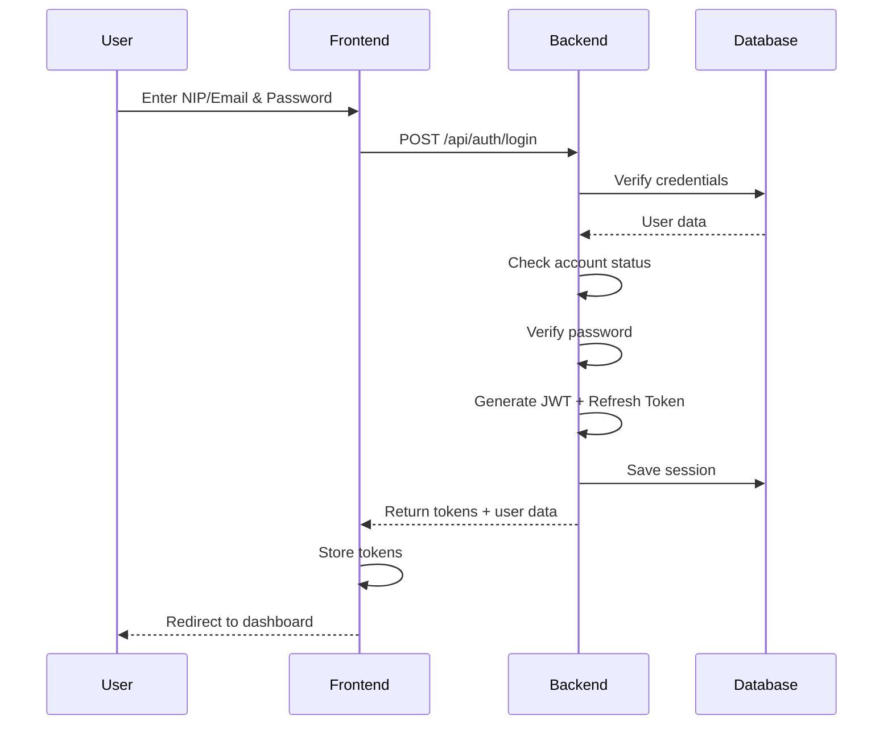
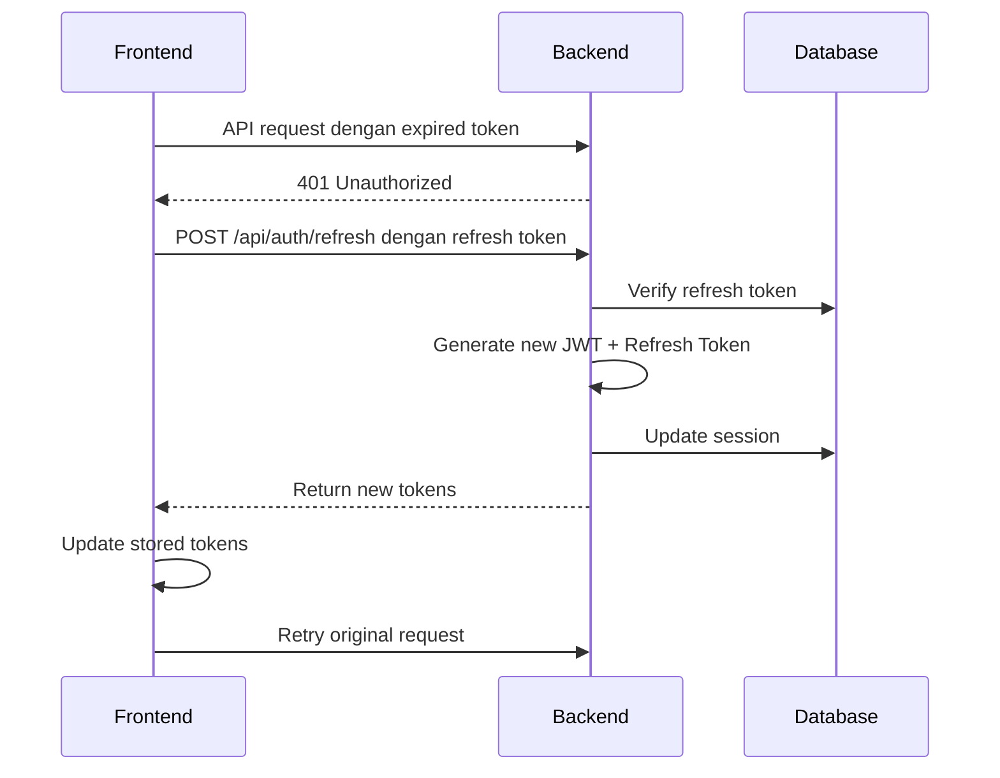
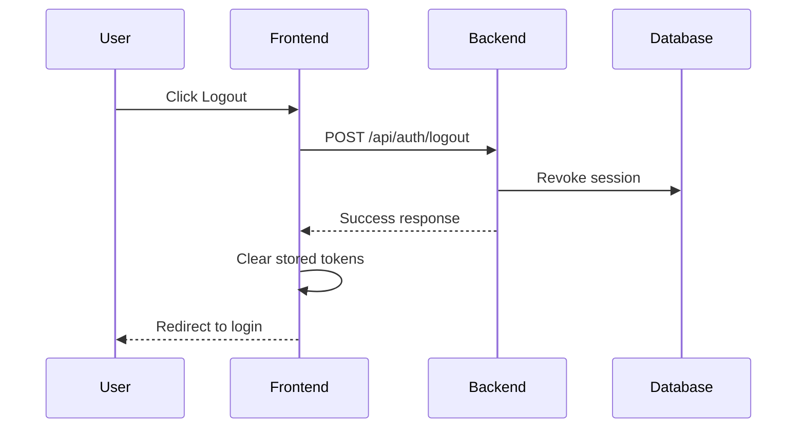

# Authentication System Documentation

**Developer**: Zulfikar Hidayatullah  
**Version**: 1.0.0  
**Last Updated**: 2025-01-29

Dokumentasi lengkap untuk Authentication System di Sirine Go, yang mencakup API endpoints, flow diagram, error codes, dan security best practices.

---

## Table of Contents

- [Overview](#overview)
- [Authentication Flow](#authentication-flow)
- [API Endpoints](#api-endpoints)
- [Request/Response Examples](#requestresponse-examples)
- [JWT Token Structure](#jwt-token-structure)
- [Error Codes](#error-codes)
- [Security Features](#security-features)
- [Password Policy](#password-policy)
- [Best Practices](#best-practices)

---

## Overview

Sistem authentication menggunakan JWT (JSON Web Token) dengan refresh token mechanism untuk secure dan scalable authentication. Sistem ini mendukung:

- Login dengan NIP atau Email
- Remember Me functionality
- Password reset via email
- Force password change pada first login
- Account lockout setelah failed attempts
- Session management dengan token tracking
- Role-based access control (RBAC)

### Technology Stack

- **Backend**: Go dengan Gin framework
- **Authentication**: JWT dengan HS256 signing
- **Password Hashing**: bcrypt dengan cost factor 12
- **Token Storage**: MySQL database untuk session tracking
- **Email**: SMTP untuk password reset

---

## Authentication Flow

### Login Flow



### Token Refresh Flow



### Logout Flow



---

## API Endpoints

### Public Endpoints (No Authentication Required)

#### 1. Login

**Endpoint**: `POST /api/auth/login`

**Description**: Authenticate user dengan NIP atau Email dan password.

**Request Body**:
```json
{
  "nip": "12345",           // atau email
  "password": "Password123!",
  "remember_me": false      // optional, default false
}
```

**Response Success (200)**:
```json
{
  "success": true,
  "data": {
    "token": "eyJhbGciOiJIUzI1NiIsInR5cCI6IkpXVCJ9...",
    "refresh_token": "eyJhbGciOiJIUzI1NiIsInR5cCI6IkpXVCJ9...",
    "user": {
      "id": 1,
      "nip": "12345",
      "full_name": "John Doe",
      "email": "john@example.com",
      "role": "ADMIN",
      "department": "KHAZWAL",
      "profile_photo_url": "/uploads/profiles/1.jpg"
    },
    "require_password_change": false
  },
  "message": "Login berhasil"
}
```

**Response Error (401)**:
```json
{
  "success": false,
  "message": "NIP/Email atau password salah"
}
```

**Response Error (403 - Account Locked)**:
```json
{
  "success": false,
  "message": "Akun Anda terkunci hingga 15:30:00 karena terlalu banyak percobaan login gagal"
}
```

---

#### 2. Forgot Password

**Endpoint**: `POST /api/auth/forgot-password`

**Description**: Request password reset dengan mengirim email reset link.

**Request Body**:
```json
{
  "nip_or_email": "12345"   // bisa NIP atau Email
}
```

**Response Success (200)**:
```json
{
  "success": true,
  "message": "Link reset password telah dikirim ke email Anda"
}
```

**Note**: Response selalu success untuk prevent email enumeration.

---

#### 3. Reset Password

**Endpoint**: `POST /api/auth/reset-password`

**Description**: Reset password menggunakan token dari email.

**Request Body**:
```json
{
  "token": "abc123...",
  "new_password": "NewPassword123!",
  "confirm_password": "NewPassword123!"
}
```

**Response Success (200)**:
```json
{
  "success": true,
  "message": "Password berhasil direset. Silakan login dengan password baru."
}
```

**Response Error (400)**:
```json
{
  "success": false,
  "message": "Token reset sudah kadaluarsa, silakan request ulang"
}
```

---

### Protected Endpoints (Authentication Required)

#### 4. Get Current User

**Endpoint**: `GET /api/auth/me`

**Headers**:
```
Authorization: Bearer {token}
```

**Response Success (200)**:
```json
{
  "success": true,
  "data": {
    "id": 1,
    "nip": "12345",
    "full_name": "John Doe",
    "email": "john@example.com",
    "phone": "08123456789",
    "role": "ADMIN",
    "department": "KHAZWAL",
    "status": "ACTIVE",
    "profile_photo_url": "/uploads/profiles/1.jpg",
    "total_points": 150,
    "level": "Gold",
    "last_login_at": "2025-01-29T10:30:00Z"
  }
}
```

---

#### 5. Refresh Token

**Endpoint**: `POST /api/auth/refresh`

**Request Body**:
```json
{
  "refresh_token": "eyJhbGciOiJIUzI1NiIsInR5cCI6IkpXVCJ9..."
}
```

**Response Success (200)**:
```json
{
  "success": true,
  "data": {
    "token": "new_jwt_token...",
    "refresh_token": "new_refresh_token...",
    "user": { /* user data */ }
  }
}
```

---

#### 6. Logout

**Endpoint**: `POST /api/auth/logout`

**Headers**:
```
Authorization: Bearer {token}
```

**Response Success (200)**:
```json
{
  "success": true,
  "message": "Logout berhasil"
}
```

---

#### 7. Change Password

**Endpoint**: `PUT /api/profile/password`

**Headers**:
```
Authorization: Bearer {token}
```

**Request Body**:
```json
{
  "current_password": "OldPassword123!",
  "new_password": "NewPassword123!",
  "confirm_password": "NewPassword123!"
}
```

**Response Success (200)**:
```json
{
  "success": true,
  "message": "Password berhasil diubah. Silakan login kembali."
}
```

**Note**: Setelah change password, semua existing sessions akan di-revoke.

---

## JWT Token Structure

### Access Token Claims

```json
{
  "user_id": 1,
  "nip": "12345",
  "email": "john@example.com",
  "role": "ADMIN",
  "department": "KHAZWAL",
  "exp": 1706529000,      // Expiry: 15 minutes dari issued
  "iat": 1706528100,      // Issued at
  "nbf": 1706528100,      // Not before
  "iss": "sirine-go",     // Issuer
  "sub": "1"              // Subject (user ID)
}
```

### Refresh Token Claims

```json
{
  "user_id": 1,
  "nip": "12345",
  "email": "john@example.com",
  "role": "ADMIN",
  "department": "KHAZWAL",
  "exp": 1709120100,      // Expiry: 30 days dari issued
  "iat": 1706528100,
  "nbf": 1706528100,
  "iss": "sirine-go-refresh",
  "sub": "1"
}
```

### Token Storage

- **Access Token**: Expiry 15 minutes
- **Refresh Token**: Expiry 30 days (atau lebih jika remember_me = true)
- **Storage**: Token hash disimpan di `user_sessions` table untuk tracking
- **Revocation**: Session bisa di-revoke kapan saja (logout, password change)

---

## Error Codes

### HTTP Status Codes

| Code | Meaning | Description |
|------|---------|-------------|
| 200 | OK | Request berhasil |
| 400 | Bad Request | Invalid request body atau validation error |
| 401 | Unauthorized | Token missing, invalid, atau expired |
| 403 | Forbidden | User tidak memiliki permission atau account locked |
| 404 | Not Found | Resource tidak ditemukan |
| 429 | Too Many Requests | Rate limit exceeded |
| 500 | Internal Server Error | Server error |

### Application Error Messages

**Authentication Errors:**
- `"NIP/Email atau password salah"` - Invalid credentials
- `"Akun Anda terkunci hingga [time]"` - Account locked
- `"Akun Anda tidak aktif, hubungi administrator"` - Inactive account
- `"Token tidak valid atau sudah expired"` - Invalid/expired token
- `"Sesi Anda telah berakhir, silakan login kembali"` - Session expired

**Password Errors:**
- `"Password saat ini tidak valid"` - Wrong current password
- `"Password baru tidak boleh sama dengan password saat ini"` - Same password
- `"Password minimal 8 karakter"` - Too short
- `"Password harus mengandung minimal 1 huruf besar"` - Missing uppercase
- `"Password harus mengandung minimal 1 angka"` - Missing number
- `"Password harus mengandung minimal 1 karakter spesial"` - Missing special char

**Rate Limiting Errors:**
- `"Terlalu banyak permintaan. Silakan coba lagi nanti."` - Rate limit exceeded

---

## Security Features

### 1. Password Hashing

- **Algorithm**: bcrypt
- **Cost Factor**: 12 (configurable via .env)
- **Salt**: Automatically generated per password

### 2. Account Lockout

- **Max Attempts**: 5 failed login attempts
- **Lockout Duration**: 15 minutes
- **Tracking**: Per user, not per IP (prevent distributed attacks)
- **Reset**: Counter reset setelah successful login

### 3. Rate Limiting

**Login Endpoint:**
- 5 requests per 15 minutes per IP
- Prevent brute force attacks

**General API:**
- 100 requests per minute per user
- Prevent API abuse

### 4. Token Security

- **Signing Algorithm**: HS256 (HMAC with SHA-256)
- **Secret Key**: Strong random string (min 32 characters)
- **Token Hash**: SHA256 hash stored di database
- **Revocation**: Immediate via session table update

### 5. Security Headers

```
X-Frame-Options: DENY
X-Content-Type-Options: nosniff
X-XSS-Protection: 1; mode=block
Content-Security-Policy: default-src 'self'
Strict-Transport-Security: max-age=31536000; includeSubDomains
```

### 6. CORS Protection

- Whitelist specific origins
- Credentials allowed only untuk trusted origins
- Preflight requests handled correctly

### 7. SQL Injection Prevention

- GORM ORM dengan parameterized queries
- Input validation dan sanitization
- Prepared statements

---

## Password Policy

### Requirements

1. **Minimum Length**: 8 characters
2. **Uppercase**: At least 1 uppercase letter (A-Z)
3. **Lowercase**: At least 1 lowercase letter (a-z)
4. **Number**: At least 1 digit (0-9)
5. **Special Character**: At least 1 special char (!@#$%^&*()_+-=[]{}|;:'",.<>?/)

### Password Strength Levels

| Strength | Criteria |
|----------|----------|
| Very Weak | < 8 characters, missing requirements |
| Weak | 8+ characters, missing some requirements |
| Medium | 8+ characters, all requirements met |
| Strong | 12+ characters, all requirements met |
| Very Strong | 16+ characters, all requirements met, diverse chars |

### Password Change Policy

- **First Login**: User harus change password (must_change_password flag)
- **Change Frequency**: Recommended setiap 90 days (not enforced)
- **Password Reuse**: Cannot reuse current password
- **Session Invalidation**: All sessions revoked setelah password change

---

## Best Practices

### For Frontend Developers

1. **Token Storage**:
   - Store tokens di `localStorage` atau `sessionStorage`
   - Never store di `cookies` jika tidak ada httpOnly flag
   - Clear tokens setelah logout

2. **Auto-Refresh**:
   - Implement token refresh sebelum expiry
   - Use axios interceptor untuk automatic retry
   - Handle 401 errors gracefully

3. **User Experience**:
   - Show loading states during login
   - Display clear error messages
   - Implement session timeout warning
   - Provide "Remember Me" option

4. **Security**:
   - Never log tokens di console
   - Use HTTPS untuk all requests
   - Validate input before sending
   - Sanitize error messages

### For Backend Developers

1. **JWT Secret**:
   - Use strong random secret (min 32 chars)
   - Never commit secret ke repository
   - Rotate secret periodically
   - Use environment variables

2. **Database**:
   - Index token_hash column untuk fast lookup
   - Cleanup expired sessions regularly
   - Use transactions untuk critical operations
   - Monitor slow queries

3. **Logging**:
   - Log all authentication attempts
   - Log security events (lockouts, suspicious activity)
   - Never log passwords atau tokens
   - Use log levels appropriately

4. **Error Handling**:
   - Generic error messages untuk users
   - Detailed logs untuk developers
   - Handle all edge cases
   - Test error scenarios

---

## Testing

### Unit Tests

```bash
# Run password service tests
go test ./backend/tests/unit/services/password_service_test.go -v

# Run auth service tests
go test ./backend/tests/unit/services/auth_service_test.go -v

# Run middleware tests
go test ./backend/tests/unit/middleware/ -v
```

### Integration Tests

```bash
# Run complete auth flow tests
go test ./backend/tests/integration/auth_flow_test.go -v
```

### Manual Testing Checklist

- [ ] Login dengan valid credentials → Success
- [ ] Login dengan wrong password → Error
- [ ] Login dengan non-existent NIP → Error
- [ ] Login dengan email instead of NIP → Success
- [ ] Login 5x dengan wrong password → Account locked
- [ ] Login dengan locked account → Error with time
- [ ] Login dengan Remember Me → Longer token expiry
- [ ] Request password reset → Email received
- [ ] Reset password dengan valid token → Success
- [ ] Reset password dengan expired token → Error
- [ ] Change password dengan correct current → Success
- [ ] Change password dengan wrong current → Error
- [ ] Change password dengan same new password → Error
- [ ] Change password dengan weak password → Validation error
- [ ] Logout → Token revoked
- [ ] Access protected route without token → 401
- [ ] Access protected route dengan expired token → 401
- [ ] Refresh token → New tokens generated

---

## Troubleshooting

### Common Issues

**1. Token validation failed**
- Check JWT_SECRET consistency antara environments
- Verify token not expired
- Check session not revoked

**2. CORS errors**
- Verify CORS_ALLOWED_ORIGINS di backend .env
- Check frontend API_BASE_URL
- Ensure credentials included di requests

**3. Rate limiting triggered**
- Wait for cooldown period
- Check if legitimate traffic
- Adjust limits jika perlu

**4. Email not sending**
- Verify SMTP credentials
- Check email service logs
- Test with Mailtrap untuk development

---

## Support

**Developer**: Zulfikar Hidayatullah  
**Phone**: +62 857-1583-8733

**Documentation**: `/docs` directory  
**API Postman Collection**: `/docs/11-appendix/postman-collection.md`

---

**Last Updated**: 2025-01-29  
**Version**: 1.0.0
