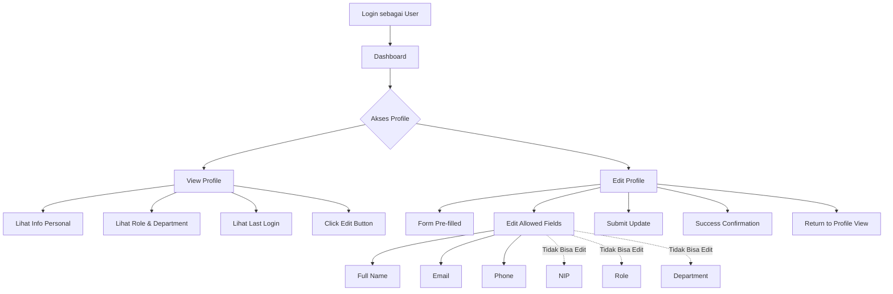
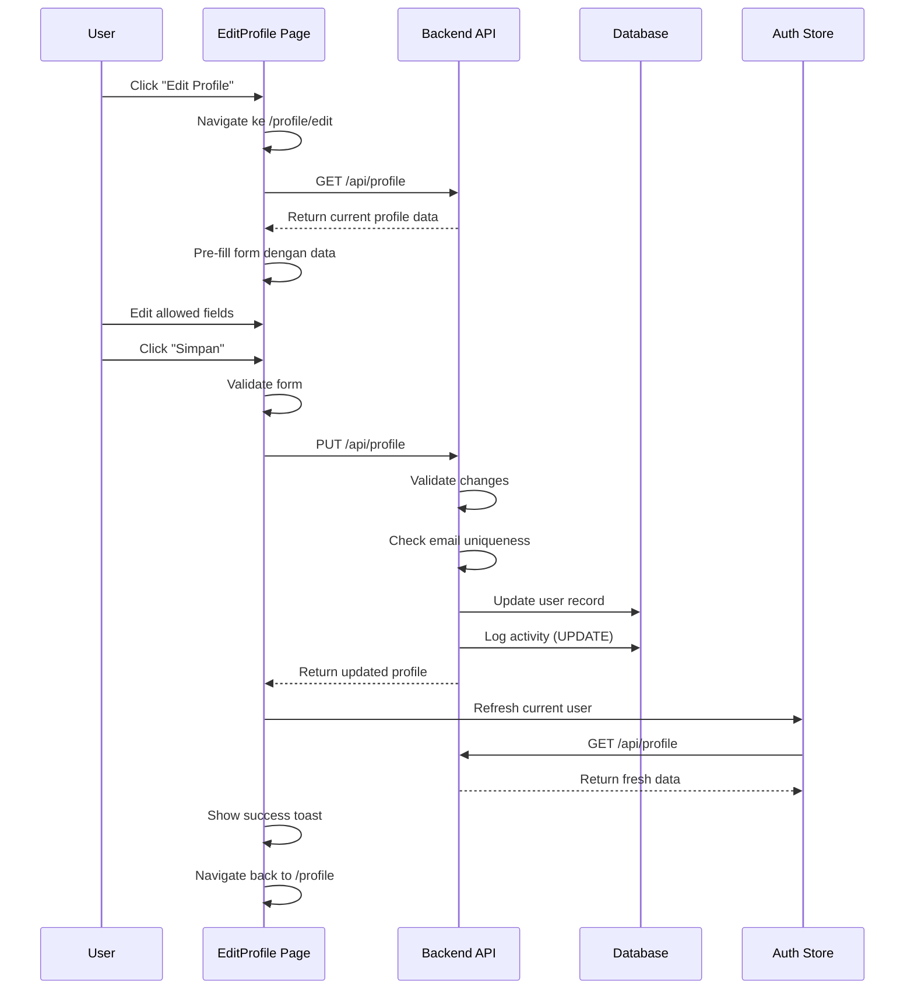

# User Journey: User Profile Management (Self-Service)

**Feature**: Profile Management System  
**Actor**: All Authenticated Users  
**Version**: 1.1.0  
**Last Updated**: 28 Desember 2025

---

## Overview

User journey ini menggambarkan alur self-service profile management untuk semua users, yaitu: view own profile, update personal information (limited fields), dengan restrictions untuk security.

---

## Journey Map



---

## Detailed Flow

### 1. Akses Profile

**Trigger**: User click menu "Profile" di navbar atau sidebar

#### Entry Points

**Option 1: Navbar Avatar**
- User click avatar/photo di top-right navbar
- Dropdown menu appears:
  - "Lihat Profile"
  - "Pengaturan"
  - "Logout"
- Click "Lihat Profile" → redirect ke `/profile`

**Option 2: Sidebar Menu**
- User click "Profile" menu di sidebar
- Direct redirect ke `/profile`

**Option 3: Direct URL**
- User navigate ke `/profile` directly
- Auth guard check authentication
- If not authenticated → redirect ke `/login`

**Animations**:
- Page entrance: Spring animation dari bottom
- Profile card: Fade-in dengan scale effect
- Info sections: Staggered fade-in

**API Call**:
```javascript
GET /api/profile
```

**Success Criteria**:
- ✅ Profile data displayed lengkap
- ✅ Avatar/photo shown (atau default avatar)
- ✅ All info sections visible
- ✅ Edit button accessible

---

### 2. View Profile

**Layout Structure**:

```
┌─────────────────────────────────────┐
│         Profile Header              │
│  ┌─────┐                            │
│  │     │  Nama Lengkap              │
│  │ 👤  │  NIP: 12345                │
│  │     │  Role Badge                │
│  └─────┘                            │
│                                     │
│  [Edit Profile Button]              │
└─────────────────────────────────────┘

┌─────────────────────────────────────┐
│      Informasi Personal             │
│  📧 Email: user@sirine.local        │
│  📱 Telepon: 081234567890           │
│  🏢 Department: KHAZWAL             │
│  🕐 Shift: PAGI                     │
└─────────────────────────────────────┘

┌─────────────────────────────────────┐
│      Informasi Akun                 │
│  📅 Bergabung: 20 Des 2025          │
│  🔐 Login Terakhir: 28 Des 2025     │
│  ✅ Status: ACTIVE                  │
└─────────────────────────────────────┘
```

#### Display Components

**1. Profile Header Card**
- **Avatar**: 
  - Profile photo (jika uploaded)
  - Default avatar dengan initial (jika belum upload)
  - Size: 96x96px, rounded-full
  
- **Name & Role**:
  - Full name (large, bold)
  - NIP (secondary text)
  - Role badge (color-coded)

- **Edit Button**:
  - Primary button: "Edit Profile"
  - iOS-style with active-scale effect

**2. Personal Info Card**
- Email dengan icon
- Phone dengan icon
- Department dengan icon
- Shift dengan icon
- Glass-card styling dengan backdrop blur

**3. Account Info Card**
- Join date (formatted: "20 Desember 2025")
- Last login (relative: "2 jam yang lalu")
- Account status badge
- Glass-card styling

**UX Enhancements**:
- Smooth scroll animations
- Card hover effects (subtle lift)
- Icon animations on hover
- Responsive layout (mobile-first)

---

### 3. Edit Profile

**Trigger**: User click "Edit Profile" button

#### Flow Diagram



#### Detailed Steps

**Step 1: Navigate to Edit Page**
- Click "Edit Profile" button
- Page transition dengan slide animation
- Navigate ke `/profile/edit`
- System fetch current profile data

**Step 2: Form Pre-filled**

**Editable Fields** (✅ User CAN change):
- **Nama Lengkap**
  - Input type: text
  - Validation: Min 3, max 100 char
  - Real-time character counter
  
- **Email**
  - Input type: email
  - Validation: Valid email format, unique
  - Real-time duplicate check
  - Error: "Email sudah digunakan oleh user lain"
  
- **No. Telepon**
  - Input type: tel
  - Validation: Format 08xxx, 10-15 digit
  - Auto-format during typing
  - Pattern: 08xx-xxxx-xxxx

**Read-Only Fields** (❌ User CANNOT change):
- **NIP**
  - Displayed dengan disabled styling
  - Tooltip: "NIP tidak dapat diubah"
  
- **Role**
  - Displayed as badge
  - Tooltip: "Role diatur oleh admin"
  
- **Department**
  - Displayed as text
  - Tooltip: "Department diatur oleh admin"
  
- **Shift**
  - Displayed as text
  - Tooltip: "Shift diatur oleh admin"

**Step 3: Edit Fields**

**Real-time Validation**:
- Email format check on blur
- Phone format check on input
- Character counter untuk name field
- Duplicate email check dengan debounce 500ms

**Visual Feedback**:
- Valid input: Green checkmark icon
- Invalid input: Red border + error message
- Loading: Spinner during validation
- Disabled submit until all valid

**Step 4: Submit Update**
- Click "Simpan" button
- Button shows loading spinner
- Form disabled during submission
- Optimistic UI update (instant feedback)

**Step 5: Success Response**
- Toast: "Profile berhasil diupdate"
- Auth store refresh dengan new data
- Navigate back ke `/profile` dengan animation
- Updated fields highlighted briefly

**API Request**:
```javascript
PUT /api/profile
{
  "full_name": "Updated Name",
  "email": "newemail@sirine.local",
  "phone": "089876543210"
}
```

**API Response**:
```javascript
{
  "success": true,
  "message": "Profile berhasil diupdate",
  "data": {
    "id": 1,
    "nip": "12345",
    "full_name": "Updated Name",
    "email": "newemail@sirine.local",
    "phone": "089876543210",
    "role": "STAFF_KHAZWAL",
    "department": "KHAZWAL",
    "updated_at": "2025-12-28T15:30:00+07:00"
  }
}
```

**Activity Log Captured**:
```json
{
  "action": "UPDATE",
  "entity_type": "users",
  "entity_id": 1,
  "changes": {
    "before": {
      "full_name": "Old Name",
      "email": "old@sirine.local",
      "phone": "081234567890"
    },
    "after": {
      "full_name": "Updated Name",
      "email": "newemail@sirine.local",
      "phone": "089876543210"
    }
  }
}
```

---

## User Experience Enhancements

### iOS-Inspired Interactions

**1. Form Interactions**
- Input focus: Smooth border color transition
- Label animation: Float-up on focus
- Keyboard appearance: Slide-up dengan spring
- Auto-scroll to focused input (mobile)

**2. Button Feedback**
- Press: Scale to 0.97
- Release: Spring back to 1.0
- Haptic vibration on tap (mobile)
- Loading state: Spinner + disabled

**3. Validation Feedback**
- Success: Green checkmark fade-in
- Error: Red shake animation
- Warning: Yellow pulse effect
- Info: Blue slide-in tooltip

**4. Navigation**
- Page transition: Slide left/right
- Back button: iOS-style chevron
- Swipe gesture: Swipe right to go back (mobile)

**5. Loading States**
- Skeleton loader untuk form fields
- Shimmer effect during data fetch
- Progress indicator untuk submit
- Smooth state transitions

---

## Security & Restrictions

### Field-Level Permissions

**User CAN Update**:
- ✅ Full Name (personal info)
- ✅ Email (dengan uniqueness check)
- ✅ Phone (dengan format validation)

**User CANNOT Update** (Admin-only):
- ❌ NIP (immutable identifier)
- ❌ Role (security-critical)
- ❌ Department (organizational structure)
- ❌ Shift (operational scheduling)
- ❌ Status (account state management)
- ❌ Password (use separate change password flow)

### Validation Rules

**Full Name**:
- Min length: 3 characters
- Max length: 100 characters
- Allowed: Letters, spaces, hyphens
- Not allowed: Numbers, special chars

**Email**:
- Valid email format (RFC 5322)
- Must be unique across system
- Case-insensitive check
- Cannot use disposable email domains

**Phone**:
- Format: 08xxx (Indonesia mobile)
- Length: 10-15 digits
- Auto-format: 08xx-xxxx-xxxx
- No international format allowed

### Activity Logging

**Logged Actions**:
- ✅ Profile update (self-service)
- ✅ Before/after values captured
- ✅ Timestamp & IP address
- ✅ User agent information

**Audit Trail Purpose**:
- Security monitoring
- Compliance requirements
- Dispute resolution
- User behavior analytics

---

## Error Scenarios

### Validation Errors

**Scenario 1: Duplicate Email**
```
Error: "Email sudah digunakan oleh user lain"
Field: Email input border red
Action: Focus on email field
```

**Scenario 2: Invalid Phone Format**
```
Error: "Format nomor telepon tidak valid. Gunakan format: 08xx-xxxx-xxxx"
Field: Phone input border red
Action: Show format example
```

**Scenario 3: Name Too Short**
```
Error: "Nama minimal 3 karakter"
Field: Name input border red
Action: Show character counter
```

### Network Errors

**Scenario**: API request failed

**Handling**:
- Toast error: "Gagal terhubung ke server"
- Form data preserved (tidak hilang)
- Retry button available
- Auto-retry setelah 3 detik
- Offline indicator shown

### Permission Errors

**Scenario**: Session expired during edit

**Handling**:
- Save form data to localStorage
- Redirect to login page
- Toast: "Sesi Anda telah berakhir. Silakan login kembali."
- After login: Restore form data
- Prompt: "Lanjutkan edit profile?"

---

## Mobile Optimization

### Responsive Design

**Breakpoints**:
- Mobile: < 640px (single column)
- Tablet: 640px - 1024px (optimized spacing)
- Desktop: > 1024px (max-width container)

**Mobile-Specific UX**:
- Larger touch targets (min 44x44px)
- Bottom-fixed action buttons
- Auto-scroll to focused input
- Native keyboard types:
  - Email input → email keyboard
  - Phone input → tel keyboard
- Pull-to-refresh on profile page
- Swipe-right to go back

### Performance

**Optimization**:
- Lazy load images
- Debounced validation (500ms)
- Optimistic UI updates
- Cached profile data (5 min)
- Compressed images (WebP)

**Loading Strategy**:
- Critical CSS inline
- Defer non-critical JS
- Preload profile data
- Service worker caching

---

## Accessibility

### WCAG 2.1 Compliance

**Level AA Requirements**:
- ✅ Keyboard navigation support
- ✅ Screen reader compatible
- ✅ Color contrast ratio > 4.5:1
- ✅ Focus indicators visible
- ✅ Form labels associated
- ✅ Error messages descriptive

**Keyboard Shortcuts**:
- `Tab`: Navigate between fields
- `Shift+Tab`: Navigate backward
- `Enter`: Submit form
- `Esc`: Cancel edit (return to view)

**Screen Reader**:
- Form labels announced
- Validation errors announced
- Success messages announced
- Loading states announced

---

## Success Metrics

**Performance**:
- Page load: < 1 second
- Form submission: < 500ms
- Animation smoothness: 60 FPS
- Time to Interactive: < 2 seconds

**Usability**:
- Task completion rate: > 98%
- Error rate: < 3%
- User satisfaction: > 4.7/5
- Average edit time: < 2 minutes

**Engagement**:
- Profile update frequency: 2-3x per month
- Edit abandonment rate: < 10%
- Success rate: > 95%

---

## Related Documentation

- **API Reference**: [user-management.md](../../api/user-management.md)
- **Testing Guide**: [user-management-testing.md](../../testing/user-management-testing.md)
- **Admin Journey**: [admin-user-management.md](./admin-user-management.md)

---

**Last Updated**: 28 Desember 2025  
**Version**: 1.1.0 - Sprint 2  
**Status**: ✅ Complete
