# 📚 Codebase Documentation Guide

## Overview

Dokumen ini merupakan panduan komprehensif untuk membuat dan mengelola dokumentasi codebase yang bertujuan untuk memastikan setiap developer (termasuk diri sendiri di masa depan) dapat memahami, mengembangkan, dan maintain project dengan efisien, yaitu: mengurangi onboarding time, mempercepat debugging, dan meminimalkan knowledge silos.

---

## 🚨 MANDATORY: Feature Documentation Requirements

> **⚠️ READ THIS FIRST - INCOMPLETE DOCUMENTATION = INCOMPLETE TASK**
>
> Setiap kali mendokumentasikan feature, **WAJIB** membuat SEMUA file berikut.
> JANGAN commit documentation jika ada file yang missing.

### ✅ MANDATORY Files untuk Setiap Feature

| # | File | Location | Status |
|---|------|----------|--------|
| 1 | **Feature Doc** | `docs/features/{role}/{CODE}-feature.md` | WAJIB |
| 2 | **Test Plan** | `docs/testing/{CODE}-test-plan.md` | WAJIB |
| 3 | **API Doc** | `docs/api/{resource}.md` | WAJIB (jika ada API) |
| 4 | **User Journeys** | `docs/guides/{feature}-user-journeys.md` | WAJIB (jika complex) |

### ✅ MANDATORY Checklist Sebelum Commit Documentation

```
[ ] Feature doc dibuat (≤300 lines)
[ ] Test plan dibuat dengan QA checklist lengkap
[ ] API doc dibuat dengan routes & examples
[ ] User journeys dibuat di guides/ (BUKAN di feature doc)
[ ] Semua README.md terkait di-update dengan referensi ke file baru
[ ] Cross-references antar dokumen sudah benar
```

### ✅ MANDATORY BUT ❌ DO NOT Include dalam Feature Doc

| Content | ❌ JANGAN di Feature Doc | ✅ TARUH di |
|---------|--------------------------|-------------|
| User journey diagrams | ❌ | `docs/user-journeys/{feature}-user-journeys.md` |
| Full Manual and System QA test cases | ❌ | `docs/testing/{CODE}-test-plan.md` |
| Full API routes list | ❌ | `docs/api/{resource}.md` |
| Step-by-step manual tests | ❌ | `docs/testing/{CODE}-test-plan.md` |

### 📏 Size Limits untuk Feature Doc

| Metric | Maximum | Jika Exceeded |
|--------|---------|---------------|
| Total lines | **≤300 lines** | Split ke file lain |
| User Stories | **≤15 stories** | Group by phase |
| Routes table | **≤20 routes** | Summary only, detail di `docs/api/` |
| Edge Cases | **≤15 cases** | Prioritize critical ones |
| Manual Testing | **≤10 checkboxes** | Full plan di `docs/testing/` |

### 📂 Complete File Structure Example

```
docs/
├── features/
│   └── owner/
│       └── OE17-marketing-strategy.md   # ≤300 lines, lean reference
│
├── api/
│   └── marketing.md                     # Full route documentation
│
├── testing/
│   └── OE17-marketing-test-plan.md      # Full QA checklist
│
└── guides/
    └── marketing-user-journeys.md       # User journey diagrams
```

### 🔗 Cross-Reference Template

Setiap feature doc **WAJIB** memiliki section `Related Documentation`:

```markdown
## Related Documentation

- **API Documentation:** [Feature API](../../api/{resource}.md)
- **Test Plan:** [{CODE} Test Plan](../../testing/{CODE}-test-plan.md)
- **User Journeys:** [Feature User Journeys](../../guides/{feature}-user-journeys.md)
```

---

## 📁 Recommended Folder Structure

```
my-project/
│
├── 📄 README.md                    # Project overview & quick start
├── 📄 CONTRIBUTING.md              # How to contribute (optional for solo)
├── 📄 CHANGELOG.md                 # Version history (optional)
│
├── 📁 docs/                        # All documentation lives here
│   │
│   ├── 📁 architecture/            # System design & patterns
│   │   ├── ARCHITECTURE.md         # System overview & layers
│   │   ├── DATA_FLOW.md            # How data moves through system
│   │   ├── DATABASE.md             # Database design & conventions
│   │   └── EVENTS.md               # Event-driven docs (if applicable)
│   │
│   ├── 📁 adr/                     # Architecture Decision Records
│   │   ├── README.md               # ADR index & template
│   │   ├── 001-tech-stack.md
│   │   ├── 002-authentication.md
│   │   └── ...
│   │
│   ├── 📁 api/                     # API documentation
│   │   ├── README.md               # API overview & conventions
│   │   ├── authentication.md
│   │   ├── users.md
│   │   └── ...
│   │
│   ├── 📁 features/                # Feature-specific docs
│   │   ├── user-management.md
│   │   ├── order-processing.md
│   │   └── ...
│   │
│   └── 📁 guides/                  # How-to guides
│       ├── local-setup.md
│       ├── deployment.md
│       ├── debugging.md
│       └── ...
│
└── 📁 src/                         # Source code with inline docs
    └── ... (code with JSDoc/docstrings)
```

---

## 📋 Documentation Checklist

### Quick Reference: Apa yang Perlu Didokumentasikan?

| Document | Wajib? | Kapan Dibuat? | Kapan Diupdate? |
|----------|--------|---------------|-----------------|
| README.md | ✅ WAJIB | Awal project | Setiap ada perubahan setup/tech stack |
| ARCHITECTURE.md | ✅ WAJIB | Setelah struktur project jelas | Hanya jika ada perubahan pattern |
| DATA_FLOW.md | ⚡ Recommended | Setelah ada 3+ layers | Jika flow berubah signifikan |
| DATABASE.md | ⚡ Recommended | Setelah schema stabil | Setiap ada migrasi besar |
| ADRs | ⚡ Recommended | Setiap keputusan arsitektur | Tidak diupdate (immutable) |
| API Docs | ✅ WAJIB (jika ada API) | Per endpoint/resource | Setiap API berubah |
| Feature Docs | 💡 Optional | Untuk fitur kompleks | Setiap fitur dimodifikasi |
| Inline Comments | ✅ WAJIB | Saat coding | Saat logic berubah |

---

# 📄 Document Templates & Guidelines

---

## 1. README.md

### ❓ Do I Need This?
> **SELALU YA.** Ini adalah pintu masuk pertama ke project kamu. Tanpa README yang baik, 
> orang (termasuk kamu sendiri 6 bulan kemudian) tidak akan tahu cara menjalankan project.

### 🎯 Purpose
- Memberikan overview singkat tentang project
- Menjelaskan cara setup dan menjalankan project
- Menjadi "landing page" repository

### 📝 Template

```markdown
# Project Name

Brief description of what this project does (1-2 sentences).

## Tech Stack

- **Runtime**: Node.js v18+
- **Framework**: Express.js / NestJS / etc
- **Database**: PostgreSQL 14+
- **Cache**: Redis 7+
- **Package Manager**: Yarn

## Prerequisites

- Node.js >= 18.0.0
- PostgreSQL 14+
- Redis 7+ (optional for development)

## Quick Start

### 1. Clone & Install

\`\`\`bash
git clone https://github.com/username/project.git
cd project
yarn install
\`\`\`

### 2. Environment Setup

\`\`\`bash
cp .env.example .env
# Edit .env dengan konfigurasi lokal
\`\`\`

### 3. Database Setup

\`\`\`bash
yarn db:migrate
yarn db:seed  # Optional: sample data
\`\`\`

### 4. Run Development Server

\`\`\`bash
yarn dev
# Server running at http://localhost:3000
\`\`\`

## Project Structure

\`\`\`
src/
├── controllers/    # HTTP request handlers
├── services/       # Business logic
├── repositories/   # Database operations
├── models/         # Data models/entities
├── middlewares/    # Express middlewares
├── utils/          # Helper functions
└── config/         # Configuration files
\`\`\`

## Available Scripts

| Command | Description |
|---------|-------------|
| `yarn dev` | Start development server with hot reload |
| `yarn build` | Build for production |
| `yarn start` | Start production server |
| `yarn test` | Run tests |
| `yarn lint` | Run linter |
| `yarn db:migrate` | Run database migrations |

## Documentation

- [Architecture Overview](./docs/architecture/ARCHITECTURE.md)
- [API Documentation](./docs/api/README.md)
- [Contributing Guidelines](./CONTRIBUTING.md)

## Author

Developer Name - contact@email.com
```

### 🔄 When to Update?
- [ ] Tech stack berubah (new dependency major)
- [ ] Environment variables baru ditambahkan
- [ ] Cara setup/instalasi berubah
- [ ] Project structure berubah signifikan
- [ ] Script baru ditambahkan di package.json

---

## 2. ARCHITECTURE.md

### ❓ Do I Need This?
> **YA, jika project punya lebih dari 1 layer atau folder structure yang tidak self-explanatory.**
> Skip jika project sangat sederhana (single file script, simple CRUD tanpa business logic).

### 🎯 Purpose
- Menjelaskan bagaimana sistem diorganisir
- Mendefinisikan rules antar layer/module
- Membantu developer baru memahami "where to put things"

### 📝 Template

```markdown
# System Architecture

## Overview

[Nama Project] menggunakan **[Architecture Pattern]** yang bertujuan untuk 
[tujuan utama], yaitu: [benefit 1], [benefit 2], dan [benefit 3].

## Architecture Diagram

\`\`\`mermaid
flowchart TB
    subgraph PRESENTATION["🎯 PRESENTATION LAYER"]
        direction LR
        P1["Controllers / Handlers"]
        P2["Responsibility: HTTP handling, request validation"]
        P3["Files: src/controllers/*"]
    end

    subgraph SERVICE["⚙️ SERVICE LAYER"]
        direction LR
        S1["Business Logic"]
        S2["Responsibility: Business rules, orchestration"]
        S3["Files: src/services/*"]
    end

    subgraph REPOSITORY["💾 REPOSITORY LAYER"]
        direction LR
        R1["Data Access"]
        R2["Responsibility: Database queries, data mapping"]
        R3["Files: src/repositories/*"]
    end

    subgraph DATABASE["🗄️ DATABASE"]
        DB["PostgreSQL / MySQL / etc"]
    end

    PRESENTATION --> SERVICE
    SERVICE --> REPOSITORY
    REPOSITORY --> DATABASE
\`\`\`

## Layer Rules

| Layer | Can Import | Cannot Import | Notes |
|-------|------------|---------------|-------|
| Controllers | Services, Utils | Repositories, Models | Thin layer, no business logic |
| Services | Repositories, Models, Utils, Other Services | Controllers | Main business logic here |
| Repositories | Models, Database | Services, Controllers | Pure data access only |
| Models | (None) | Everything | Plain data structures |

## Folder Structure Explanation

| Folder | Purpose | Example Files |
|--------|---------|---------------|
| `src/controllers/` | Handle HTTP requests | `userController.js` |
| `src/services/` | Business logic | `userService.js` |
| `src/repositories/` | Database operations | `userRepository.js` |
| `src/models/` | Data structures/entities | `User.js` |
| `src/middlewares/` | Request processing | `authMiddleware.js` |
| `src/utils/` | Shared helpers | `dateFormatter.js` |
| `src/config/` | Configuration | `database.js` |

## Adding New Feature Checklist

Ketika menambah fitur baru, ikuti urutan berikut:

1. [ ] Buat/update Model di `src/models/`
2. [ ] Buat Repository di `src/repositories/`
3. [ ] Buat Service di `src/services/`
4. [ ] Buat Controller di `src/controllers/`
5. [ ] Register route di router
6. [ ] Update API documentation

## Cross-Cutting Concerns

### Error Handling
- Semua error di-throw dari service layer
- Controller menangkap dan format response
- Global error handler di `src/middlewares/errorHandler.js`

### Logging
- Logger instance dari `src/utils/logger.js`
- Log level: error, warn, info, debug
- Format: `[TIMESTAMP] [LEVEL] [CONTEXT] Message`

### Authentication
- JWT-based authentication
- Middleware: `src/middlewares/authMiddleware.js`
- Protected routes menggunakan `requireAuth` middleware
```

### 🔄 When to Update?
- [ ] Layer baru ditambahkan (e.g., adding cache layer)
- [ ] Rules antar layer berubah
- [ ] Folder structure berubah
- [ ] Pattern baru diintroduce (e.g., event-driven)

### ❓ When to Create NEW Architecture Doc?
> Buat document BARU (bukan update) jika introduce pattern yang BERBEDA dari existing.
> Contoh: project awalnya REST, sekarang tambah WebSocket → buat `WEBSOCKET_ARCHITECTURE.md`

---

## 3. DATA_FLOW.md

### ❓ Do I Need This?
> **YA, jika:**
> - Ada lebih dari 3 layer dalam architecture
> - Ada async processing (queue, workers, events)
> - Flow tidak linear (ada branching, side effects)
>
> **SKIP jika:** Simple CRUD dengan flow linear yang obvious.

### 🎯 Purpose
- Visualisasi bagaimana data mengalir dalam sistem
- Membantu debugging dengan tahu "checkpoint" di setiap step
- Dokumentasi side effects dan async operations

### 📝 Template

```markdown
# Data Flow Documentation

## Overview

Dokumen ini menjelaskan bagaimana data mengalir dalam sistem [Project Name],
dari request masuk hingga response keluar, termasuk semua side effects dan
async operations yang terjadi.

## Standard Request Flow

\`\`\`mermaid
flowchart TD
    A[🌐 Client Request] --> B[Middleware]
    B --> |Auth check, validation, logging| C[Controller]
    C --> |Parse request, call service| D[Service]
    D --> |Business logic, orchestration| E[Repository]
    E --> |Database query| F[(Database)]
    F --> G[📤 Response]

    style A fill:#e1f5fe
    style G fill:#c8e6c9
    style F fill:#fff3e0
\`\`\`

## Feature-Specific Flows

### [Feature Name] Flow

**Trigger**: [What triggers this flow]
**Result**: [What is the end result]

\`\`\`
[ASCII diagram of the flow]
\`\`\`

**Steps:**
1. [Step 1 description]
2. [Step 2 description]
3. ...

**Side Effects:**
- [Side effect 1, e.g., "Email notification sent"]
- [Side effect 2, e.g., "Cache invalidated"]

---

## Async Processing Flows

### Background Job: [Job Name]

**Triggered by**: [Event/Schedule]
**Processed by**: [Worker name]

\`\`\`
[Diagram]
\`\`\`
```

### 🔄 When to Update?
- [ ] Flow untuk fitur yang ada berubah
- [ ] Side effect baru ditambahkan
- [ ] Async processing baru diintroduce

### ❓ When to Create NEW Flow Doc?
> Tambahkan SECTION BARU di file yang sama untuk setiap fitur kompleks.
> Buat FILE BARU hanya jika flow sangat berbeda (e.g., `REALTIME_FLOW.md` untuk WebSocket).

---

## 4. DATABASE.md

### ❓ Do I Need This?
> **YA, jika:**
> - Database schema tidak self-explanatory
> - Ada relasi kompleks antar tabel
> - Ada conventions khusus (soft delete, audit fields, etc.)
>
> **SKIP jika:** Menggunakan ORM dengan model yang sudah well-documented.

### 🎯 Purpose
- Dokumentasi schema dan relasi
- Explain naming conventions
- Document special columns (audit, soft delete, etc.)

### 📝 Template

```markdown
# Database Documentation

## Overview

Project ini menggunakan **[Database Type]** dengan [ORM/Query Builder] 
untuk data persistence apply dari relational data model.

## Entity Relationship Diagram

\`\`\`mermaid
erDiagram
    users ||--o{ orders : "has many"
    products ||--o{ orders : "has many"

    users {
        uuid id PK
        varchar email
        varchar name
        timestamp created_at
        timestamp updated_at
    }

    orders {
        uuid id PK
        uuid user_id FK
        uuid product_id FK
        int quantity
        varchar status
        timestamp created_at
    }

    products {
        uuid id PK
        varchar name
        decimal price
        int stock
        timestamp created_at
    }
\`\`\`

## Naming Conventions

| Element | Convention | Example |
|---------|------------|---------|
| Table names | snake_case, plural | `users`, `order_items` |
| Column names | snake_case | `created_at`, `user_id` |
| Primary key | `id` | `id` |
| Foreign key | `{table_singular}_id` | `user_id`, `product_id` |
| Timestamps | `created_at`, `updated_at` | - |
| Soft delete | `deleted_at` | - |
| Boolean | `is_` prefix | `is_active`, `is_verified` |

## Standard Columns

Setiap tabel WAJIB memiliki kolom berikut:

| Column | Type | Description |
|--------|------|-------------|
| `id` | UUID/SERIAL | Primary key |
| `created_at` | TIMESTAMP | Auto-set saat insert |
| `updated_at` | TIMESTAMP | Auto-update saat modify |

## Table Descriptions

### `users`
Menyimpan data user yang terdaftar dalam sistem.

| Column | Type | Nullable | Description |
|--------|------|----------|-------------|
| id | UUID | NO | Primary key |
| email | VARCHAR(255) | NO | Email unik untuk login |
| name | VARCHAR(100) | NO | Nama lengkap |
| password_hash | VARCHAR(255) | NO | Bcrypt hashed password |
| is_active | BOOLEAN | NO | Status aktif user |
| created_at | TIMESTAMP | NO | Waktu registrasi |
| updated_at | TIMESTAMP | NO | Waktu update terakhir |

**Indexes:**
- `idx_users_email` (UNIQUE) on `email`

**Constraints:**
- Email must be unique
- Email must be valid format (application-level)

---

(Repeat for each table)
```

### 🔄 When to Update?
- [ ] Tabel baru ditambahkan
- [ ] Kolom baru ditambahkan ke tabel existing
- [ ] Index atau constraint berubah
- [ ] Relasi antar tabel berubah

---

## 5. ADR (Architecture Decision Records)

### ❓ Do I Need This?
> **YA, jika:**
> - Membuat keputusan arsitektur yang bisa dipertanyakan di masa depan
> - Memilih teknologi A instead of B
> - Membuat trade-off yang perlu dijelaskan
>
> **SKIP jika:** Keputusan obvious atau sudah jadi standard practice.

### 🎯 Purpose
- Mencatat KENAPA keputusan dibuat, bukan hanya APA
- Mencegah "kenapa pakai ini ya?" di masa depan
- Membantu onboarding developer baru

### 📝 Template

```markdown
# ADR-[NUMBER]: [Title]

## Status

[Proposed | Accepted | Deprecated | Superseded by ADR-XXX]

## Date

[YYYY-MM-DD]

## Context

[Jelaskan situasi dan masalah yang dihadapi. Apa yang memicu kebutuhan 
untuk membuat keputusan ini?]

## Decision

[Jelaskan keputusan yang diambil dengan jelas dan konkret.]

## Alternatives Considered

### Alternative 1: [Name]
- **Pros**: [kelebihan]
- **Cons**: [kekurangan]
- **Why rejected**: [alasan tidak dipilih]

### Alternative 2: [Name]
- **Pros**: [kelebihan]
- **Cons**: [kekurangan]
- **Why rejected**: [alasan tidak dipilih]

## Consequences

### Positive
- [Dampak positif 1]
- [Dampak positif 2]

### Negative
- [Dampak negatif 1]
- [Dampak negatif 2]

### Risks
- [Risiko potensial dan mitigasinya]

## References

- [Link ke resource relevan]
- [Link ke discussion/ticket]
```

### 🔄 When to Update?
> **ADR TIDAK PERNAH DIUPDATE.** ADR bersifat immutable.
> Jika keputusan berubah, buat ADR BARU yang supersede ADR lama.

### ❓ Contoh Kapan Perlu ADR?

| Keputusan | Perlu ADR? | Alasan |
|-----------|------------|--------|
| Pilih PostgreSQL vs MySQL | ✅ Ya | Keputusan strategis |
| Pilih JWT vs Session | ✅ Ya | Ada trade-offs |
| Gunakan TypeScript | ✅ Ya | Major tech decision |
| Gunakan lodash | ❌ Tidak | Minor utility |
| Folder structure pattern | ✅ Ya | Affects all developers |
| Pilih date library | ❌ Tidak | Easily changeable |

---

## 6. API Documentation

### ❓ Do I Need This?
> **SELALU YA jika project punya API** (REST, GraphQL, WebSocket, dll).
> Ini adalah kontrak antara backend dan frontend/consumer.

### 🎯 Purpose
- Dokumentasi endpoint, request/response format
- Contoh penggunaan
- Error codes dan handling

### 📝 Template

```markdown
# API Documentation: [Resource Name]

## Overview

API untuk mengelola [resource description].

Base URL: `https://api.example.com/v1`

## Authentication

Semua endpoint memerlukan header:
\`\`\`
Authorization: Bearer <access_token>
\`\`\`

---

## Endpoints

### List [Resources]

Mengambil daftar [resources] dengan pagination dan filter.

**Endpoint:** `GET /[resources]`

**Query Parameters:**

| Parameter | Type | Required | Default | Description |
|-----------|------|----------|---------|-------------|
| page | integer | No | 1 | Nomor halaman |
| limit | integer | No | 10 | Jumlah item per halaman (max: 100) |
| search | string | No | - | Kata kunci pencarian |
| status | string | No | - | Filter by status |

**Response:** `200 OK`

\`\`\`json
{
  "success": true,
  "data": [
    {
      "id": "uuid-here",
      "name": "Item Name",
      "status": "active",
      "createdAt": "2024-01-15T10:30:00Z"
    }
  ],
  "meta": {
    "page": 1,
    "limit": 10,
    "totalItems": 100,
    "totalPages": 10
  }
}
\`\`\`

---

### Get [Resource] by ID

Mengambil detail [resource] berdasarkan ID.

**Endpoint:** `GET /[resources]/:id`

**Path Parameters:**

| Parameter | Type | Description |
|-----------|------|-------------|
| id | UUID | [Resource] ID |

**Response:** `200 OK`

\`\`\`json
{
  "success": true,
  "data": {
    "id": "uuid-here",
    "name": "Item Name",
    "description": "Full description",
    "status": "active",
    "createdAt": "2024-01-15T10:30:00Z",
    "updatedAt": "2024-01-15T10:30:00Z"
  }
}
\`\`\`

**Error Response:** `404 Not Found`

\`\`\`json
{
  "success": false,
  "error": {
    "code": "RESOURCE_NOT_FOUND",
    "message": "[Resource] dengan ID tersebut tidak ditemukan"
  }
}
\`\`\`

---

### Create [Resource]

Membuat [resource] baru.

**Endpoint:** `POST /[resources]`

**Request Body:**

\`\`\`json
{
  "name": "New Item",
  "description": "Item description",
  "status": "active"
}
\`\`\`

| Field | Type | Required | Validation |
|-------|------|----------|------------|
| name | string | Yes | Min 3, Max 100 chars |
| description | string | No | Max 500 chars |
| status | string | No | Enum: active, inactive |

**Response:** `201 Created`

\`\`\`json
{
  "success": true,
  "data": {
    "id": "new-uuid-here",
    "name": "New Item",
    "description": "Item description",
    "status": "active",
    "createdAt": "2024-01-15T10:30:00Z"
  }
}
\`\`\`

---

## Error Codes

| Code | HTTP Status | Description |
|------|-------------|-------------|
| VALIDATION_ERROR | 400 | Request body tidak valid |
| UNAUTHORIZED | 401 | Token tidak valid atau expired |
| FORBIDDEN | 403 | Tidak punya akses ke resource |
| RESOURCE_NOT_FOUND | 404 | Resource tidak ditemukan |
| CONFLICT | 409 | Resource sudah ada (duplicate) |
| INTERNAL_ERROR | 500 | Server error |
```

### 🔄 When to Update?
- [ ] Endpoint baru ditambahkan
- [ ] Request/response format berubah
- [ ] Validation rules berubah
- [ ] Error codes baru ditambahkan

---

## 7. Feature Documentation

### ❓ Do I Need This?
> **YA, jika:**
> - Fitur memiliki business logic kompleks
> - Fitur melibatkan multiple services/modules
> - Fitur punya edge cases yang tidak obvious
>
> **SKIP jika:** Fitur adalah simple CRUD tanpa special logic.

### 🎯 Purpose
- Dokumentasi business requirements dan rules
- Technical reference untuk implementation
- Explain edge cases dan handling
- Guide untuk modifikasi di masa depan

### 📁 Template Files

Gunakan template yang sesuai:

| Template | Use When | File |
|----------|----------|------|
| **Full Template** | Fitur kompleks dengan banyak komponen | `features/_templates/feature-template.md` |
| **Minimal Template** | Fitur sederhana, quick reference | `features/_templates/feature-template-minimal.md` |

### 📝 Template Structure

```markdown
# Feature: [CODE] - [Feature Name]

> **Code:** [OE01/UF01] | **Priority:** [Critical/High/Medium/Low] | **Status:** [Complete/In Progress/Planned]
> **Sprint:** [X-Y] | **Menu:** [Location in app menu]

---

## Overview
[Feature name] merupakan fitur yang bertujuan untuk [tujuan],
yaitu: [benefit 1], [benefit 2], dan [benefit 3].

## Business Requirements
### User Stories
| ID | As a | I want to | So that | Status |
|----|------|-----------|---------|--------|

### Business Rules
| Rule ID | Rule Description | Implementation |
|---------|------------------|----------------|

## Technical Implementation
### Components Involved
| Layer | File | Responsibility |
|-------|------|----------------|
| Controller | `app/Http/Controllers/X/XController.php` | Handle HTTP |
| Service | `app/Services/XService.php` | Business logic |
| Page | `resources/js/pages/x/Index.vue` | UI component |

### Routes
| Method | URI | Controller@Method | Name |

### Database
> 📌 Lihat DATABASE.md untuk schema lengkap.

## Data Structures
[TypeScript interfaces untuk request/response]

## UI/UX Specifications
[Layout, interactions, states]

## Edge Cases & Handling
| Scenario | Expected Behavior | Implementation |

## Configuration
| Key | Type | Default | Description |

## Testing
### Automated Tests
| Test ID | Scenario | Type | File |

### Manual Testing Checklist
- [ ] Desktop responsive
- [ ] Mobile responsive
- [ ] Loading states
- [ ] Error handling

## Security Considerations
| Concern | Mitigation | Implementation |

## Performance Considerations
| Concern | Solution | Implementation |

## Related Features
- **[OE-XX](./OE-XX.md)** - [Connection description]

## Changelog
| Version | Date | Changes |

## Update Triggers
Update dokumentasi ini ketika:
- [ ] Business rules berubah
- [ ] API contract berubah
- [ ] New edge cases ditemukan

---
*Last Updated: YYYY-MM-DD*
```

### 📋 Required Sections (Minimum)

Setiap feature doc **WAJIB** memiliki:

| Section | Why |
|---------|-----|
| Overview | Context dan scope fitur |
| User Stories | Business requirements |
| Business Rules | Logic yang harus dipahami |
| Technical Implementation | Where things live |
| Routes | API contract |
| Edge Cases | Non-obvious behaviors |

### 📋 Optional Sections

Tambahkan jika relevant:

| Section | When to Include |
|---------|-----------------|
| Data Structures | Ada TypeScript types yang kompleks |
| UI/UX Specifications | Ada interaction patterns khusus |
| Configuration | Ada feature flags/env vars |
| Security Considerations | Handle sensitive data |
| Performance Considerations | High-traffic features |
| Changelog | Feature sering diupdate |

### 🔄 When to Update?
- [ ] Business rules berubah
- [ ] API contract berubah
- [ ] Database schema berubah
- [ ] Edge case baru ditemukan
- [ ] UI/UX flow berubah

### ❌ Avoid These Mistakes

| Mistake | Why | Instead |
|---------|-----|---------|
| Full model definitions | Duplicated across docs | Reference DATABASE.md |
| Keywords section | Redundant if well-structured | Use descriptive headings |
| Copy-paste TypeScript types | Hard to maintain | Create shared types.md |
| Mixing Owner/User formats | Inconsistent | Use same template |

---

### 🚫 STRICT: What Does NOT Belong in Feature Docs

> **CRITICAL:** Feature documentation harus LEAN dan FOCUSED. 
> Jangan jadikan feature doc sebagai "dump everything here" file.

#### ❌ NEVER Include These in Feature Docs:

| Content | Why NOT Here | Where It Should Go |
|---------|--------------|-------------------|
| **User Journeys / Flow Diagrams** | Terlalu verbose, bukan technical reference | `docs/guides/{feature}-user-journeys.md` |
| **Full QA Test Plan** | Bukan dokumentasi fitur, ini test artifact | `docs/testing/{feature}-test-plan.md` |
| **Detailed API Documentation** | Feature doc = summary only | `docs/api/{resource}.md` |
| **Step-by-step Manual Test Cases** | Test artifact, bukan feature spec | `docs/testing/{feature}-test-plan.md` |
| **Full Database Schema** | Duplicated, hard to maintain | Reference `DATABASE.md` |
| **Complete TypeScript Interfaces** | Hard to sync with code | `docs/api/types.md` atau inline di code |
| **Changelog History** | Grows infinitely | `CHANGELOG.md` atau git history |

#### 📏 Size Guidelines

| Metric | Maximum | If Exceeded |
|--------|---------|-------------|
| Total lines | **~300 lines** | Split into separate docs |
| User Stories | **10-15 stories** | Group by phase/sprint |
| Routes table | **15-20 routes** | Summary only, details in `docs/api/` |
| Edge Cases | **10-15 cases** | Prioritize critical ones |
| Manual Testing | **5-10 checkboxes** | Full plan in `docs/testing/` |

#### 🔴 Anti-Pattern Examples

**❌ BAD: User Journey dalam Feature Doc**
```markdown
## User Journeys

### Journey 1: Owner Adds Equipment
📍 START: Owner Dashboard
    │
    ├─▶ Navigate to: Equipment > Index
    │   └─ See equipment list
    ├─▶ Click: "Tambah Equipment"
    ... (50+ lines of journey diagram)
```

**✅ GOOD: Reference ke Guide**
```markdown
## Related Documentation
- **User Journeys**: Lihat [Equipment User Journeys](../guides/equipment-user-journeys.md)
```

---

**❌ BAD: Full QA Checklist dalam Feature Doc**
```markdown
## Manual QA Test Checklist

### Test Case: EC-001 - Create Equipment
| Step | Action | Expected Result | Pass/Fail |
|------|--------|-----------------|-----------|
| 1 | Navigate to `/owner/equipment` | Page loads | ☐ |
| 2 | Click "Tambah Equipment" | Form opens | ☐ |
... (100+ checkpoints)
```

**✅ GOOD: Brief Checklist + Reference**
```markdown
## Testing

### Quick Verification
- [ ] CRUD operations work
- [ ] Validation errors displayed
- [ ] Mobile responsive
- [ ] Loading states shown

> 📋 Full test plan: [OE15 Test Plan](../testing/OE15-equipment-test-plan.md)
```

---

**❌ BAD: 50+ Routes dalam Feature Doc**
```markdown
### Routes
| Method | URI | Controller@Method | Name |
|--------|-----|-------------------|------|
| GET | `/owner/equipment` | `EquipmentController@index` | `owner.equipment.index` |
| POST | `/owner/equipment` | `EquipmentController@store` | `owner.equipment.store` |
... (48 more routes with full details)
```

**✅ GOOD: Summary + Reference**
```markdown
### Routes Summary

| Group | Count | Prefix |
|-------|-------|--------|
| Equipment CRUD | 10 | `owner/equipment` |
| Categories | 5 | `owner/equipment/categories` |
| Inventory | 4 | `owner/equipment/inventory` |
| Rentals | 7 | `owner/equipment/rentals` |
| User Rentals | 8 | `user/equipment-rentals` |

> 📡 Full API documentation: [Equipment API](../api/equipment.md)
```

---

### 📂 Correct File Structure for Complex Features

Untuk fitur kompleks seperti Equipment Management yang span multiple sprints:

```
docs/
├── features/
│   └── owner/
│       └── OE15-equipment-management.md   # ≤300 lines, lean reference
│
├── api/
│   └── equipment.md                       # Full route documentation
│   └── equipment-rentals.md               # Rental-specific API
│
├── testing/
│   └── OE15-equipment-test-plan.md        # Full QA checklist
│
└── guides/
    └── equipment-user-journeys.md         # User journey diagrams
```

### ✅ Feature Doc Checklist (Before Committing)

Sebelum commit feature documentation, verify:

- [ ] Total lines ≤ 300?
- [ ] User stories ≤ 15?
- [ ] Routes hanya summary (bukan full list)?
- [ ] Manual testing hanya brief checklist?
- [ ] Tidak ada user journey diagrams?
- [ ] Tidak ada step-by-step test cases?
- [ ] Reference ke docs lain sudah benar?

---

## 8. Inline Code Documentation

### ❓ Do I Need This?
> **SELALU YA.** Minimal untuk:
> - Functions dengan logic tidak obvious
> - Complex algorithms
> - Business rules dalam code
> - Workarounds atau hacks

### 🎯 Best Practices

#### Function Documentation (JSDoc/Docstring)

```javascript
/**
 * Menghitung total harga order setelah diskon dan pajak.
 * 
 * Calculation flow:
 * 1. Sum semua item prices
 * 2. Apply discount (percentage atau fixed)
 * 3. Add pajak PPN 11%
 * 4. Round ke 2 decimal places
 * 
 * @param {OrderItem[]} items - Array of order items
 * @param {Discount|null} discount - Discount object atau null jika tidak ada
 * @returns {number} Total harga dalam Rupiah
 * 
 * @example
 * const items = [{ price: 100000, qty: 2 }, { price: 50000, qty: 1 }];
 * const discount = { type: 'percentage', value: 10 };
 * calculateOrderTotal(items, discount); // Returns 249750
 * 
 * @throws {ValidationError} Jika items kosong
 */
function calculateOrderTotal(items, discount) {
  // Implementation
}
```

#### Inline Comments

```javascript
// ✅ GOOD: Explain WHY, not WHAT
// Timeout 5 detik karena external API kadang lambat saat peak hours
const TIMEOUT = 5000;

// ❌ BAD: Obvious comment
// Set timeout to 5000
const TIMEOUT = 5000;

// ✅ GOOD: Explain business rule
// User dengan role 'admin' bypass limit check karena kebutuhan operational
if (user.role === 'admin') {
  return true;
}

// ❌ BAD: Obvious comment  
// Check if user is admin
if (user.role === 'admin') {
  return true;
}

// ✅ GOOD: Explain workaround
// HACK: Library X punya bug yang return null untuk empty array
// Ref: https://github.com/library/issues/123
// TODO: Remove setelah upgrade ke v2.0
const result = libraryFunction() || [];
```

---

# 🔄 Decision Flowchart: Kapan Buat/Update Dokumentasi?

## Saat Membuat Fitur Baru

```mermaid
flowchart TD
    A[🆕 Fitur Baru Dibuat] --> B{Fitur ini punya<br/>API endpoint?}
    B -->|Ya| C[📝 Buat/update<br/>docs/api/resource.md]
    B -->|Tidak| D{Fitur ini punya<br/>business logic kompleks?}
    
    D -->|Ya| E[📝 Buat<br/>docs/features/feature.md]
    D -->|Tidak| F{Ada keputusan<br/>arsitektur baru?}
    
    F -->|Ya| G[📝 Buat ADR baru<br/>docs/adr/xxx.md]
    F -->|Tidak| H{Tambah tabel/<br/>kolom database?}
    
    H -->|Ya| I[📝 Update<br/>DATABASE.md]
    H -->|Tidak| J[✅ Cukup inline<br/>documentation]

    C --> D
    E --> F
    G --> H

    style A fill:#e3f2fd
    style C fill:#c8e6c9
    style E fill:#c8e6c9
    style G fill:#c8e6c9
    style I fill:#c8e6c9
    style J fill:#fff9c4
```



## Saat Modifikasi Fitur Existing

```mermaid
flowchart TD
    A[🔄 Modifikasi Fitur] --> B{API contract<br/>berubah?}
    B -->|Ya| C[📝 Update API docs]
    B -->|Tidak| D{Business rules<br/>berubah?}
    
    D -->|Ya| E[📝 Update feature docs]
    D -->|Tidak| F{Architecture<br/>decision berubah?}
    
    F -->|Ya| G[📝 Buat ADR baru<br/>supersede yang lama]
    F -->|Tidak| H[✅ Update inline<br/>comments only]

    C --> D
    E --> F

    style A fill:#fff3e0
    style C fill:#c8e6c9
    style E fill:#c8e6c9
    style G fill:#c8e6c9
    style H fill:#fff9c4
```



---

# ✅ Quick Checklist: Apakah Codebase-ku Cukup Terdokumentasi?

## Minimum Viable Documentation

- [ ] README.md dengan quick start guide
- [ ] Clear folder structure (atau ARCHITECTURE.md jika tidak obvious)
- [ ] API documentation untuk semua public endpoints
- [ ] Inline comments untuk complex logic

## Recommended (Medium-sized Projects)

- [ ] All above, plus:
- [ ] ARCHITECTURE.md dengan layer diagram
- [ ] DATABASE.md dengan schema overview
- [ ] ADRs untuk major tech decisions

## Comprehensive (Large/Team Projects)

- [ ] All above, plus:
- [ ] DATA_FLOW.md untuk complex flows
- [ ] Feature documentation untuk business-critical features
- [ ] CONTRIBUTING.md dengan coding standards
- [ ] CHANGELOG.md untuk version history

---

# 📚 Additional Resources

## Documentation Tools

| Tool | Purpose | URL |
|------|---------|-----|
| Swagger/OpenAPI | API Documentation | https://swagger.io |
| JSDoc | JavaScript documentation | https://jsdoc.app |
| TypeDoc | TypeScript documentation | https://typedoc.org |
| Mermaid | Diagrams in Markdown | https://mermaid.js.org |
| dbdiagram.io | Database diagrams | https://dbdiagram.io |

## References

- [The Documentation System](https://documentation.divio.com/) - 4 types of documentation
- [ADR GitHub](https://adr.github.io/) - Architecture Decision Records
- [Write the Docs](https://www.writethedocs.org/) - Documentation community

---

## Author

Dokumen ini dibuat sebagai panduan internal untuk memastikan konsistensi 
dokumentasi dalam project development.

Last Updated: 2025-12-17