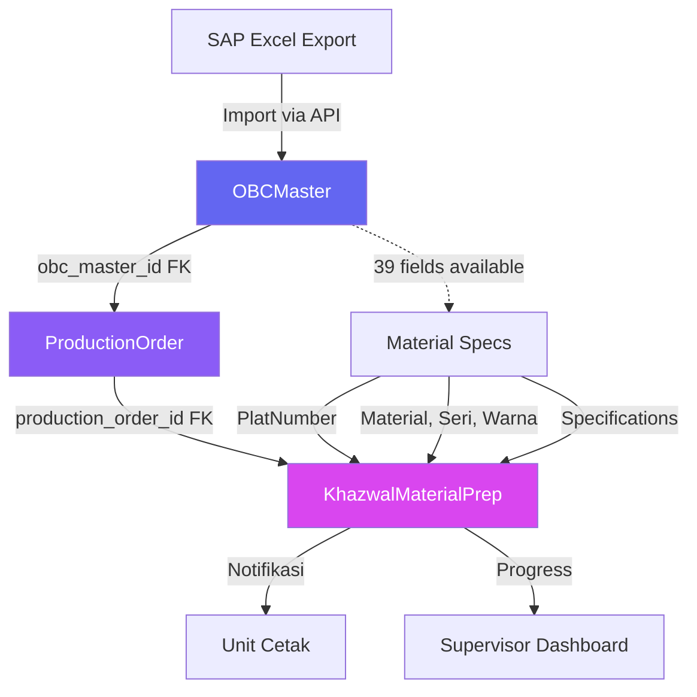

# Material Preparation - Phase 6: Integration with OBC Master Architecture

**Date:** 30 Desember 2025  
**Phase:** 6 - OBC Master Integration & Implementation Adjustments  
**Status:** 📋 Planning  
**Developer:** Zulfikar Hidayatullah

---

## 📊 OVERVIEW

Phase 6 merupakan tahap revisi dan adjustment untuk Material Preparation implementation berdasarkan arsitektur OBC Master yang telah diimplementasi di Phases 1-3. ProductionOrder sekarang memiliki relationship ke OBCMaster via foreign key `obc_master_id`, yang mencakup 39 fields spesifikasi OBC dari SAP Excel.

**Key Integration Points:**
- ProductionOrder model simplified (OBC data moved to OBCMaster)
- All queries must preload OBCMaster relationship
- Frontend components access OBC data via `po.obc_master.*`
- SAP service simplified (most data from OBCMaster)

---

## 🔄 ARCHITECTURE UPDATE

### Data Flow Diagram (Updated)



### Entity Relationship (Updated)

```mermaid
erDiagram
    OBCMaster ||--o{ ProductionOrder : "has many"
    ProductionOrder ||--o| KhazwalMaterialPrep : "has one"
    ProductionOrder ||--o{ POStageTracking : "has many"
    User ||--o{ KhazwalMaterialPrep : "prepares"
    
    OBCMaster {
        uint64 id PK
        string obc_number UK "UNIQUE"
        string material "INDEX"
        string seri "INDEX"
        string warna "INDEX"
        string factory_code "INDEX"
        string plat_number "For Khazwal"
        string material_description
        int quantity_ordered
        date due_date
        string personalization
        decimal rpb
        decimal hje
    }
    
    ProductionOrder {
        uint64 id PK
        uint64 obc_master_id FK "INDEX - NEW"
        int64 po_number UK
        int quantity_ordered
        int quantity_target_lembar_besar
        int estimated_rims
        date order_date
        date due_date
        enum priority
        int priority_score
        enum current_stage
        enum current_status
        text notes
    }
    
    KhazwalMaterialPrep {
        uint64 id PK
        uint64 production_order_id FK UK
        string sap_plat_code "from OBCMaster.PlatNumber"
        int kertas_blanko_quantity
        jsonb tinta_requirements "from OBCMaster.Warna"
        timestamp plat_retrieved_at
        int kertas_blanko_actual
        int kertas_blanko_variance
        text kertas_blanko_variance_reason
        jsonb tinta_actual
        jsonb material_photos
        enum status
        timestamp started_at
        timestamp completed_at
        int duration_minutes
        uint64 prepared_by FK
    }
```

---

## 🗄️ DATABASE SCHEMA UPDATES

### 1. Production Orders Table (Already Updated in Phase 1)

**Status:** ✅ Implemented in OBC Master Phase 1

```sql
-- Table already exists with correct structure
CREATE TABLE production_orders (
    id BIGINT UNSIGNED PRIMARY KEY AUTO_INCREMENT,
    
    -- ✅ NEW: Foreign key ke OBCMaster
    obc_master_id BIGINT UNSIGNED NOT NULL,
    
    -- Core PO fields
    po_number BIGINT NOT NULL UNIQUE,
    quantity_ordered INT NOT NULL,
    quantity_target_lembar_besar INT NOT NULL,
    estimated_rims INT NOT NULL,
    
    -- Dates
    order_date DATE NOT NULL,
    due_date DATE NOT NULL,
    
    -- Priority & Status
    priority VARCHAR(20) NOT NULL DEFAULT 'NORMAL',
    priority_score INT,
    current_stage VARCHAR(50) NOT NULL DEFAULT 'KHAZWAL_MATERIAL_PREP',
    current_status VARCHAR(50) NOT NULL DEFAULT 'WAITING_MATERIAL_PREP',
    
    -- Notes
    notes TEXT,
    
    -- Timestamps
    created_at TIMESTAMP DEFAULT CURRENT_TIMESTAMP,
    updated_at TIMESTAMP DEFAULT CURRENT_TIMESTAMP ON UPDATE CURRENT_TIMESTAMP,
    deleted_at TIMESTAMP NULL,
    
    -- Audit
    created_by BIGINT UNSIGNED,
    updated_by BIGINT UNSIGNED,
    
    -- Indexes
    INDEX idx_obc_master_id (obc_master_id),
    INDEX idx_po_number (po_number),
    INDEX idx_status_priority (current_stage, current_status, priority, due_date),
    INDEX idx_deleted_at (deleted_at),
    
    -- Foreign Keys
    CONSTRAINT fk_obc_master FOREIGN KEY (obc_master_id) 
        REFERENCES obc_masters(id) ON DELETE RESTRICT,
    CONSTRAINT fk_created_by FOREIGN KEY (created_by) 
        REFERENCES users(id) ON DELETE SET NULL,
    CONSTRAINT fk_updated_by FOREIGN KEY (updated_by) 
        REFERENCES users(id) ON DELETE SET NULL
);
```

**❌ Removed Fields (moved to OBCMaster):**
- `obc_number` → `obc_master.obc_number`
- `sap_customer_code` → `obc_master.factory_code`
- `sap_product_code` → `obc_master.material`
- `product_name` → `obc_master.material_description`
- `product_specifications` → individual OBCMaster fields

---

### 2. Khazwal Material Preparations Table

**Status:** 🆕 New table to be created

**File:** `backend/database/migrations/xxx_create_khazwal_material_preparations.sql`

```sql
CREATE TABLE khazwal_material_preparations (
    id BIGINT UNSIGNED PRIMARY KEY AUTO_INCREMENT,
    
    -- ✅ FK to ProductionOrder (one-to-one)
    production_order_id BIGINT UNSIGNED NOT NULL UNIQUE,
    
    -- ✅ Material Info (populated from OBCMaster on prep start)
    sap_plat_code VARCHAR(50) NOT NULL COMMENT 'From OBCMaster.PlatNumber',
    kertas_blanko_quantity INT NOT NULL COMMENT 'Target lembar besar',
    tinta_requirements JSON COMMENT 'From OBCMaster.Warna specs',
    
    -- ✅ Plat Confirmation
    plat_retrieved_at TIMESTAMP NULL COMMENT 'When plat was scanned/confirmed',
    plat_scanned_code VARCHAR(50) COMMENT 'Actual scanned barcode',
    plat_match BOOLEAN DEFAULT FALSE COMMENT 'Whether scanned matches expected',
    
    -- ✅ Kertas Blanko Actual
    kertas_blanko_actual INT COMMENT 'Actual lembar besar prepared',
    kertas_blanko_variance INT COMMENT 'Difference from target',
    kertas_blanko_variance_percentage DECIMAL(5,2) COMMENT 'Variance %',
    kertas_blanko_variance_reason TEXT COMMENT 'Reason if variance > 5%',
    
    -- ✅ Tinta Actual
    tinta_actual JSON COMMENT 'Actual tinta quantities per color',
    tinta_low_stock_flags JSON COMMENT 'Colors with low stock warning',
    
    -- ✅ Photo Evidence
    material_photos JSON COMMENT 'Array of photo URLs/paths',
    
    -- ✅ Status & Timeline
    status VARCHAR(50) NOT NULL DEFAULT 'PENDING' COMMENT 'PENDING, IN_PROGRESS, COMPLETED, CANCELLED',
    started_at TIMESTAMP NULL,
    completed_at TIMESTAMP NULL,
    duration_minutes INT COMMENT 'Total preparation time',
    
    -- ✅ Staff Assignment
    prepared_by BIGINT UNSIGNED COMMENT 'Staff who prepared',
    
    -- ✅ Timestamps
    created_at TIMESTAMP DEFAULT CURRENT_TIMESTAMP,
    updated_at TIMESTAMP DEFAULT CURRENT_TIMESTAMP ON UPDATE CURRENT_TIMESTAMP,
    deleted_at TIMESTAMP NULL,
    
    -- ✅ Indexes
    INDEX idx_production_order_id (production_order_id),
    INDEX idx_status (status),
    INDEX idx_prepared_by (prepared_by),
    INDEX idx_started_at (started_at),
    INDEX idx_completed_at (completed_at),
    INDEX idx_deleted_at (deleted_at),
    
    -- ✅ Foreign Keys
    CONSTRAINT fk_po_khazwal_prep FOREIGN KEY (production_order_id) 
        REFERENCES production_orders(id) ON DELETE CASCADE,
    CONSTRAINT fk_prepared_by FOREIGN KEY (prepared_by) 
        REFERENCES users(id) ON DELETE SET NULL
) ENGINE=InnoDB DEFAULT CHARSET=utf8mb4 COLLATE=utf8mb4_unicode_ci;
```

**JSON Schema Examples:**

```json
// tinta_requirements example
{
  "colors": [
    {
      "color": "MERAH",
      "mmea_code": "RED-01",
      "estimated_kg": 25.5
    },
    {
      "color": "BIRU",
      "mmea_code": "BLUE-02",
      "estimated_kg": 18.0
    }
  ]
}

// tinta_actual example
{
  "colors": [
    {
      "color": "MERAH",
      "actual_kg": 26.0,
      "stock_before": 150.5,
      "stock_after": 124.5
    },
    {
      "color": "BIRU",
      "actual_kg": 18.5,
      "stock_before": 95.0,
      "stock_after": 76.5
    }
  ]
}

// material_photos example
{
  "photos": [
    {
      "type": "plat",
      "url": "/uploads/khazwal/2025/12/plat_123456.jpg",
      "uploaded_at": "2025-12-30T10:30:00Z"
    },
    {
      "type": "pallet",
      "url": "/uploads/khazwal/2025/12/pallet_123456.jpg",
      "uploaded_at": "2025-12-30T11:45:00Z"
    }
  ]
}
```

---

### 3. PO Stage Tracking Table

**Status:** 🆕 New table to be created

**Purpose:** Track stage transitions dan timestamps untuk analytics

```sql
CREATE TABLE po_stage_tracking (
    id BIGINT UNSIGNED PRIMARY KEY AUTO_INCREMENT,
    
    production_order_id BIGINT UNSIGNED NOT NULL,
    
    stage VARCHAR(50) NOT NULL COMMENT 'Stage name',
    status VARCHAR(50) NOT NULL COMMENT 'Status within stage',
    
    started_at TIMESTAMP NULL,
    completed_at TIMESTAMP NULL,
    duration_minutes INT,
    
    notes TEXT,
    
    created_at TIMESTAMP DEFAULT CURRENT_TIMESTAMP,
    
    INDEX idx_production_order_id (production_order_id),
    INDEX idx_stage (stage),
    INDEX idx_started_at (started_at),
    
    CONSTRAINT fk_po_stage_tracking FOREIGN KEY (production_order_id) 
        REFERENCES production_orders(id) ON DELETE CASCADE
) ENGINE=InnoDB DEFAULT CHARSET=utf8mb4 COLLATE=utf8mb4_unicode_ci;
```

---

## 🔧 BACKEND IMPLEMENTATION UPDATES

### 1. Khazwal Service with OBCMaster Integration

**File:** `backend/services/khazwal_service.go`

**Status:** ⏳ Needs updates from Phase 5 + new methods

```go
package services

import (
    "errors"
    "time"
    "math"
    "gorm.io/gorm"
    "sirine-go/backend/models"
)

type KhazwalService struct {
    db *gorm.DB
}

func NewKhazwalService(db *gorm.DB) *KhazwalService {
    return &KhazwalService{db: db}
}

// ✅ GetMaterialPrepQueue - dengan OBCMaster preload
func (s *KhazwalService) GetMaterialPrepQueue(filters map[string]interface{}) ([]models.KhazwalMaterialPreparation, error) {
    var preps []models.KhazwalMaterialPreparation
    
    query := s.db.Model(&models.KhazwalMaterialPreparation{}).
        // ✅ CRITICAL: Preload ProductionOrder dengan OBCMaster
        Preload("ProductionOrder.OBCMaster").
        Preload("ProductionOrder").
        Preload("PreparedBy").
        Where("status = ?", "PENDING").
        Order("production_orders.priority_score ASC, production_orders.due_date ASC")
    
    // Apply filters
    if status, ok := filters["status"].(string); ok {
        query = query.Where("status = ?", status)
    }
    
    if priority, ok := filters["priority"].(string); ok {
        query = query.Joins("JOIN production_orders ON production_orders.id = khazwal_material_preparations.production_order_id").
            Where("production_orders.priority = ?", priority)
    }
    
    if err := query.Find(&preps).Error; err != nil {
        return nil, err
    }
    
    return preps, nil
}

// ✅ GetMaterialPrepDetail - dengan full OBCMaster data
func (s *KhazwalService) GetMaterialPrepDetail(prepID uint64) (*models.KhazwalMaterialPreparation, error) {
    var prep models.KhazwalMaterialPreparation
    
    err := s.db.
        Preload("ProductionOrder.OBCMaster").
        Preload("ProductionOrder").
        Preload("PreparedBy").
        First(&prep, prepID).Error
    
    if err != nil {
        return nil, err
    }
    
    return &prep, nil
}

// ✅ StartMaterialPrep - initialize dengan OBCMaster data
func (s *KhazwalService) StartMaterialPrep(poID uint64, userID uint64) (*models.KhazwalMaterialPreparation, error) {
    // Load PO dengan OBCMaster
    var po models.ProductionOrder
    if err := s.db.Preload("OBCMaster").First(&po, poID).Error; err != nil {
        return nil, err
    }
    
    // Validate OBCMaster exists
    if po.OBCMaster == nil {
        return nil, errors.New("OBC Master tidak ditemukan untuk Production Order ini")
    }
    
    // Check if prep already exists
    var existing models.KhazwalMaterialPreparation
    if err := s.db.Where("production_order_id = ?", poID).First(&existing).Error; err == nil {
        return nil, errors.New("Material preparation untuk PO ini sudah ada")
    }
    
    // Calculate tinta requirements dari OBCMaster.Warna
    tintaReqs := s.calculateTintaRequirements(po.OBCMaster, po.QuantityOrdered)
    
    // Create new prep record
    prep := models.KhazwalMaterialPreparation{
        ProductionOrderID:      poID,
        SAPPlatCode:           po.OBCMaster.PlatNumber,           // ✅ From OBCMaster
        KertasBlankoQuantity:  po.QuantityTargetLembarBesar,
        TintaRequirements:     tintaReqs,                        // ✅ Calculated from OBCMaster
        Status:                "IN_PROGRESS",
        StartedAt:             timePtr(time.Now()),
        PreparedBy:            &userID,
    }
    
    // Start transaction
    err := s.db.Transaction(func(tx *gorm.DB) error {
        // Create prep record
        if err := tx.Create(&prep).Error; err != nil {
            return err
        }
        
        // Update PO status
        if err := tx.Model(&po).Updates(map[string]interface{}{
            "current_status": "SEDANG_DISIAPKAN",
            "updated_at":     time.Now(),
        }).Error; err != nil {
            return err
        }
        
        // Create stage tracking
        tracking := models.POStageTracking{
            ProductionOrderID: poID,
            Stage:            "KHAZWAL_MATERIAL_PREP",
            Status:           "IN_PROGRESS",
            StartedAt:        timePtr(time.Now()),
        }
        if err := tx.Create(&tracking).Error; err != nil {
            return err
        }
        
        return nil
    })
    
    if err != nil {
        return nil, err
    }
    
    // Reload with relationships
    s.db.Preload("ProductionOrder.OBCMaster").First(&prep, prep.ID)
    
    return &prep, nil
}

// ✅ ConfirmPlat - validate scanned plat against OBCMaster
func (s *KhazwalService) ConfirmPlat(prepID uint64, scannedCode string) error {
    var prep models.KhazwalMaterialPreparation
    if err := s.db.Preload("ProductionOrder.OBCMaster").First(&prep, prepID).Error; err != nil {
        return err
    }
    
    // Validate OBCMaster exists
    if prep.ProductionOrder.OBCMaster == nil {
        return errors.New("OBC Master tidak ditemukan")
    }
    
    // Compare scanned code dengan expected plat number
    expectedPlat := prep.ProductionOrder.OBCMaster.PlatNumber
    isMatch := (scannedCode == expectedPlat)
    
    // Update prep record
    updates := map[string]interface{}{
        "plat_scanned_code": scannedCode,
        "plat_match":        isMatch,
        "plat_retrieved_at": time.Now(),
        "updated_at":        time.Now(),
    }
    
    if err := s.db.Model(&prep).Updates(updates).Error; err != nil {
        return err
    }
    
    if !isMatch {
        return errors.New("kode plat tidak sesuai dengan ekspektasi")
    }
    
    return nil
}

// ✅ UpdateKertas - input kertas actual dengan variance calculation
func (s *KhazwalService) UpdateKertas(prepID uint64, actualQuantity int, varianceReason string) error {
    var prep models.KhazwalMaterialPreparation
    if err := s.db.First(&prep, prepID).Error; err != nil {
        return err
    }
    
    // Calculate variance
    variance := actualQuantity - prep.KertasBlankoQuantity
    variancePercentage := float64(variance) / float64(prep.KertasBlankoQuantity) * 100
    
    // Validate variance reason if > 5%
    if math.Abs(variancePercentage) > 5.0 && varianceReason == "" {
        return errors.New("alasan selisih diperlukan untuk variance > 5%")
    }
    
    // Update prep record
    updates := map[string]interface{}{
        "kertas_blanko_actual":             actualQuantity,
        "kertas_blanko_variance":           variance,
        "kertas_blanko_variance_percentage": variancePercentage,
        "updated_at":                       time.Now(),
    }
    
    if varianceReason != "" {
        updates["kertas_blanko_variance_reason"] = varianceReason
    }
    
    return s.db.Model(&prep).Updates(updates).Error
}

// ✅ UpdateTinta - input tinta actual per color
func (s *KhazwalService) UpdateTinta(prepID uint64, tintaActual map[string]interface{}) error {
    var prep models.KhazwalMaterialPreparation
    if err := s.db.First(&prep, prepID).Error; err != nil {
        return err
    }
    
    // Check for low stock warnings
    lowStockFlags := s.checkLowStockTinta(tintaActual)
    
    updates := map[string]interface{}{
        "tinta_actual":         tintaActual,
        "tinta_low_stock_flags": lowStockFlags,
        "updated_at":           time.Now(),
    }
    
    return s.db.Model(&prep).Updates(updates).Error
}

// ✅ FinalizeMaterialPrep - complete preparation dan notify Cetak
func (s *KhazwalService) FinalizeMaterialPrep(prepID uint64, photos []string) error {
    var prep models.KhazwalMaterialPreparation
    if err := s.db.Preload("ProductionOrder").First(&prep, prepID).Error; err != nil {
        return err
    }
    
    // Validate all steps completed
    if prep.PlatRetrievedAt == nil {
        return errors.New("plat belum dikonfirmasi")
    }
    if prep.KertasBlankoActual == 0 {
        return errors.New("jumlah kertas belum diinput")
    }
    if prep.TintaActual == nil {
        return errors.New("tinta belum dikonfirmasi")
    }
    
    // Calculate duration
    duration := int(time.Since(*prep.StartedAt).Minutes())
    
    // Build photo JSON
    photoJSON := buildPhotoJSON(photos)
    
    // Transaction untuk finalize
    err := s.db.Transaction(func(tx *gorm.DB) error {
        // Update prep status
        updates := map[string]interface{}{
            "status":           "COMPLETED",
            "completed_at":     time.Now(),
            "duration_minutes": duration,
            "material_photos":  photoJSON,
            "updated_at":       time.Now(),
        }
        
        if err := tx.Model(&prep).Updates(updates).Error; err != nil {
            return err
        }
        
        // Update PO stage
        if err := tx.Model(&prep.ProductionOrder).Updates(map[string]interface{}{
            "current_stage":  "CETAK",
            "current_status": "SIAP_CETAK",
            "updated_at":     time.Now(),
        }).Error; err != nil {
            return err
        }
        
        // Complete stage tracking
        if err := tx.Model(&models.POStageTracking{}).
            Where("production_order_id = ? AND stage = ? AND completed_at IS NULL", 
                prep.ProductionOrderID, "KHAZWAL_MATERIAL_PREP").
            Updates(map[string]interface{}{
                "status":           "COMPLETED",
                "completed_at":     time.Now(),
                "duration_minutes": duration,
            }).Error; err != nil {
            return err
        }
        
        // Create notification untuk Unit Cetak
        // TODO: Implement notification service
        
        return nil
    })
    
    return err
}

// ✅ Helper: Calculate tinta requirements dari OBCMaster.Warna
func (s *KhazwalService) calculateTintaRequirements(obc *models.OBCMaster, quantity int) map[string]interface{} {
    // Parse colors dari OBCMaster.Warna (format: "MERAH,BIRU,HIJAU")
    colors := parseColorsFromWarna(obc.Warna)
    
    colorReqs := make([]map[string]interface{}, 0)
    for _, color := range colors {
        // Estimate tinta per color (simplified formula)
        // Real calculation should consider coverage, density, etc.
        estimatedKg := float64(quantity) / 1000.0 * 2.5 // ~2.5kg per 1000 units
        
        colorReqs = append(colorReqs, map[string]interface{}{
            "color":        color,
            "mmea_code":    obc.MMEAColorCode,
            "estimated_kg": estimatedKg,
        })
    }
    
    return map[string]interface{}{
        "colors": colorReqs,
    }
}

// Helper: Check low stock tinta
func (s *KhazwalService) checkLowStockTinta(tintaActual map[string]interface{}) map[string]interface{} {
    // TODO: Integrate dengan SAP inventory API
    // For now, return empty
    return map[string]interface{}{}
}

// Helper functions
func timePtr(t time.Time) *time.Time {
    return &t
}

func parseColorsFromWarna(warna string) []string {
    // Split by comma, trim spaces
    // Example: "MERAH, BIRU" -> ["MERAH", "BIRU"]
    // TODO: Implement proper parsing
    return []string{"MERAH", "BIRU"} // placeholder
}

func buildPhotoJSON(photos []string) map[string]interface{} {
    photoArray := make([]map[string]interface{}, 0)
    for _, url := range photos {
        photoArray = append(photoArray, map[string]interface{}{
            "url":         url,
            "uploaded_at": time.Now(),
        })
    }
    return map[string]interface{}{
        "photos": photoArray,
    }
}
```

---

### 2. Khazwal Handler with DTOs

**File:** `backend/handlers/khazwal_handler.go`

```go
package handlers

import (
    "net/http"
    "strconv"
    "github.com/gin-gonic/gin"
    "sirine-go/backend/models"
    "sirine-go/backend/services"
)

type KhazwalHandler struct {
    khazwalService *services.KhazwalService
}

func NewKhazwalHandler(khazwalService *services.KhazwalService) *KhazwalHandler {
    return &KhazwalHandler{
        khazwalService: khazwalService,
    }
}

// DTO Structures

type MaterialPrepQueueDTO struct {
    ID               uint64    `json:"id"`
    ProductionOrder  POInfoDTO `json:"production_order"`
    Status           string    `json:"status"`
    StartedAt        *string   `json:"started_at"`
    PreparedBy       *UserDTO  `json:"prepared_by"`
    CreatedAt        string    `json:"created_at"`
}

type POInfoDTO struct {
    ID                       uint64       `json:"id"`
    PONumber                 int64        `json:"po_number"`
    QuantityOrdered          int          `json:"quantity_ordered"`
    QuantityTargetLembarBesar int         `json:"quantity_target_lembar_besar"`
    Priority                 string       `json:"priority"`
    PriorityScore            int          `json:"priority_score"`
    DueDate                  string       `json:"due_date"`
    CurrentStage             string       `json:"current_stage"`
    CurrentStatus            string       `json:"current_status"`
    OBCMaster                OBCInfoDTO   `json:"obc_master"` // ✅ OBC Master data
}

type OBCInfoDTO struct {
    ID                  uint64  `json:"id"`
    OBCNumber           string  `json:"obc_number"`
    Material            string  `json:"material"`
    MaterialDescription string  `json:"material_description"`
    Seri                string  `json:"seri"`
    Warna               string  `json:"warna"`
    FactoryCode         string  `json:"factory_code"`
    PlatNumber          string  `json:"plat_number"`      // ✅ For plat confirmation
    AdhesiveType        string  `json:"adhesive_type"`
    Personalization     string  `json:"personalization"`
    QuantityOrdered     int     `json:"quantity_ordered"`
    DueDate             string  `json:"due_date"`
}

type UserDTO struct {
    ID       uint64 `json:"id"`
    Name     string `json:"name"`
    Username string `json:"username"`
    Role     string `json:"role"`
}

type MaterialPrepDetailDTO struct {
    ID                           uint64                 `json:"id"`
    ProductionOrder              POInfoDTO              `json:"production_order"`
    SAPPlatCode                  string                 `json:"sap_plat_code"`
    KertasBlankoQuantity         int                    `json:"kertas_blanko_quantity"`
    TintaRequirements            map[string]interface{} `json:"tinta_requirements"`
    PlatRetrievedAt              *string                `json:"plat_retrieved_at"`
    PlatScannedCode              *string                `json:"plat_scanned_code"`
    PlatMatch                    bool                   `json:"plat_match"`
    KertasBlankoActual           int                    `json:"kertas_blanko_actual"`
    KertasBlankoVariance         int                    `json:"kertas_blanko_variance"`
    KertasBlankoVariancePercentage float64             `json:"kertas_blanko_variance_percentage"`
    KertasBlankoVarianceReason   string                 `json:"kertas_blanko_variance_reason"`
    TintaActual                  map[string]interface{} `json:"tinta_actual"`
    TintaLowStockFlags           map[string]interface{} `json:"tinta_low_stock_flags"`
    MaterialPhotos               map[string]interface{} `json:"material_photos"`
    Status                       string                 `json:"status"`
    StartedAt                    *string                `json:"started_at"`
    CompletedAt                  *string                `json:"completed_at"`
    DurationMinutes              int                    `json:"duration_minutes"`
    PreparedBy                   *UserDTO               `json:"prepared_by"`
    CreatedAt                    string                 `json:"created_at"`
    UpdatedAt                    string                 `json:"updated_at"`
}

// Handlers

// @route   GET /api/khazwal/material-prep/queue
// @access  STAFF_KHAZWAL, SUPERVISOR_KHAZWAL, MANAGER, ADMIN
func (h *KhazwalHandler) GetQueue(c *gin.Context) {
    // Parse filters
    filters := map[string]interface{}{}
    
    if status := c.Query("status"); status != "" {
        filters["status"] = status
    }
    
    if priority := c.Query("priority"); priority != "" {
        filters["priority"] = priority
    }
    
    // Get queue from service
    preps, err := h.khazwalService.GetMaterialPrepQueue(filters)
    if err != nil {
        c.JSON(http.StatusInternalServerError, gin.H{
            "success": false,
            "message": "Gagal mengambil queue material preparation",
            "error":   err.Error(),
        })
        return
    }
    
    // Transform to DTOs
    dtos := make([]MaterialPrepQueueDTO, len(preps))
    for i, prep := range preps {
        dtos[i] = toMaterialPrepQueueDTO(prep)
    }
    
    c.JSON(http.StatusOK, gin.H{
        "success": true,
        "message": "Queue material preparation berhasil diambil",
        "data": gin.H{
            "items": dtos,
            "total": len(dtos),
        },
    })
}

// @route   GET /api/khazwal/material-prep/:id
// @access  STAFF_KHAZWAL, SUPERVISOR_KHAZWAL, MANAGER, ADMIN
func (h *KhazwalHandler) GetDetail(c *gin.Context) {
    id, err := strconv.ParseUint(c.Param("id"), 10, 64)
    if err != nil {
        c.JSON(http.StatusBadRequest, gin.H{
            "success": false,
            "message": "ID tidak valid",
            "error":   "Parameter ID harus berupa angka",
        })
        return
    }
    
    prep, err := h.khazwalService.GetMaterialPrepDetail(id)
    if err != nil {
        c.JSON(http.StatusNotFound, gin.H{
            "success": false,
            "message": "Material preparation tidak ditemukan",
            "error":   err.Error(),
        })
        return
    }
    
    c.JSON(http.StatusOK, gin.H{
        "success": true,
        "message": "Detail material preparation berhasil diambil",
        "data":    toMaterialPrepDetailDTO(prep),
    })
}

// @route   POST /api/khazwal/material-prep/:id/start
// @access  STAFF_KHAZWAL
func (h *KhazwalHandler) StartPreparation(c *gin.Context) {
    poID, err := strconv.ParseUint(c.Param("id"), 10, 64)
    if err != nil {
        c.JSON(http.StatusBadRequest, gin.H{
            "success": false,
            "message": "ID Production Order tidak valid",
            "error":   "Parameter ID harus berupa angka",
        })
        return
    }
    
    // Get user ID from context (set by auth middleware)
    userID := c.GetUint64("user_id")
    
    prep, err := h.khazwalService.StartMaterialPrep(poID, userID)
    if err != nil {
        c.JSON(http.StatusInternalServerError, gin.H{
            "success": false,
            "message": "Gagal memulai material preparation",
            "error":   err.Error(),
        })
        return
    }
    
    c.JSON(http.StatusOK, gin.H{
        "success": true,
        "message": "Material preparation berhasil dimulai",
        "data":    toMaterialPrepDetailDTO(prep),
    })
}

// @route   POST /api/khazwal/material-prep/:id/confirm-plat
// @access  STAFF_KHAZWAL
func (h *KhazwalHandler) ConfirmPlat(c *gin.Context) {
    prepID, err := strconv.ParseUint(c.Param("id"), 10, 64)
    if err != nil {
        c.JSON(http.StatusBadRequest, gin.H{
            "success": false,
            "message": "ID tidak valid",
        })
        return
    }
    
    var req struct {
        ScannedCode string `json:"scanned_code" binding:"required"`
    }
    
    if err := c.ShouldBindJSON(&req); err != nil {
        c.JSON(http.StatusBadRequest, gin.H{
            "success": false,
            "message": "Kode plat yang di-scan harus diisi",
            "error":   err.Error(),
        })
        return
    }
    
    if err := h.khazwalService.ConfirmPlat(prepID, req.ScannedCode); err != nil {
        c.JSON(http.StatusBadRequest, gin.H{
            "success": false,
            "message": "Konfirmasi plat gagal",
            "error":   err.Error(),
        })
        return
    }
    
    c.JSON(http.StatusOK, gin.H{
        "success": true,
        "message": "Plat berhasil dikonfirmasi",
    })
}

// @route   PATCH /api/khazwal/material-prep/:id/kertas
// @access  STAFF_KHAZWAL
func (h *KhazwalHandler) UpdateKertas(c *gin.Context) {
    prepID, err := strconv.ParseUint(c.Param("id"), 10, 64)
    if err != nil {
        c.JSON(http.StatusBadRequest, gin.H{
            "success": false,
            "message": "ID tidak valid",
        })
        return
    }
    
    var req struct {
        ActualQuantity  int    `json:"actual_quantity" binding:"required"`
        VarianceReason string `json:"variance_reason"`
    }
    
    if err := c.ShouldBindJSON(&req); err != nil {
        c.JSON(http.StatusBadRequest, gin.H{
            "success": false,
            "message": "Jumlah kertas actual harus diisi",
            "error":   err.Error(),
        })
        return
    }
    
    if err := h.khazwalService.UpdateKertas(prepID, req.ActualQuantity, req.VarianceReason); err != nil {
        c.JSON(http.StatusBadRequest, gin.H{
            "success": false,
            "message": "Update kertas gagal",
            "error":   err.Error(),
        })
        return
    }
    
    c.JSON(http.StatusOK, gin.H{
        "success": true,
        "message": "Jumlah kertas berhasil diupdate",
    })
}

// @route   PATCH /api/khazwal/material-prep/:id/tinta
// @access  STAFF_KHAZWAL
func (h *KhazwalHandler) UpdateTinta(c *gin.Context) {
    prepID, err := strconv.ParseUint(c.Param("id"), 10, 64)
    if err != nil {
        c.JSON(http.StatusBadRequest, gin.H{
            "success": false,
            "message": "ID tidak valid",
        })
        return
    }
    
    var req map[string]interface{}
    if err := c.ShouldBindJSON(&req); err != nil {
        c.JSON(http.StatusBadRequest, gin.H{
            "success": false,
            "message": "Data tinta tidak valid",
            "error":   err.Error(),
        })
        return
    }
    
    if err := h.khazwalService.UpdateTinta(prepID, req); err != nil {
        c.JSON(http.StatusBadRequest, gin.H{
            "success": false,
            "message": "Update tinta gagal",
            "error":   err.Error(),
        })
        return
    }
    
    c.JSON(http.StatusOK, gin.H{
        "success": true,
        "message": "Data tinta berhasil diupdate",
    })
}

// @route   POST /api/khazwal/material-prep/:id/finalize
// @access  STAFF_KHAZWAL
func (h *KhazwalHandler) Finalize(c *gin.Context) {
    prepID, err := strconv.ParseUint(c.Param("id"), 10, 64)
    if err != nil {
        c.JSON(http.StatusBadRequest, gin.H{
            "success": false,
            "message": "ID tidak valid",
        })
        return
    }
    
    var req struct {
        Photos []string `json:"photos"`
    }
    
    if err := c.ShouldBindJSON(&req); err != nil {
        // Photos optional, continue
        req.Photos = []string{}
    }
    
    if err := h.khazwalService.FinalizeMaterialPrep(prepID, req.Photos); err != nil {
        c.JSON(http.StatusBadRequest, gin.H{
            "success": false,
            "message": "Finalisasi material preparation gagal",
            "error":   err.Error(),
        })
        return
    }
    
    c.JSON(http.StatusOK, gin.H{
        "success": true,
        "message": "Material preparation berhasil diselesaikan dan PO dikirim ke Unit Cetak",
    })
}

// DTO Transformation Functions

func toMaterialPrepQueueDTO(prep models.KhazwalMaterialPreparation) MaterialPrepQueueDTO {
    dto := MaterialPrepQueueDTO{
        ID:              prep.ID,
        ProductionOrder: toPOInfoDTO(&prep.ProductionOrder),
        Status:          prep.Status,
        CreatedAt:       prep.CreatedAt.Format("2006-01-02T15:04:05Z07:00"),
    }
    
    if prep.StartedAt != nil {
        startedAt := prep.StartedAt.Format("2006-01-02T15:04:05Z07:00")
        dto.StartedAt = &startedAt
    }
    
    if prep.PreparedBy != nil {
        user := toUserDTO(prep.PreparedBy)
        dto.PreparedBy = &user
    }
    
    return dto
}

func toPOInfoDTO(po *models.ProductionOrder) POInfoDTO {
    dto := POInfoDTO{
        ID:                        po.ID,
        PONumber:                  po.PONumber,
        QuantityOrdered:           po.QuantityOrdered,
        QuantityTargetLembarBesar: po.QuantityTargetLembarBesar,
        Priority:                  po.Priority,
        PriorityScore:             po.PriorityScore,
        DueDate:                   po.DueDate.Format("2006-01-02"),
        CurrentStage:              po.CurrentStage,
        CurrentStatus:             po.CurrentStatus,
    }
    
    // ✅ Include OBCMaster data
    if po.OBCMaster != nil {
        dto.OBCMaster = toOBCInfoDTO(po.OBCMaster)
    }
    
    return dto
}

func toOBCInfoDTO(obc *models.OBCMaster) OBCInfoDTO {
    dto := OBCInfoDTO{
        ID:                  obc.ID,
        OBCNumber:           obc.OBCNumber,
        Material:            obc.Material,
        MaterialDescription: obc.MaterialDescription,
        Seri:                obc.Seri,
        Warna:               obc.Warna,
        FactoryCode:         obc.FactoryCode,
        PlatNumber:          obc.PlatNumber,
        AdhesiveType:        obc.AdhesiveType,
        Personalization:     obc.Personalization,
        QuantityOrdered:     obc.QuantityOrdered,
    }
    
    if obc.DueDate != nil {
        dto.DueDate = obc.DueDate.Format("2006-01-02")
    }
    
    return dto
}

func toUserDTO(user *models.User) UserDTO {
    return UserDTO{
        ID:       user.ID,
        Name:     user.Name,
        Username: user.Username,
        Role:     user.Role,
    }
}

func toMaterialPrepDetailDTO(prep *models.KhazwalMaterialPreparation) MaterialPrepDetailDTO {
    dto := MaterialPrepDetailDTO{
        ID:                             prep.ID,
        ProductionOrder:                toPOInfoDTO(&prep.ProductionOrder),
        SAPPlatCode:                    prep.SAPPlatCode,
        KertasBlankoQuantity:           prep.KertasBlankoQuantity,
        TintaRequirements:              prep.TintaRequirements,
        PlatMatch:                      prep.PlatMatch,
        KertasBlankoActual:             prep.KertasBlankoActual,
        KertasBlankoVariance:           prep.KertasBlankoVariance,
        KertasBlankoVariancePercentage: prep.KertasBlankoVariancePercentage,
        KertasBlankoVarianceReason:     prep.KertasBlankoVarianceReason,
        TintaActual:                    prep.TintaActual,
        TintaLowStockFlags:             prep.TintaLowStockFlags,
        MaterialPhotos:                 prep.MaterialPhotos,
        Status:                         prep.Status,
        DurationMinutes:                prep.DurationMinutes,
        CreatedAt:                      prep.CreatedAt.Format("2006-01-02T15:04:05Z07:00"),
        UpdatedAt:                      prep.UpdatedAt.Format("2006-01-02T15:04:05Z07:00"),
    }
    
    if prep.PlatRetrievedAt != nil {
        platRetrieved := prep.PlatRetrievedAt.Format("2006-01-02T15:04:05Z07:00")
        dto.PlatRetrievedAt = &platRetrieved
    }
    
    if prep.PlatScannedCode != nil {
        dto.PlatScannedCode = prep.PlatScannedCode
    }
    
    if prep.StartedAt != nil {
        startedAt := prep.StartedAt.Format("2006-01-02T15:04:05Z07:00")
        dto.StartedAt = &startedAt
    }
    
    if prep.CompletedAt != nil {
        completedAt := prep.CompletedAt.Format("2006-01-02T15:04:05Z07:00")
        dto.CompletedAt = &completedAt
    }
    
    if prep.PreparedBy != nil {
        user := toUserDTO(prep.PreparedBy)
        dto.PreparedBy = &user
    }
    
    return dto
}
```

---

### 3. Routes Configuration

**File:** `backend/routes/routes.go`

```go
// Khazwal Material Preparation Routes
khazwal := api.Group("/khazwal")
khazwal.Use(middleware.AuthMiddleware(db, cfg))
khazwal.Use(middleware.RequireRole("STAFF_KHAZWAL", "SUPERVISOR_KHAZWAL", "MANAGER", "ADMIN"))
khazwal.Use(middleware.ActivityLogger(db))
{
    // Queue & Detail (Read operations)
    khazwal.GET("/material-prep/queue", khazwalHandler.GetQueue)
    khazwal.GET("/material-prep/:id", khazwalHandler.GetDetail)
    
    // Write operations (Staff only)
    staffOnly := khazwal.Group("")
    staffOnly.Use(middleware.RequireRole("STAFF_KHAZWAL", "ADMIN"))
    {
        staffOnly.POST("/material-prep/:id/start", khazwalHandler.StartPreparation)
        staffOnly.POST("/material-prep/:id/confirm-plat", khazwalHandler.ConfirmPlat)
        staffOnly.PATCH("/material-prep/:id/kertas", khazwalHandler.UpdateKertas)
        staffOnly.PATCH("/material-prep/:id/tinta", khazwalHandler.UpdateTinta)
        staffOnly.POST("/material-prep/:id/finalize", khazwalHandler.Finalize)
    }
}
```

---

## 🎨 FRONTEND IMPLEMENTATION UPDATES

### 1. Material Prep Queue Page

**File:** `frontend/src/views/khazwal/MaterialPrepQueuePage.vue`

```vue
<script setup>
import { ref, onMounted, computed } from 'vue'
import { Motion } from 'motion-v'
import { entranceAnimations, springPresets } from '@/composables/useMotion'
import { useKhazwalStore } from '@/stores/khazwal'
import POQueueCard from '@/components/khazwal/POQueueCard.vue'
import PriorityBadge from '@/components/common/PriorityBadge.vue'

const khazwalStore = useKhazwalStore()

// State
const loading = ref(false)
const queue = ref([])
const filters = ref({
  status: '',
  priority: '',
  search: ''
})

// Computed
const filteredQueue = computed(() => {
  let result = queue.value
  
  if (filters.value.search) {
    result = result.filter(item => 
      item.production_order.po_number.toString().includes(filters.value.search) ||
      item.production_order.obc_master.obc_number.toLowerCase().includes(filters.value.search.toLowerCase()) ||
      item.production_order.obc_master.material_description.toLowerCase().includes(filters.value.search.toLowerCase())
    )
  }
  
  return result
})

// Methods
async function fetchQueue() {
  loading.value = true
  try {
    const response = await khazwalStore.getMaterialPrepQueue(filters.value)
    queue.value = response.items
  } catch (error) {
    console.error('Error fetching queue:', error)
  } finally {
    loading.value = false
  }
}

async function handleStartPrep(poId) {
  if (!confirm('Mulai persiapan material untuk PO ini?')) return
  
  try {
    await khazwalStore.startMaterialPrep(poId)
    // Navigate to process page
    router.push(`/khazwal/material-prep/${poId}/process`)
  } catch (error) {
    alert('Gagal memulai persiapan: ' + error.message)
  }
}

// Lifecycle
onMounted(() => {
  fetchQueue()
})
</script>

<template>
  <div class="material-prep-queue-page">
    <!-- Header -->
    <Motion v-bind="entranceAnimations.fadeUp">
      <div class="page-header">
        <h1 class="text-2xl font-bold text-gray-900">Persiapan Material</h1>
        <p class="text-gray-600 mt-1">Queue Production Order untuk persiapan material</p>
      </div>
    </Motion>

    <!-- Filters -->
    <Motion 
      v-bind="entranceAnimations.fadeUp"
      :transition="{ ...springPresets.default, delay: 0.1 }"
    >
      <div class="filters-card glass-card p-4 mb-6">
        <div class="grid grid-cols-1 md:grid-cols-3 gap-4">
          <!-- Search -->
          <div>
            <label class="block text-sm font-medium text-gray-700 mb-2">
              Cari PO / OBC / Material
            </label>
            <input
              v-model="filters.search"
              type="text"
              placeholder="Ketik untuk mencari..."
              class="w-full px-4 py-2 border border-gray-200 rounded-lg focus:ring-2 focus:ring-indigo-100 focus:border-indigo-500"
            >
          </div>

          <!-- Status Filter -->
          <div>
            <label class="block text-sm font-medium text-gray-700 mb-2">
              Status
            </label>
            <select
              v-model="filters.status"
              class="w-full px-4 py-2 border border-gray-200 rounded-lg focus:ring-2 focus:ring-indigo-100 focus:border-indigo-500"
            >
              <option value="">Semua Status</option>
              <option value="PENDING">Pending</option>
              <option value="IN_PROGRESS">Sedang Diproses</option>
              <option value="COMPLETED">Selesai</option>
            </select>
          </div>

          <!-- Priority Filter -->
          <div>
            <label class="block text-sm font-medium text-gray-700 mb-2">
              Prioritas
            </label>
            <select
              v-model="filters.priority"
              class="w-full px-4 py-2 border border-gray-200 rounded-lg focus:ring-2 focus:ring-indigo-100 focus:border-indigo-500"
            >
              <option value="">Semua Prioritas</option>
              <option value="URGENT">Urgent</option>
              <option value="HIGH">High</option>
              <option value="NORMAL">Normal</option>
              <option value="LOW">Low</option>
            </select>
          </div>
        </div>
      </div>
    </Motion>

    <!-- Queue List -->
    <div v-if="loading" class="space-y-4">
      <!-- Skeleton Loading -->
      <div v-for="i in 3" :key="i" class="glass-card p-6 animate-pulse">
        <div class="h-4 bg-gray-200 rounded w-1/4 mb-4"></div>
        <div class="h-4 bg-gray-200 rounded w-1/2"></div>
      </div>
    </div>

    <div v-else-if="filteredQueue.length === 0" class="empty-state">
      <Motion v-bind="entranceAnimations.fadeScale">
        <div class="glass-card p-12 text-center">
          <div class="text-6xl mb-4">📦</div>
          <h3 class="text-xl font-semibold text-gray-900 mb-2">Tidak Ada PO dalam Queue</h3>
          <p class="text-gray-600">Belum ada Production Order yang perlu disiapkan material.</p>
        </div>
      </Motion>
    </div>

    <div v-else class="queue-list space-y-4">
      <Motion
        v-for="(item, index) in filteredQueue"
        :key="item.id"
        :initial="{ opacity: 0, y: 15 }"
        :animate="{ opacity: 1, y: 0 }"
        :transition="{ duration: 0.25, delay: index * 0.05, ease: 'easeOut' }"
      >
        <POQueueCard
          :prep="item"
          @start="handleStartPrep"
        />
      </Motion>
    </div>
  </div>
</template>

<style scoped>
.material-prep-queue-page {
  max-width: 1200px;
  margin: 0 auto;
  padding: 2rem 1rem;
}

.page-header {
  margin-bottom: 2rem;
}

.glass-card {
  @apply bg-white/95 border border-gray-200/30 rounded-xl shadow-sm;
}

@media (max-width: 768px) {
  .material-prep-queue-page {
    padding: 1rem 0.5rem;
  }
}
</style>
```

---

### 2. PO Queue Card Component (with OBC Master Data)

**File:** `frontend/src/components/khazwal/POQueueCard.vue`

```vue
<script setup>
import { computed } from 'vue'
import { Motion } from 'motion-v'
import { iconAnimations } from '@/composables/useMotion'
import PriorityBadge from '@/components/common/PriorityBadge.vue'

const props = defineProps({
  prep: {
    type: Object,
    required: true
  }
})

const emit = defineEmits(['start', 'view'])

// Computed
const po = computed(() => props.prep.production_order)
const obc = computed(() => po.value.obc_master || {})

const priorityColor = computed(() => {
  const colors = {
    URGENT: 'bg-red-100 text-red-800',
    HIGH: 'bg-orange-100 text-orange-800',
    NORMAL: 'bg-blue-100 text-blue-800',
    LOW: 'bg-gray-100 text-gray-800'
  }
  return colors[po.value.priority] || colors.NORMAL
})

const statusLabel = computed(() => {
  const labels = {
    PENDING: 'Menunggu',
    IN_PROGRESS: 'Sedang Diproses',
    COMPLETED: 'Selesai'
  }
  return labels[props.prep.status] || props.prep.status
})

// Methods
function handleStart() {
  emit('start', po.value.id)
}

function handleView() {
  emit('view', props.prep.id)
}
</script>

<template>
  <div class="po-queue-card glass-card p-6 hover:shadow-md transition-shadow cursor-pointer active-scale">
    <div class="flex items-start justify-between mb-4">
      <!-- Left: PO & OBC Info -->
      <div class="flex-1">
        <!-- PO Number -->
        <div class="flex items-center gap-2 mb-2">
          <span class="text-sm font-medium text-gray-500">PO</span>
          <span class="text-lg font-bold text-gray-900">{{ po.po_number }}</span>
          <PriorityBadge :priority="po.priority" />
        </div>

        <!-- ✅ OBC Master Info -->
        <div class="space-y-1">
          <div class="flex items-center gap-2 text-sm">
            <span class="text-gray-500">OBC:</span>
            <span class="font-semibold text-indigo-600">{{ obc.obc_number || 'N/A' }}</span>
          </div>
          
          <div class="text-sm text-gray-700 font-medium">
            {{ obc.material_description || 'No description' }}
          </div>
          
          <div class="flex items-center gap-4 text-xs text-gray-600">
            <span>Material: {{ obc.material || '-' }}</span>
            <span>Seri: {{ obc.seri || '-' }}</span>
            <span>Warna: {{ obc.warna || '-' }}</span>
          </div>
          
          <div v-if="obc.personalization" class="inline-flex items-center gap-1 px-2 py-0.5 bg-purple-100 text-purple-700 text-xs rounded-full mt-1">
            <span>{{ obc.personalization }}</span>
          </div>
        </div>
      </div>

      <!-- Right: Actions -->
      <div class="flex flex-col items-end gap-2">
        <div :class="['px-3 py-1 rounded-full text-xs font-medium', priorityColor]">
          {{ po.priority }}
        </div>
        <div class="text-xs text-gray-500">
          Due: {{ new Date(po.due_date).toLocaleDateString('id-ID') }}
        </div>
      </div>
    </div>

    <!-- Quantity Info -->
    <div class="grid grid-cols-2 gap-4 py-3 border-t border-gray-100">
      <div>
        <div class="text-xs text-gray-500">Quantity Ordered</div>
        <div class="text-lg font-bold text-gray-900">{{ po.quantity_ordered.toLocaleString() }}</div>
      </div>
      <div>
        <div class="text-xs text-gray-500">Target Lembar Besar</div>
        <div class="text-lg font-bold text-gray-900">{{ po.quantity_target_lembar_besar.toLocaleString() }}</div>
      </div>
    </div>

    <!-- ✅ Material Preview -->
    <div class="mt-4 p-3 bg-gray-50 rounded-lg">
      <div class="text-xs font-medium text-gray-700 mb-2">Material yang Dibutuhkan:</div>
      <div class="space-y-1 text-xs text-gray-600">
        <div class="flex items-center gap-2">
          <span class="w-16">Plat:</span>
          <span class="font-mono font-semibold text-gray-900">{{ obc.plat_number || '-' }}</span>
        </div>
        <div class="flex items-center gap-2">
          <span class="w-16">Perekat:</span>
          <span>{{ obc.adhesive_type || '-' }}</span>
        </div>
        <div class="flex items-center gap-2">
          <span class="w-16">Factory:</span>
          <span>{{ obc.factory_code || '-' }}</span>
        </div>
      </div>
    </div>

    <!-- Actions -->
    <div class="mt-4 pt-4 border-t border-gray-100 flex justify-between items-center">
      <div class="text-sm text-gray-600">
        Status: <span class="font-medium">{{ statusLabel }}</span>
      </div>

      <button
        v-if="prep.status === 'PENDING'"
        @click="handleStart"
        class="px-4 py-2 bg-gradient-to-r from-indigo-600 to-fuchsia-600 text-white rounded-lg font-medium hover:shadow-lg transition-all active-scale"
      >
        Mulai Persiapan
      </button>

      <button
        v-else
        @click="handleView"
        class="px-4 py-2 bg-white border border-gray-200 text-gray-700 rounded-lg font-medium hover:bg-gray-50 transition-all active-scale"
      >
        Lihat Detail
      </button>
    </div>
  </div>
</template>

<style scoped>
.po-queue-card {
  @apply bg-white/95 border border-gray-200/30 rounded-xl;
  transition: all 0.2s ease-out;
}

.po-queue-card:hover {
  @apply shadow-md border-indigo-200;
}

.active-scale:active {
  transform: scale(0.98);
}

.glass-card {
  backdrop-filter: blur(8px);
}
</style>
```

---

### 3. Pinia Store for Khazwal

**File:** `frontend/src/stores/khazwal.js`

```javascript
import { defineStore } from 'pinia'
import api from '@/utils/api'

export const useKhazwalStore = defineStore('khazwal', {
  state: () => ({
    queue: [],
    currentPrep: null,
    loading: false,
    error: null
  }),

  getters: {
    pendingQueue: (state) => state.queue.filter(item => item.status === 'PENDING'),
    inProgressQueue: (state) => state.queue.filter(item => item.status === 'IN_PROGRESS'),
    completedQueue: (state) => state.queue.filter(item => item.status === 'COMPLETED'),
  },

  actions: {
    // ✅ Get Material Prep Queue (with OBCMaster preloaded)
    async getMaterialPrepQueue(filters = {}) {
      this.loading = true
      this.error = null
      
      try {
        const response = await api.get('/khazwal/material-prep/queue', { params: filters })
        this.queue = response.data.data.items
        return response.data.data
      } catch (error) {
        this.error = error.response?.data?.message || 'Gagal mengambil queue'
        throw error
      } finally {
        this.loading = false
      }
    },

    // ✅ Get Material Prep Detail (with full OBCMaster data)
    async getMaterialPrepDetail(prepId) {
      this.loading = true
      this.error = null
      
      try {
        const response = await api.get(`/khazwal/material-prep/${prepId}`)
        this.currentPrep = response.data.data
        return response.data.data
      } catch (error) {
        this.error = error.response?.data?.message || 'Gagal mengambil detail'
        throw error
      } finally {
        this.loading = false
      }
    },

    // ✅ Start Material Prep
    async startMaterialPrep(poId) {
      this.loading = true
      this.error = null
      
      try {
        const response = await api.post(`/khazwal/material-prep/${poId}/start`)
        this.currentPrep = response.data.data
        
        // Remove from pending queue
        this.queue = this.queue.filter(item => item.production_order.id !== poId)
        
        return response.data.data
      } catch (error) {
        this.error = error.response?.data?.message || 'Gagal memulai persiapan'
        throw error
      } finally {
        this.loading = false
      }
    },

    // ✅ Confirm Plat
    async confirmPlat(prepId, scannedCode) {
      try {
        const response = await api.post(`/khazwal/material-prep/${prepId}/confirm-plat`, {
          scanned_code: scannedCode
        })
        
        // Update current prep
        if (this.currentPrep && this.currentPrep.id === prepId) {
          this.currentPrep.plat_scanned_code = scannedCode
          this.currentPrep.plat_match = true
          this.currentPrep.plat_retrieved_at = new Date().toISOString()
        }
        
        return response.data
      } catch (error) {
        throw error
      }
    },

    // ✅ Update Kertas
    async updateKertas(prepId, actualQuantity, varianceReason = '') {
      try {
        const response = await api.patch(`/khazwal/material-prep/${prepId}/kertas`, {
          actual_quantity: actualQuantity,
          variance_reason: varianceReason
        })
        
        // Update current prep
        if (this.currentPrep && this.currentPrep.id === prepId) {
          this.currentPrep.kertas_blanko_actual = actualQuantity
          const variance = actualQuantity - this.currentPrep.kertas_blanko_quantity
          this.currentPrep.kertas_blanko_variance = variance
          this.currentPrep.kertas_blanko_variance_percentage = 
            (variance / this.currentPrep.kertas_blanko_quantity) * 100
          this.currentPrep.kertas_blanko_variance_reason = varianceReason
        }
        
        return response.data
      } catch (error) {
        throw error
      }
    },

    // ✅ Update Tinta
    async updateTinta(prepId, tintaActual) {
      try {
        const response = await api.patch(`/khazwal/material-prep/${prepId}/tinta`, tintaActual)
        
        // Update current prep
        if (this.currentPrep && this.currentPrep.id === prepId) {
          this.currentPrep.tinta_actual = tintaActual
        }
        
        return response.data
      } catch (error) {
        throw error
      }
    },

    // ✅ Finalize Material Prep
    async finalizeMaterialPrep(prepId, photos = []) {
      try {
        const response = await api.post(`/khazwal/material-prep/${prepId}/finalize`, {
          photos: photos
        })
        
        // Update current prep
        if (this.currentPrep && this.currentPrep.id === prepId) {
          this.currentPrep.status = 'COMPLETED'
          this.currentPrep.completed_at = new Date().toISOString()
        }
        
        return response.data
      } catch (error) {
        throw error
      }
    }
  }
})
```

---

## 📋 IMPLEMENTATION CHECKLIST

### Prerequisites (Must be Completed First)

- [x] **OBC Master Phase 1** - Model & database architecture
- [x] **OBC Master Phase 2** - Excel import service
- [x] **OBC Master Phase 3** - API endpoints
- [ ] **OBC Master Phase 4** - Database migration
- [ ] **OBC Master Phase 5** - Service layer updates (khazwal_service.go, cetak_service.go)

### Phase 6 Implementation Tasks

#### Sprint 1: Database & Models (Week 1)
- [ ] Create `khazwal_material_preparations` table migration
- [ ] Create `po_stage_tracking` table migration
- [ ] Run migrations on development database
- [ ] Verify foreign key constraints
- [ ] Create KhazwalMaterialPrep Go model
- [ ] Create POStageTracking Go model
- [ ] Register models in models_registry.go
- [ ] Test model CRUD operations
- [ ] Seed test data untuk development

#### Sprint 2: Backend Service Layer (Week 2)
- [ ] Create/Update `khazwal_service.go` dengan OBCMaster preloading
- [ ] Implement `GetMaterialPrepQueue()` with filters
- [ ] Implement `GetMaterialPrepDetail()` with full data
- [ ] Implement `StartMaterialPrep()` with OBCMaster initialization
- [ ] Implement `ConfirmPlat()` dengan barcode validation
- [ ] Implement `UpdateKertas()` dengan variance calculation
- [ ] Implement `UpdateTinta()` dengan low stock check
- [ ] Implement `FinalizeMaterialPrep()` dengan notification
- [ ] Unit tests untuk service methods

#### Sprint 3: Backend Handler & Routes (Week 3)
- [ ] Create `khazwal_handler.go` dengan DTOs
- [ ] Implement all handler methods (7 endpoints)
- [ ] Create DTO transformation functions
- [ ] Add khazwal routes ke routes.go
- [ ] Configure role-based access control
- [ ] Add activity logging middleware
- [ ] Test all endpoints dengan Postman
- [ ] API documentation

#### Sprint 4: Frontend Pages (Week 4)
- [ ] Create `MaterialPrepQueuePage.vue`
- [ ] Create `MaterialPrepDetailPage.vue`
- [ ] Create `MaterialPrepProcessPage.vue`
- [ ] Add khazwal routes ke Vue Router
- [ ] Configure navigation guards
- [ ] Add khazwal menu ke sidebar
- [ ] Test page navigation flow

#### Sprint 5: Frontend Components (Week 5)
- [ ] Create `POQueueCard.vue` dengan OBC Master display
- [ ] Create `PriorityBadge.vue`
- [ ] Create `BarcodeScanner.vue` component
- [ ] Create `MaterialChecklist.vue` dengan OBC specs
- [ ] Create `TintaInputForm.vue` dengan color indicators
- [ ] Create `VarianceAlert.vue` component
- [ ] Create `PhotoUploader.vue` component
- [ ] Mobile responsive testing

#### Sprint 6: Integration & Testing (Week 6)
- [ ] Create Pinia store `useKhazwalStore()`
- [ ] Integrate API calls dengan axios
- [ ] Error handling dan loading states
- [ ] Empty state designs
- [ ] Success/confirmation dialogs
- [ ] Pull-to-refresh untuk mobile
- [ ] E2E testing full workflow
- [ ] Performance optimization
- [ ] User acceptance testing

---

## 🚀 UPDATED USER JOURNEYS

### Journey 1: Staff Melihat Queue dan Memulai Persiapan

**Staff Actions:**
1. Login dan navigasi ke "Khazanah Awal" menu
2. Melihat queue dengan **OBC Master info displayed:**
   - OBC Number
   - Material Description
   - Material, Seri, Warna
   - Personalization status
   - Factory Code
3. Klik "Mulai Persiapan" pada PO card
4. Sistem load PO **dengan OBCMaster relationship preloaded**
5. Sistem initialize MaterialPrep dengan data dari OBC Master:
   - `sap_plat_code` = `obc_master.plat_number`
   - `kertas_blanko_quantity` = calculated from PO qty
   - `tinta_requirements` = dari `obc_master.warna` specs
6. Redirect ke process page dengan full OBC context

**API Call:**
```javascript
POST /api/khazwal/material-prep/:id/start

// Response includes full OBCMaster data:
{
  "production_order": {
    "id": 1,
    "po_number": 1735540800001,
    "obc_master": {
      "obc_number": "OBC123456",
      "plat_number": "P001",
      "material": "MAT001",
      "material_description": "Pita Cukai MMEA 2025 Merah Seri A",
      "seri": "SERI-A",
      "warna": "MERAH",
      "factory_code": "FC001",
      "personalization": "non Perso",
      "adhesive_type": "Water-based"
    }
  },
  "sap_plat_code": "P001", // From OBCMaster
  "tinta_requirements": {
    "colors": [
      {
        "color": "MERAH",
        "estimated_kg": 25.5
      }
    ]
  }
}
```

---

### Journey 2: Staff Konfirmasi Material dengan OBC Context

**Enhanced Material Display:**

**Step 1 - Plat (dengan OBC Master validation):**
- Staff sees expected plat code dari `obc_master.plat_number`
- Staff scans barcode
- System validates: `scanned_code === obc_master.plat_number`
- Display GR code dari `obc_master.gr`
- Display plat type information

**Step 2 - Kertas (dengan OBC specs):**
- Display material dari `obc_master.material`
- Display full description dari `obc_master.material_description`
- Display target quantity
- Calculate variance real-time
- Show factory code untuk context

**Step 3 - Tinta (dengan OBC color specs):**
- Parse colors dari `obc_master.warna`
- Display MMEA color code dari `obc_master.mmea_color_code`
- Show personalization status untuk special handling
- Color visual indicators dengan proper color swatches
- Real-time stock check per color

---

## 📊 INTEGRATION BENEFITS

### 1. Richer Data Display

**Before (Old Plan):**
```javascript
// Limited data from ProductionOrder
{
  obc_number: "OBC123",
  product_name: "Some product"
}
```

**After (With OBC Master):**
```javascript
// 39 fields available from OBCMaster
{
  obc_master: {
    obc_number: "OBC123456",
    material: "MAT001",
    material_description: "Pita Cukai MMEA 2025 Merah Seri A",
    seri: "SERI-A",
    warna: "MERAH",
    factory_code: "FC001",
    plat_number: "P001",
    personalization: "non Perso",
    adhesive_type: "Water-based",
    gr: "GR-123",
    type: "Type A",
    // ... 28 more fields for analytics, reporting, compliance
  }
}
```

### 2. Enhanced Search Capabilities

```javascript
// Search by OBC fields (all indexed)
const searchableFields = [
  'obc_master.obc_number',
  'obc_master.material',
  'obc_master.seri',
  'obc_master.warna',
  'obc_master.factory_code',
  'obc_master.material_description'
]

// Filter by indexed fields (fast queries)
const filterableFields = [
  'material',  // INDEX
  'seri',      // INDEX
  'warna',     // INDEX
  'factory_code' // INDEX
]
```

### 3. PCA & Excise Compliance

OBC Master provides PCA/excise data untuk regulatory requirements:

```javascript
{
  pca_category: "A1",
  alcohol_percentage: 5.5,
  hptl_content: 3.2,
  excise_rate_per_liter: 25000.00,
  pca_volume: 1000.50,
  // Use for compliance reporting during material prep
}
```

### 4. Production Planning Context

```javascript
{
  production_year: 2025,
  created_on: "2025-01-01",
  allocation: "Untuk distribusi nasional",
  region_code: "JKT",
  // Context untuk planning decisions
}
```

---

## 🎯 NEXT STEPS

### 1. Complete OBC Master Phases 4-5 First
Before starting Phase 6, ensure:
- [ ] Phase 4: Database migration completed
- [ ] Phase 5: Service layer fixes (khazwal_service.go, cetak_service.go) completed
- [ ] All OBCMaster relationships working correctly
- [ ] Preloading tested and optimized

### 2. Start Phase 6 Implementation
Follow sprint breakdown in implementation checklist

### 3. Testing Strategy
- Unit tests untuk services dengan OBCMaster mocking
- Integration tests untuk full workflow
- Frontend E2E tests untuk all user journeys
- Performance testing dengan large datasets

### 4. Documentation
- Update API documentation dengan OBCMaster response examples
- Create user manual with OBC context screenshots
- Document troubleshooting for OBCMaster relationship issues

---

## 📝 NOTES

### Critical Reminders

1. **Always Preload OBCMaster**
   ```go
   // ❌ BAD: Will cause N+1 queries or missing data
   db.Find(&preps)
   
   // ✅ GOOD: Preload relationship
   db.Preload("ProductionOrder.OBCMaster").Find(&preps)
   ```

2. **Null Safety for OBCMaster**
   ```javascript
   // ✅ Always check for null
   const obcNumber = po.obc_master?.obc_number || 'N/A'
   ```

3. **Access Pattern Update**
   ```go
   // ❌ OLD: Direct access (removed fields)
   po.OBCNumber
   po.ProductName
   
   // ✅ NEW: Via relationship
   po.OBCMaster.OBCNumber
   po.OBCMaster.MaterialDescription
   ```

4. **Migration Dependency Order**
   ```
   1. OBC Master Phase 4 (migration)
   2. OBC Master Phase 5 (service fixes)
   3. Material Prep Phase 6 (implementation)
   ```

---

**Document Status:** ✅ Ready for Implementation  
**Prerequisites:** ⏳ Waiting for OBC Master Phases 4-5  
**Next Action:** Complete OBC Master phases, then start Sprint 1 of Phase 6

---

**Developer:** Zulfikar Hidayatullah (+62 857-1583-8733)  
**Created:** 30 Desember 2025  
**Last Updated:** 30 Desember 2025
