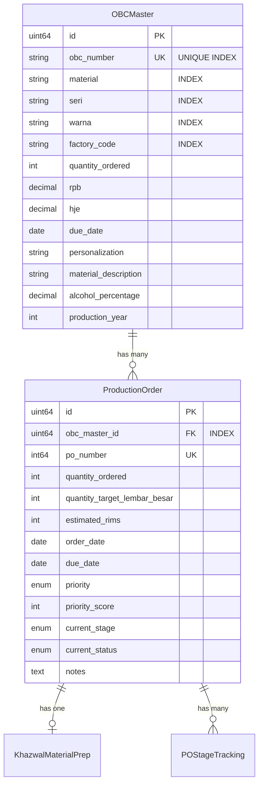

# OBC Master Excel Import - Phase 1 Summary

**Date:** 30 Desember 2025  
**Phase:** 1 - OBC Master Model & Database Architecture  
**Status:** ✅ Completed

---

## Overview

Phase 1 merupakan tahap foundational untuk implementasi sistem OBC Master yang terpisah dari Production Order. Tujuan utama yaitu: memisahkan data spesifikasi OBC (39 fields dari SAP) ke tabel dedicated `obc_masters` dan meng-refactor `production_orders` untuk reference ke OBCMaster via foreign key.

---

## Changes Implemented

### 1. New Model: OBCMaster

**File:** `backend/models/obc_master.go`

Model baru dengan 39 fields yang mencakup semua data spesifikasi OBC dari SAP Excel, antara lain:

#### Core Fields
- `OBCNumber` (VARCHAR(20), UNIQUE INDEX) - Primary identifier
- `OBCDate` (DATE) - Tanggal OBC
- `Material` (VARCHAR(50), INDEX) - Kode material
- `Seri` (VARCHAR(50), INDEX) - Seri produk
- `Warna` (VARCHAR(50), INDEX) - Warna produk
- `FactoryCode` (VARCHAR(50), INDEX) - Kode pabrik

#### Quantity & Financial Fields
- `QuantityOrdered` (INT) - Jumlah pesanan
- `RPB` (DECIMAL(15,2)) - Harga RPB
- `HJE` (DECIMAL(15,2)) - Harga HJE
- `BPB` (INT) - BPB value
- `Rencet` (INT) - Rencet value
- `TotalOrderOBC` (INT) - Total pesanan OBC

#### Product Specification Fields
- `JHT` (VARCHAR(100)) - JHT specification
- `Personalization` (VARCHAR(20)) - Perso/non-Perso
- `AdhesiveType` (VARCHAR(50)) - Jenis perekat
- `GR` (VARCHAR(50)) - GR code
- `PlatNumber` (VARCHAR(50)) - Nomor pelat
- `Type` (VARCHAR(50)) - Tipe produk

#### SAP Reference Fields
- `SalesDocument` (VARCHAR(50)) - Sales document number
- `ItemCode` (VARCHAR(50)) - Item code
- `MaterialDescription` (VARCHAR(255)) - Deskripsi material
- `BaseUnit` (VARCHAR(20)) - Base unit of measure

#### PCA & Excise Fields
- `PCACategory` (VARCHAR(50)) - Golongan PCA
- `AlcoholPercentage` (DECIMAL(5,2)) - Kadar alkohol
- `HPTLContent` (DECIMAL(5,2)) - Kadar HPTL
- `PCAVolume` (DECIMAL(15,2)) - Volume PCA
- `ExciseRatePerLiter` (DECIMAL(15,2)) - Tarif cukai per liter

#### Administrative Fields
- `RegionCode` (VARCHAR(20)) - Kode wilayah
- `OBCInitial` (VARCHAR(50)) - OBC awal
- `Allocation` (VARCHAR(255)) - Peruntukan
- `PlantCode` (VARCHAR(10)) - Kode plant
- `Unit` (VARCHAR(20)) - Satuan
- `ProductionYear` (INT) - Tahun produksi
- `MMEAColorCode` (VARCHAR(50)) - Warna MMEA
- `DueDate` (DATE) - Tanggal jatuh tempo
- `CreatedOn` (DATE) - Created date dari SAP

#### Indexes
Untuk optimasi query performance, indexes diterapkan pada:
- `obc_number` (UNIQUE) - untuk lookup cepat
- `material` - untuk filter by material
- `seri` - untuk filter by seri
- `warna` - untuk filter by warna
- `factory_code` - untuk filter by factory

#### Helper Methods

```go
// GetDisplayName mengembalikan "OBC123 - Material Name"
func (o *OBCMaster) GetDisplayName() string

// HasProductionOrders check apakah ada PO terkait
func (o *OBCMaster) HasProductionOrders() bool

// GetTotalPOQuantity menghitung total qty dari semua PO
func (o *OBCMaster) GetTotalPOQuantity() int

// CalculateTotalWithBuffer menghitung: QTY + (QTY * 6%)
func (o *OBCMaster) CalculateTotalWithBuffer() int

// IsPersonalized check apakah produk personalisasi
func (o *OBCMaster) IsPersonalized() bool
```

#### Relationship
- **One-to-Many** dengan `ProductionOrder` via `OBCMasterID` foreign key

---

### 2. Modified Model: ProductionOrder

**File:** `backend/models/production_order.go`

#### Fields Removed
Fields berikut dihapus karena sekarang ada di OBCMaster:
- ❌ `OBCNumber` → moved to `OBCMaster.OBCNumber`
- ❌ `SAPCustomerCode` → moved to `OBCMaster.FactoryCode`
- ❌ `SAPProductCode` → moved to `OBCMaster.Material`
- ❌ `ProductName` → moved to `OBCMaster.MaterialDescription`
- ❌ `ProductSpecifications` (JSON) → replaced by individual OBCMaster fields

#### Fields Added
- ✅ `OBCMasterID` (uint64, indexed, not null) - Foreign key ke `obc_masters`
- ✅ `OBCMaster` (*OBCMaster) - Relationship pointer untuk preload

#### Import Changes
- Removed `gorm.io/datatypes` import (tidak lagi digunakan)

#### Access Pattern (New)
```go
// OLD - direct access (DEPRECATED)
po.OBCNumber
po.ProductName
po.SAPCustomerCode

// NEW - via relationship
po.OBCMaster.OBCNumber
po.OBCMaster.MaterialDescription
po.OBCMaster.FactoryCode
```

---

### 3. Models Registry Update

**File:** `backend/database/models_registry.go`

#### Registration Order
OBCMaster **HARUS** diregister sebelum ProductionOrder untuk dependency order yang benar:

```go
// OBC Master & Production Order models
registry.Register(&models.OBCMaster{}, "obc_masters")      // FIRST
registry.Register(&models.ProductionOrder{}, "production_orders") // SECOND
```

Urutan ini penting untuk:
- GORM AutoMigrate membuat tabel dengan foreign key constraint yang benar
- Rollback/drop tables dalam reverse order yang aman

---

## Database Schema Changes

### New Table: `obc_masters`

```sql
CREATE TABLE obc_masters (
    id BIGINT UNSIGNED PRIMARY KEY AUTO_INCREMENT,
    obc_number VARCHAR(20) NOT NULL UNIQUE,
    obc_date DATE,
    material VARCHAR(50),
    seri VARCHAR(50),
    warna VARCHAR(50),
    factory_code VARCHAR(50),
    quantity_ordered INT,
    jht VARCHAR(100),
    rpb DECIMAL(15,2),
    hje DECIMAL(15,2),
    bpb INT,
    rencet INT,
    due_date DATE,
    personalization VARCHAR(20),
    adhesive_type VARCHAR(50),
    gr VARCHAR(50),
    plat_number VARCHAR(50),
    type VARCHAR(50),
    created_on DATE,
    sales_document VARCHAR(50),
    item_code VARCHAR(50),
    material_description VARCHAR(255),
    base_unit VARCHAR(20),
    pca_category VARCHAR(50),
    alcohol_percentage DECIMAL(5,2),
    hptl_content DECIMAL(5,2),
    region_code VARCHAR(20),
    obc_initial VARCHAR(50),
    allocation VARCHAR(255),
    total_order_obc INT,
    plant_code VARCHAR(10),
    unit VARCHAR(20),
    production_year INT,
    excise_rate_per_liter DECIMAL(15,2),
    pca_volume DECIMAL(15,2),
    mmea_color_code VARCHAR(50),
    created_at TIMESTAMP DEFAULT CURRENT_TIMESTAMP,
    updated_at TIMESTAMP DEFAULT CURRENT_TIMESTAMP ON UPDATE CURRENT_TIMESTAMP,
    deleted_at TIMESTAMP NULL,
    
    INDEX idx_material (material),
    INDEX idx_seri (seri),
    INDEX idx_warna (warna),
    INDEX idx_factory_code (factory_code),
    INDEX idx_deleted_at (deleted_at)
);
```

### Modified Table: `production_orders`

**Columns Dropped:**
- `obc_number`
- `sap_customer_code`
- `sap_product_code`
- `product_name`
- `product_specifications`

**Columns Added:**
- `obc_master_id` BIGINT UNSIGNED NOT NULL
- INDEX `idx_obc_master_id` (obc_master_id)
- FOREIGN KEY (obc_master_id) REFERENCES obc_masters(id)

---

## Architecture Diagram



---

## Expected Build Errors (To Be Fixed in Phase 5)

Setelah Phase 1, build akan menunjukkan errors pada services yang masih mengakses removed fields. **Ini adalah expected behavior** dan akan diperbaiki di Phase 5.

### Affected Files

#### 1. `services/khazwal_service.go`
```go
// ERROR: po.OBCNumber undefined
prep.ProductionOrder.OBCNumber

// ERROR: po.ProductName undefined
prep.ProductionOrder.ProductName
```

**Fix Pattern (Phase 5):**
```go
// Preload OBCMaster relationship
query.Preload("ProductionOrder.OBCMaster")

// Access via relationship
prep.ProductionOrder.OBCMaster.OBCNumber
prep.ProductionOrder.OBCMaster.MaterialDescription
```

#### 2. `services/cetak_service.go`
```go
// ERROR: Multiple undefined fields
po.OBCNumber
po.ProductName
po.SAPCustomerCode
po.SAPProductCode
po.ProductSpecifications
```

**Fix Pattern (Phase 5):**
```go
// Preload OBCMaster
query.Preload("OBCMaster")

// Access via relationship
po.OBCMaster.OBCNumber
po.OBCMaster.MaterialDescription
po.OBCMaster.FactoryCode
po.OBCMaster.Material
```

---

## Data Migration Strategy

### For Existing Production Orders

Ketika Phase 4 (Migration) dijalankan, existing data akan di-migrate dengan strategi:

1. **Extract Unique OBC Data**
   - Query distinct OBC combinations dari `production_orders`
   - Create temporary OBCMaster records

2. **Link Production Orders**
   - Update `obc_master_id` di setiap ProductionOrder
   - Point ke corresponding OBCMaster record

3. **Cleanup**
   - Drop old columns: `obc_number`, `sap_customer_code`, dll
   - Verify foreign key constraints

### Migration Script (Placeholder)
```sql
-- Step 1: Create OBCMaster records dari existing PO data
INSERT INTO obc_masters (obc_number, material_description, created_at)
SELECT DISTINCT obc_number, product_name, NOW()
FROM production_orders
WHERE deleted_at IS NULL;

-- Step 2: Update ProductionOrder dengan OBCMasterID
UPDATE production_orders po
INNER JOIN obc_masters obc ON po.obc_number = obc.obc_number
SET po.obc_master_id = obc.id;

-- Step 3: Drop old columns (dilakukan via GORM migration)
```

---

## Testing Checklist

### Phase 1 Verification

- [x] OBCMaster model created dengan 39 fields
- [x] Proper indexes pada Material, Seri, Warna, FactoryCode
- [x] Unique index pada OBCNumber
- [x] ProductionOrder model modified - removed 5 fields
- [x] ProductionOrder model modified - added OBCMasterID FK
- [x] OBCMaster relationship added ke ProductionOrder
- [x] Models registry updated - OBCMaster registered before ProductionOrder
- [x] No linter errors pada model files
- [ ] Database migration test (pending Phase 4)
- [ ] Service layer updates (pending Phase 5)

### Expected Behaviors (Post-Migration)

- [ ] OBCMaster CRUD operations
- [ ] ProductionOrder preload OBCMaster relationship
- [ ] Query filter by Material, Seri, Warna
- [ ] OBCMaster helper methods working correctly
- [ ] Foreign key constraint enforced

---

## File Changes Summary

### New Files
- ✅ `backend/models/obc_master.go` (187 lines)

### Modified Files
- ✅ `backend/models/production_order.go`
  - Removed: 5 fields + 1 import
  - Added: 2 fields (OBCMasterID, OBCMaster relationship)
  
- ✅ `backend/database/models_registry.go`
  - Added: OBCMaster registration before ProductionOrder

### Files Requiring Updates (Phase 5)
- ⏳ `backend/services/khazwal_service.go` - 4 errors
- ⏳ `backend/services/cetak_service.go` - 7 errors

---

## Next Steps

### Phase 2: Excel Import Service
- Install `github.com/xuri/excelize/v2` package
- Create `OBCImportService` dengan Excel parsing logic
- Implement column mapping dari Excel headers ke OBCMaster fields
- Handle date format conversion (Excel serial dates)
- Implement upsert logic (update existing, create new)
- Transaction-based import untuk rollback on error
- Generate PO dari OBC dengan formula: `Total = QTY + (QTY * 6%)`

### Phase 3: API Endpoints
- Create `OBCHandler` dengan endpoints:
  - `POST /api/obc/import` - Upload Excel
  - `GET /api/obc` - List dengan pagination & filter
  - `GET /api/obc/:id` - Detail OBC dengan POs
  - `POST /api/obc/:id/generate-po` - Manual PO generation
- Update routes dengan OBC routes group
- Add role-based access (ADMIN, PPIC only)

### Phase 4: Database Migration
- Run GORM AutoMigrate untuk create `obc_masters` table
- Migrate existing ProductionOrder data
- Verify foreign key constraints
- Test rollback scenario

### Phase 5: Service Layer Updates
- Update `khazwal_service.go` - preload OBCMaster, fix access patterns
- Update `cetak_service.go` - preload OBCMaster, fix access patterns
- Update search queries untuk include OBCMaster fields
- Test all affected endpoints

---

## Performance Considerations

### Indexes Strategy
Indexes diterapkan pada fields yang sering digunakan untuk filtering:
- `material` - filter by material type
- `seri` - filter by series
- `warna` - filter by color
- `factory_code` - filter by factory

### Query Optimization
```go
// Efficient preload untuk avoid N+1 queries
db.Preload("OBCMaster").Find(&productionOrders)

// Join query untuk search across OBCMaster fields
db.Joins("LEFT JOIN obc_masters ON obc_masters.id = production_orders.obc_master_id").
    Where("obc_masters.material LIKE ?", "%search%")
```

---

## Conclusion

Phase 1 berhasil memisahkan data OBC specification dari ProductionOrder ke dedicated OBCMaster table dengan 39 fields lengkap dari SAP Excel. Struktur database sekarang lebih normalized, scalable, dan siap untuk Excel import feature di Phase 2.

**Key Achievement:**
- ✅ Clean separation of concerns (OBC specs vs PO tracking)
- ✅ Proper indexing untuk query performance
- ✅ Foreign key relationship established
- ✅ Helper methods untuk business logic
- ✅ Ready untuk Excel import implementation

**Status:** Ready untuk Phase 2 - Excel Import Service Implementation 🚀
